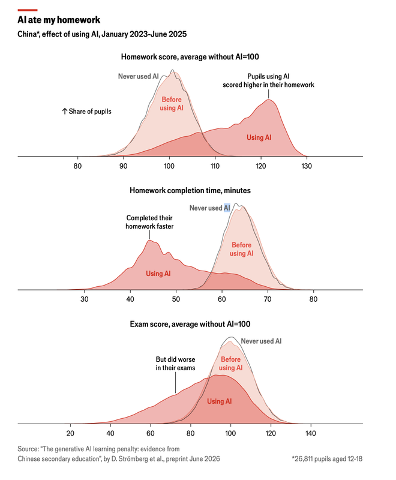
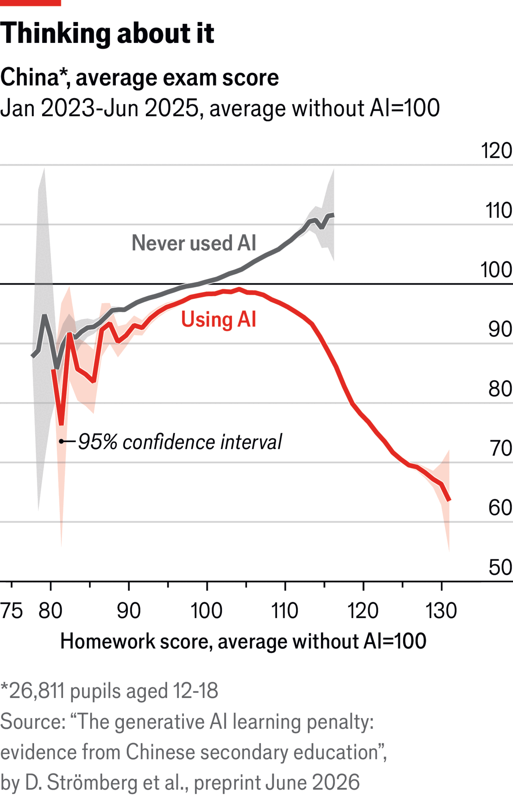
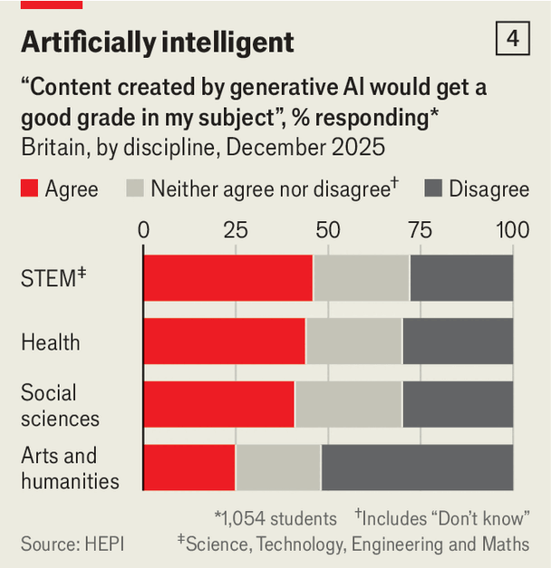
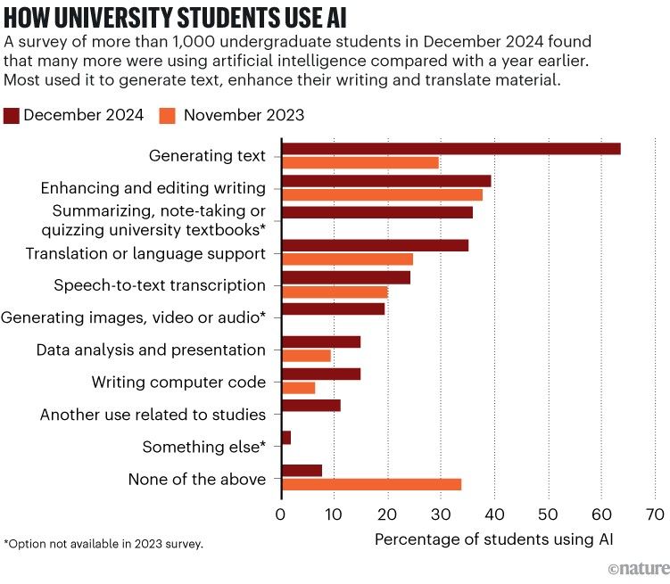
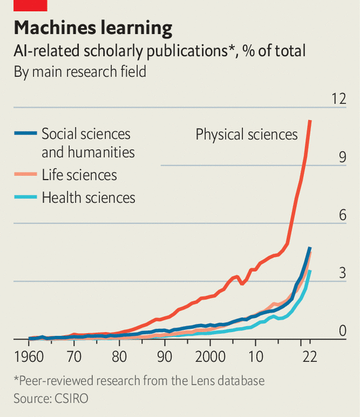
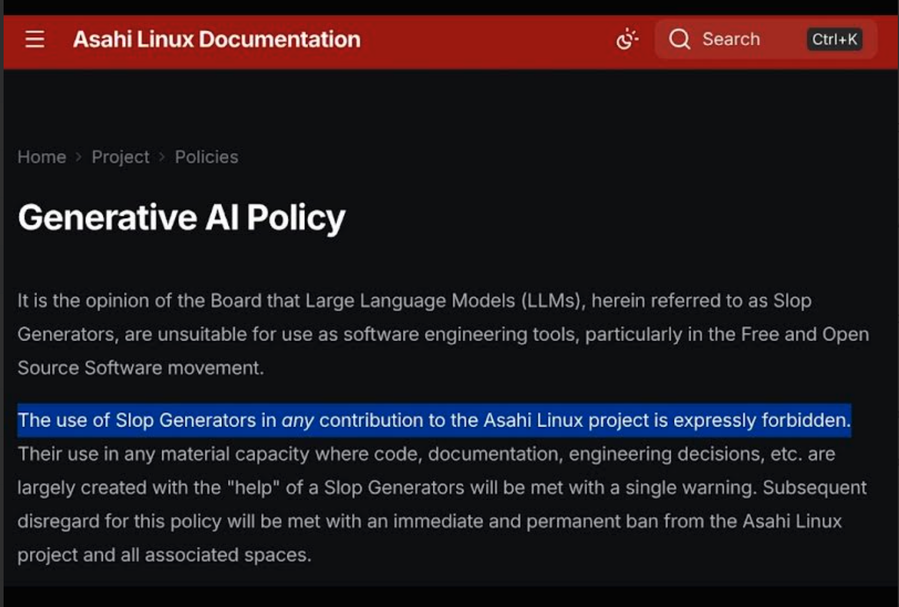

## Course Welcome

- **Course Title**: Applied Generative AI for AI Developers
- **Term**: Fall 2026 -- first class **Tuesday, September 1, 2026**
- **When/Where**: Tuesdays 8:00-10:30 AM, CBN-203 (Car Barn 203)
- **Week 1 Focus**: Generative AI foundations and AI-powered coding tools
- **Key Objectives**:
  - Understand the breadth of generative AI technologies
  - Build a practical mental model of how LLMs work
  - Learn in-context learning and prompt engineering
  - Get hands-on with AI coding assistants

## The Elephant in the Room

::: {style="text-align: center;"}
{height=270} {height=270} {height=270}

{height=250} {height=250}
:::

## The Elephant in the Room

{width=95%}

**Let's talk about this.** This is, after all, a course on Applied Generative AI -- we obviously cannot say "don't use AI." So what should our posture be?

## Opinions on AI Are on a Spectrum

::: {style="text-align: center;"}
{height=440}
:::

Source: [asahilinux.org/docs/project/policies/slop](https://asahilinux.org/docs/project/policies/slop/) *(the highlight is ours, not part of the original documentation)*

**To be clear: this is certainly not the policy of this class** -- but it is worth pointing out that opinions on AI span a full spectrum, from "expressly forbidden" to "AI-first."

## Course Structure {.smaller}

### Key Components

- **Syllabus**: Course policies, grading, schedule
- **Weekly Lectures**: Slides and recordings (Tuesdays 8:00-10:30 AM, CBN-203)
- **Labs**: Hands-on exercises with GenAI tools
- **Assignments**: Individual coding assignments
- **Weekly Presentations**: every student presents a topic individually (not as a team)
  - 45 students across 14 weeks means about 3 presenters per week, 5 minutes each
  - We will reserve the last 15 minutes of every class for this
  - *If you suspect I am not going to finish the lecture in time to leave room for presentations, remind me during class -- and we will make it 20 minutes, just to be safe* 🙂
- **Capstone Project**: Team-based GenAI application

### Important Resources

- [Course Repository](https://github.com/dsan-gu/6725-fall-2026)
- [Bookmarks Repo](https://github.com/gu-dsan6725/bookmarks) - Curated GenAI links and resources
- [Class Slack: DSAN6725-Fall-2026](https://join.slack.com/t/dsan6725-fall-2026/shared_invite/zt-47nzs8glh-JWxpIWJkiSsEkhs~9ySAlQ) - primary communication channel, join today

## A Note on Labs and Assignments

### Labs: simple, guided

- Generally straightforward -- we start them together in class
- You have **one week** to finish each one

### Assignments: hard, on purpose

- Genuinely difficult -- you have **two weeks**, and our suggestion is to **start ASAP**
- The theory behind the hard assignments: **AI has raised the floor**
  - What used to be difficult, tedious, and time-consuming no longer is -- we are all that much more productive
- The theme of this course is **not** "if AI does all the work I do, then what will I do?"

::: {.idea-callout}
Our theme: we get to the harder problems faster. Problems that were outside the scope of what capability and time allowed are now tractable. Hence the challenge.
:::

## Capstone Project Overview

### Project Guidelines

- **Team Size**: 2-4 students per team
- **Multiple teams can work on the same project idea**
- Maintain a running list of project ideas throughout the semester
- **Project abstract submission is a trackable, graded milestone**
- Project proposal due mid-semester
- Final presentation and deliverable at end of semester

### Deliverables

1. Project abstract (graded milestone)
2. Project proposal with problem statement
3. Mid-project checkpoint
4. Final presentation
5. Code repository with documentation
6. Written report

## The Final Project Matters Most

### Why It Deserves Your Attention Now

- The final project is the **most important component of this course** — it carries the **maximum weight** in your grade
- Start thinking about your project **from day one of the semester**, not when the proposal is due

### Pick a Problem You Care About

- Choose a problem that is **genuinely interesting to you** — something you deeply care about
- Pick something you would want to stay invested in for the **next 6 to 12 months, even beyond this course**
- That level of personal investment is what turns a course project into portfolio-defining work

## Project Ideas {.smaller}

### Potential Areas to Explore

- **Semantic Layer for Agents over Enterprise Data**
  - Give agents a governed, business-aware view of enterprise data -- work with data that you already understand
  - Explore emerging open standards such as Open Semantic Interchange (OSI)

- **AI-Powered Code Transformation**
  - Transform Python code to Go or Rust for performance optimization
  - Imagine millions of agents optimized this way -- the aggregate compute savings are enormous

- **Memory MCP Server for Coding Assistants**
  - Persistent memory layer for AI coding tools
  - Context retention across sessions

- **Agent Evaluations Framework**
  - Benchmarking multi-step agent tasks
  - Measuring tool use and reasoning

::: {.idea-callout}
Or explore any other idea that comes to mind -- these are just the areas that are of interest to me!
:::

## What is Generative AI?

- **Definition**: AI systems that can create new content

>Generative AI can be thought of as a machine-learning model that is trained to create new data, rather than making a prediction about a specific dataset. A generative AI system is one that learns to generate more objects that look like the data it was trained on.

_Source: https://news.mit.edu/2023/explained-generative-ai-1109_

## What is Generative AI (contd.)?

- **Core Characteristics**:
  - Learning from existing data
  - Generating novel, contextually relevant outputs
  - Spanning multiple modalities (text, image, code, audio)

## The Model Landscape (2026) {.smaller}

:::: {.columns}

::: {.column width="50%"}
### H1 2026

1. **Frontier Multimodal Models**
   - Anthropic Claude (Sonnet 4.5, Opus 4.5)
   - OpenAI GPT-5 family and o-series reasoning models
   - Google Gemini (2.5 Pro, Gemini 3)
   - Amazon Nova (Pro, Lite, Micro)

2. **Open-Weight Models**
   - Meta Llama 4
   - DeepSeek V3 and DeepSeek-R1
   - Qwen 3
   - Mistral Large

3. **Image/Video Generation**
   - DALL-E, Stable Diffusion, Midjourney
:::

::: {.column width="50%"}
### H2 2026

1. **Frontier Multimodal Models**
   - Anthropic Claude 5 family (Opus 5, Sonnet 5, Fable 5)
   - OpenAI GPT-5.x refreshes and newer reasoning models
   - xAI Grok 4.6

2. **Open-Weight Models**
   - Qwen 3.8
   - Moonshot AI Kimi K3
   - Rapid release cadence continues from Chinese labs

3. **The pattern**: capabilities keep leaping every quarter -- design applications so you can swap models easily
:::

::::

# LLM Foundations: The Practitioner's View

## An LLM in Five Ideas

1. **Tokens**: text is split into subword units; models read and write tokens, not words
2. **Next-token prediction**: an LLM predicts the next token given everything before it -- all capabilities emerge from this one trick
3. **Context window**: the model sees only what fits in its context; what is not in context does not exist
4. **Sampling and temperature**: output tokens are drawn from a probability distribution -- lower temperature is more deterministic, higher is more varied
5. **In-context learning**: models pick up new tasks from instructions and examples in the prompt -- no retraining needed

*The machinery underneath -- embeddings, self-attention, QKV, reasoning models -- is covered next week, after you have used these models hands-on.*

## Tokenization: How LLMs See Text

- **Tokens, not words**: Models operate on subword units produced by a tokenizer
- **Byte Pair Encoding (BPE)**: Iteratively merges frequent character pairs into a vocabulary (~50K-200K tokens)
- **Practical consequences**:
  - Pricing and context limits are measured in tokens (~4 characters per English token)
  - Rare words, code, and non-English text split into more tokens
  - Digit/character-level quirks ("how many r's in strawberry") trace back to tokenization
- **Try it**: [OpenAI Tokenizer](https://platform.openai.com/tokenizer), [Hugging Face Tokenizers](https://huggingface.co/docs/tokenizers/index)

# In-Context Learning and Prompt Engineering

## What is In-Context Learning (ICL)?

- **Definition**: A paradigm where models learn to perform tasks by being provided examples or instructions directly in the input (context).
- **Impact**: Reduces or eliminates the need for fine-tuning on specific tasks.
- **Analogy**: Teaching by showing examples without altering the student's core knowledge.
- **Key Feature**: Enables models to generalize without retraining.

## Hierarchy of Techniques

1. **Prompt Engineering**:
   - Easiest to implement.
   - Iterative improvement of task instructions and examples.
   - **When to use**: Small datasets, quick experiments.

2. **Fine-Tuning**:
   - Adjusts model weights for specific tasks.
   - Requires more resources (compute, labeled data).
   - **When to use**: High accuracy demands, domain-specific tasks.

3. **Continued Pre-Training (cPT)**:
   - Extends the pre-training phase with domain-specific data.
   - **When to use**: Large shifts in domain or task requirements.

## Pros and Cons of Each Technique

| Technique          | Pros                                | Cons                                   |
|--------------------|-------------------------------------|----------------------------------------|
| Prompt Engineering | Fast, low cost, no retraining.     | Limited accuracy, trial and error.    |
| Fine-Tuning        | Improved task performance.         | Requires labeled data, costly.        |
| cPT                | Handles major domain shifts well.  | Expensive, needs significant data.    |

## Prompt Engineering Overview

- **Zero-Shot Learning**:
  - No examples provided.
  - Example: "Summarize the following paragraph."

- **One-Shot Learning**:
  - One example provided.
  - Example: "Translate 'Bonjour' to English. Example: 'Hola -> Hello'. Translate 'Merci'."

- **Few-Shot Learning**:
  - Multiple examples provided.
  - Example: "Classify these reviews: 'I love this movie!' -> Positive, 'I hate this book.' -> Negative. Classify: 'This product is amazing.'"

## Few-Shot Learning Example

- **Task**: SQL Generation.
- **Prompt**:
  - "Examples:
     Input: Find all employees hired after 2020.
     Output: SELECT * FROM employees WHERE hire_date > '2020-01-01';
     Input: Count the number of departments.
     Output: SELECT COUNT(*) FROM departments;
     Input: List all customers from New York."
- **Output**: `SELECT * FROM customers WHERE city = 'New York';`
- Model outputs vary by family and by sampling parameters -- always validate generated SQL before executing it.

## Anatomy of a Prompt

- **Structure**:
  - System Message: Defines the model's role or behavior.
  - User Message: Specifies the task or query.
  - Assistant Message (optional): Provides context or prior responses.
- **Examples**:
  - System: "You are a helpful assistant."
  - User: "Summarize the following text: 'Generative AI is a game changer.'"
  - Assistant: "Generative AI is transformative."
- **Key Idea**: Clear instructions improve response quality.

## The Messages API

- **Components**:
  - `system`: Sets the model's tone and scope.
  - `user`: Contains the main prompt or task.
  - `assistant`: Used for context in iterative tasks.
- **Flow**:
  - Messages are passed as a sequence.
  - Each message builds upon the previous ones.
- **Benefits**:
  - Enhances multi-turn interactions.
  - Allows dynamic context updates.

## Example: Claude Messages API with Amazon Bedrock

- **Task**: Summarize a document.

```python
import boto3
import json

# Initialize the Bedrock Runtime client
bedrock = boto3.client('bedrock-runtime', region_name='us-east-1')

# Define messages using the Converse API
messages = [
    {
        "role": "user",
        "content": [{"text": "Summarize the following text: 'Generative AI is transforming industries by automating creative tasks.'"}]
    }
]

# Call Claude via Bedrock Converse API
response = bedrock.converse(
    modelId="anthropic.claude-sonnet-4-5-20250929-v1:0",
    messages=messages,
    system=[{"text": "You are a helpful assistant."}]
)

# Print the response
print(response["output"]["message"]["content"][0]["text"])
```

## Advanced Example: Few-Shot Learning with Claude

- **Task**: Classify sentiment.

```python
messages = [
    {
        "role": "user",
        "content": [{"text": """Examples:
Review: 'I love this product!' -> Positive
Review: 'This is the worst service ever.' -> Negative
Review: 'The delivery was on time.' ->"""}]
    }
]

response = bedrock.converse(
    modelId="anthropic.claude-sonnet-4-5-20250929-v1:0",
    messages=messages,
    system=[{"text": "You are a helpful assistant that classifies sentiment."}]
)

print(response["output"]["message"]["content"][0]["text"])
```

## Prompt Engineering Techniques

### Task Decomposition

```{.bashrc}
Break down the task of planning a vacation into smaller, manageable steps.
1. Choose a destination.
2. Set a budget.
3. Research accommodations.
4. Plan activities.
5. Book flights and accommodations.
6. Pack and prepare for the trip.
```

### Chain of Thought

```{.bashrc}
Solve the following math problem step by step.

If you have 10 apples and you give 3 apples to your friend,
then buy 5 more apples, and finally eat 2 apples,
how many apples do you have left?
```

## Prompting Best Practices

- **General Guidelines**:
  - Be specific: "Translate this sentence" vs. "Translate."
  - Avoid ambiguity: Use complete instructions.
  - Provide examples for complex tasks.

- **For GPT-5 / o-series**:
  - Use detailed instructions for creative tasks; include constraints like word limits or tone.
  - Reasoning models: let them reason; avoid "think step by step" (built-in).

- **For Claude (Sonnet 4.5, Opus 4.5)**:
  - Use XML tags to structure complex prompts.
  - Excels at reasoning tasks when examples are provided.
  - Supports extended thinking for complex problems.

- **For Llama 4 / Mistral / Qwen**:
  - Keep prompts concise; focus on factual and structured queries.
  - Use system prompts for role definition.

## Prompting Best Practices: References

| Model family | Prompt Engineering Reference |
|--------|---------------------------|
| Amazon Nova | https://docs.aws.amazon.com/nova/latest/userguide/prompting.html |
| Anthropic Claude | https://docs.anthropic.com/en/docs/build-with-claude/prompt-engineering/ |
| Meta Llama | https://www.llama.com/docs/how-to-guides/prompting/ |

## Modern Prompt Structures

### Beyond Simple Instructions

1. **XML-Tagged Sections** (Claude preferred)
```xml
<context>You are analyzing customer feedback</context>
<instructions>Classify sentiment and extract key themes</instructions>
<examples>...</examples>
<input>{{user_input}}</input>
```

2. **Structured Output Enforcement**
```
Respond in JSON format:
{"sentiment": "positive|negative|neutral", "themes": [...]}
```

3. **Chain-of-Thought Triggers**
```
Think step by step. Show your reasoning before the final answer.
```

## The Prompting Checklist {.smaller}

Six moves account for most of the gain:

1. **Be clear and direct** -- state the output format, the constraints, and the steps in order
   - Golden rule: if a colleague with no context would be confused, so is the model
2. **Give the motivation** -- explaining *why* lets the model generalize to cases you did not enumerate
3. **Show 3-5 examples** -- diverse, covering edge cases, wrapped in `<example>` tags
4. **Structure with XML tags** -- `<instructions>`, `<context>`, `<input>`; consistent and nestable
5. **Assign a role** in the system prompt -- focuses tone and domain vocabulary
6. **Order matters in long context** -- put long documents *above* the question; Anthropic reports up to ~30% improvement

### Say what to do, not what to avoid

| Don't | Do |
|-------|-----|
| "Do not use markdown" | "Write in flowing prose paragraphs" |
| "Don't be verbose" | "Answer in at most three sentences" |

## Prompting Anti-Patterns {.smaller}

| Anti-pattern | Why it hurts | Do instead |
|---|---|---|
| "Make it better" | No success criteria to optimize against | Name the target: latency, readability, coverage |
| "Do not do X" | Negation still puts X in the context | Name the positive behavior you want |
| "Think step by step" to a reasoning model | Reasoning is already built in; can degrade output | Give the problem and constraints; set effort instead |
| Pasting the whole repo | Dilutes signal, burns context | Point to files and let the agent read them |
| Contradictory rules across memory files | The model picks one arbitrarily | Audit and de-duplicate periodically |
| One mega-prompt for a six-step task | Errors compound silently | Chain prompts; verify each step |

## Treat Prompts Like Code {.smaller}

### The loop

1. **Draft** -- start from a metaprompt or prompt generator rather than a blank page
2. **Version** -- prompts live in the repo, in git, reviewed in PRs like any other artifact
3. **Evaluate** -- a small labeled set beats vibes; measure before and after every edit
4. **Refine** -- change one thing at a time so you know what moved the number

- Anthropic's [metaprompt notebook](https://colab.research.google.com/github/anthropics/claude-cookbooks/blob/main/misc/metaprompt.ipynb) gives you a first draft to critique
- Systematic evaluation is a whole topic -- **Week 6: Evals, Observability, and Guardrails**

### Rule of thumb

> Exhaust prompt engineering before reaching for fine-tuning. It is the cheapest, fastest, and most reversible lever you have.

## Prompt Engineering: Repos to Clone {.smaller}

| Resource | What it gives you |
|---|---|
| [anthropics/prompt-eng-interactive-tutorial](https://github.com/anthropics/prompt-eng-interactive-tutorial) | Nine-chapter hands-on course in notebooks -- start here |
| [anthropics/claude-cookbooks](https://github.com/anthropics/claude-cookbooks) | Runnable recipes: metaprompt, classification, RAG, tool use |
| [dair-ai/Prompt-Engineering-Guide](https://github.com/dair-ai/Prompt-Engineering-Guide) | The community reference: techniques, papers, context engineering |
| [NirDiamant/Prompt_Engineering](https://github.com/NirDiamant/Prompt_Engineering) | One notebook per technique, beginner to advanced |
| [promptslab/Awesome-Prompt-Engineering](https://github.com/promptslab/Awesome-Prompt-Engineering) | Curated papers, tools, and datasets |
| [openai/openai-cookbook](https://github.com/openai/openai-cookbook) | GPT-family prompting and reasoning-model guides |
| [agentsmd/agents.md](https://github.com/agentsmd/agents.md) | The AGENTS.md format and example files |
| [Anthropic prompting best practices](https://platform.claude.com/docs/en/build-with-claude/prompt-engineering/claude-prompting-best-practices) | The living reference -- reread it every semester |

::: {.idea-callout}
Clone one of these tonight and run a notebook. Reading about prompting is not prompting.
:::

## From Prompt Engineering to Context Engineering

### The Paradigm Shift

- **The Problem with Prompts Alone**:
  - LLMs have finite context windows
  - Flooding with irrelevant instructions dilutes important information
  - Prompts cannot compensate when the model lacks situational data

### Definition (Andrej Karpathy)

> "Context engineering is the delicate art and science of filling the context window with just the right information for each step."

- **Not just prompts** -- managing everything the model sees at runtime: retrieved documents (RAG), memory, tool definitions, prior outputs, user preferences
- We revisit context engineering throughout the course (RAG in Week 3, agents in Weeks 4-5)

# AI Coding Assistants

## AI Coding Assistants: The Landscape

- **Evolution**: From OpenAI Codex & GitHub Copilot (autocomplete) to autonomous agents.
- **Models**: Powered by Claude Sonnet/Opus 4.x, GPT-5 family, Gemini 2.5/3.
- **Main Categories**:
  - **Plugin-based**: Extensions for existing IDEs (VS Code, JetBrains).
  - **Agentic IDEs**: Standalone editors reimagined for AI collaboration.
  - **CLI agents**: Terminal-first agentic tools.

## Category 1: Plugin-based and CLI Assistants

- **Philosophy**: Enhance your existing environment (VS Code, IntelliJ, Terminal).
- **Examples**:
  - **GitHub Copilot**: The industry standard for autocomplete & chat, now with agent mode.
  - **Claude Code**: Agentic CLI tool from Anthropic (often used alongside IDEs).
  - **Aider**: A CLI tool for pair programming; edits files directly via git.
  - **Roo Code**: VS Code extension enabling autonomous task execution.
  - **Pi / oh-my-pi**: Minimal, hackable coding harness and its batteries-included fork.
  - **OpenCode**: Open-source terminal agent that works with any model.

## Category 2: Agentic IDEs

- **Philosophy**: Deeply integrated AI that "sees" the whole codebase and can drive the editor.
- **Examples**:
  - **Cursor**: A VS Code fork. Famous for "Composer" (multi-file edits) and "Tab" (prediction).
  - **Windsurf**: Features "Cascade" flow and deep context awareness.
  - **Google Antigravity**: Agent-first IDE with multi-agent orchestration.
  - **AWS Kiro**: Spec-driven agentic IDE + CLI.

## Comparative Analysis

| Tool | Type | Key Strength | Link |
|------|------|--------------|------|
| **Cursor** | Agentic IDE | Best-in-class UI/UX, 'Composer' mode. | [cursor.com](https://cursor.com) |
| **Windsurf** | Agentic IDE | Deep context 'Flow', 'Cascade' agent. | [windsurf.com](https://windsurf.com) |
| **Antigravity** | Agentic IDE | Multi-agent orchestration, free for individuals. | [antigravity.google](https://antigravity.google) |
| **Claude Code** | CLI / Plugin | Research-grade agentic capabilities. | [anthropic.com](https://anthropic.com) |
| **GitHub Copilot** | Plugin | Ubiquitous, agent mode in VS Code. | [github.com/features/copilot](https://github.com/features/copilot) |
| **Aider** | CLI Tool | Best for terminal users, git-aware. | [aider.chat](https://aider.chat) |
| **Pi / oh-my-pi** | CLI Tool | Minimal hackable harness; omp adds batteries. | [github.com/badlogic/pi-mono](https://github.com/badlogic/pi-mono) |
| **OpenCode** | CLI / TUI | Open-source, provider-agnostic, LSP-aware. | [opencode.ai](https://opencode.ai) |

## Spotlight: Pi and oh-my-pi {.smaller}

- **Pi** (Mario Zechner): a *minimal* terminal coding harness -- deliberately small core with no built-in MCP, sub-agents, or plan mode
- **Everything is an extension**: TypeScript extensions, skills (compatible with Claude Code and Codex skills), prompt templates, themes
- Part of the `pi-mono` AI agent toolkit: unified LLM API, agent loop, TUI and web UI libraries
- **Why it matters pedagogically**: the harness is small enough to actually read -- the best way to understand what tools like Claude Code do under the hood
- **oh-my-pi (`omp`)**: a batteries-included fork -- on first run it inherits the rules, skills, and MCP servers already on disk (`.claude`, `.cursor`, `.windsurf`, `.codex`, ...) and wires in IDE/LSP integration
- Links: [github.com/badlogic/pi-mono](https://github.com/badlogic/pi-mono) | [github.com/can1357/oh-my-pi](https://github.com/can1357/oh-my-pi)

## Spotlight: OpenCode {.smaller}

- Fully **open-source (MIT)** terminal-native coding agent from the SST team -- TUI first, with a desktop app and IDE extension
- **Provider-agnostic**: connect 75+ models from any provider (Claude, GPT, Gemini, open-weight models locally via Ollama), or use the curated OpenCode Zen list
- Full agent harness: tool loop, **LSP integration**, plan mode (read-only) vs. build mode, MCP support, git-backed undo/redo
- **Runs locally**, sessions stored in SQLite -- your code goes only to the model provider you choose
- The most widely used open-source coding harness: **165k+ GitHub stars**
- [opencode.ai](https://opencode.ai)

## How Coding Assistants Work

- **Underlying Technology**: Large Language Models trained on code
- **Key Capabilities**:
  - Code completion and suggestion
  - Natural language to code translation
  - Code explanation and documentation
  - Bug detection and fixing
  - Test generation

## Agentic Coding: The Next Evolution

### From Assistants to Agents

- **Traditional Assistants**: Code completion, suggestions within IDE
- **Agentic Coding Tools**: Autonomous multi-step task execution
  - Claude Code: Terminal-based agentic coding
  - Cursor Agent: IDE-integrated autonomous coding
  - Copilot coding agent: Assign GitHub issues to an agent
- **Key Capabilities**:
  - Read and understand entire codebases
  - Execute multi-file refactoring autonomously
  - Run tests and fix failures iteratively
  - Interact with tools (git, terminal, APIs)

## Spotlight: Claude Code Architecture

### The Complete Claude Code Stack (Boris Cherny)

{width=85%}

Source: [Boris Cherny on X](https://x.com/bcherny/status/2007179832300581177)

## CLAUDE.md: The Project Brain

### What is CLAUDE.md?

- **Persistent context** that Claude automatically incorporates into every conversation
- Solves the problem of repeatedly explaining the same context
- Think of it as a configuration file for your AI pair programmer

### File Hierarchy

```
~/.claude/CLAUDE.md              # Global (all projects)
~/repos/org/CLAUDE.md            # Organization-wide
~/repos/org/project/CLAUDE.md    # Project-specific (most common)
~/repos/org/project/src/CLAUDE.md  # Subdirectory (additive)
```

**Key Insight**: Files are additive - subdirectory CLAUDE.md appends to parent, doesn't override.

## CLAUDE.md: What to Include

### Essential Sections

```markdown
# Project Overview
This is a FastAPI e-commerce backend with Stripe integration.

# Tech Stack
- Python 3.12, FastAPI, SQLAlchemy 2.0
- PostgreSQL 15, Redis for caching
- pytest for testing

# Commands
- Run tests: `uv run pytest`
- Start dev server: `uv run uvicorn main:app --reload`
- Lint: `uv run ruff check --fix . && uv run ruff format .`

# Code Style
- Use Pydantic for all data validation
- Private functions start with underscore

# Architecture Decisions
- All database queries go through repository pattern
- Use dependency injection for testability
```

## CLAUDE.md: Best Practices

### Do's

1. **Keep it concise** - Focus on high-signal instructions
2. **Focus on the "how"** - Commands, patterns, conventions
3. **Use `/init`** - Let Claude generate a starter, then refine
4. **Update regularly** - Treat as living documentation

### Don'ts

1. **Don't dump everything** - Use progressive disclosure
2. **Don't include obvious things** - Claude already knows Python syntax

### Pro Tip: Progressive Disclosure

```markdown
# For detailed API documentation, see: docs/api/README.md
# For database schema details, see: docs/schema.md
```

Tell Claude **where** to find information, not all the information itself.

## AGENTS.md: One File, Every Agent

### The problem

- Every tool invented its own rules file: `CLAUDE.md`, `.cursorrules`, `.github/copilot-instructions.md`, `.windsurfrules`, `.clinerules`
- Same project, same conventions, five copies -- and they drift apart

### The fix

> "Think of AGENTS.md as a README for agents: a dedicated, predictable place to provide context and instructions to help AI coding agents work on your project."

- Plain Markdown at the repo root -- no schema, no frontmatter, nothing to learn
- **60,000+ open-source repos** have adopted it; now stewarded by the Agentic AI Foundation under the Linux Foundation
- Read by Codex, Copilot, Cursor, Jules, Gemini CLI, Aider, Devin, Zed, Windsurf, Warp, Junie, and others
- Canonical spec and examples: [agents.md](https://agents.md/) | [github.com/agentsmd/agents.md](https://github.com/agentsmd/agents.md)

## AGENTS.md: What Goes In It {.smaller}

All sections are optional -- it is just Markdown:

```markdown
# AGENTS.md

## Dev environment
- `uv sync` installs everything; Python 3.12+ required.

## Build and run
- Render slides: `./render_slides.sh`
- Build the site: `uv run python build_site.py`

## Testing
- `uv run pytest -xvs`; all tests must pass before opening a PR.

## Code style
- Ruff for lint and format; type hints on every public function.

## PR instructions
- Title format: `[area] short description`
```

### Placement rules

- A root `AGENTS.md` covers the repo; **nested** `AGENTS.md` files cover their own subtree
- The agent reads the **closest** file up the directory tree -- monorepos get per-package instructions for free
- An explicit instruction in your prompt always wins over the file

## Sample: Apache Airflow's AGENTS.md

- A real, actively maintained example from a top-level Apache project -- roughly **500 lines**, plus nested files such as `providers/AGENTS.md`
- [github.com/apache/airflow/blob/main/AGENTS.md](https://github.com/apache/airflow/blob/main/AGENTS.md)

```markdown
## Naming
Write **Dag** (title case) in all prose. Keep the all-caps or lowercase
spelling only when reproducing a literal code token ...

## Environment Setup
- **Never run pytest, python, or airflow commands directly on the host**
  -- always use `breeze`.

## Commands
- **Run a single test:**
  `uv run --project <PROJECT> pytest path/to/test.py::TestClass::test_method -xvs`
```

Section headings: Naming, Environment Setup, Commands, Repository Structure, Architecture Boundaries, Security Model, Coding Standards, Testing Standards, Commits and PRs, Boundaries, References.

## Airflow's AGENTS.md: What to Notice {.smaller}

1. **Exact commands, not descriptions** -- copy-pasteable, with placeholders like `<PROJECT>` defined in the file
2. **Hard boundaries in bold** -- *"Never run pytest, python, or airflow commands directly on the host"*; agents follow explicit prohibitions far better than vague guidance
3. **Repo-specific traps an agent could never infer** -- `Dag` in prose but `DAG` in code; newsfragments for `airflow-core/` but never for `providers/`
4. **Workflow, not just style** -- remote naming (`upstream` vs `origin`), *"Always push branches to `origin`"*, rebase before push, static checks before a PR
5. **A human-review and attribution policy, in the repo** --

> "NEVER add Co-Authored-By with yourself as co-author of the commit. Agents cannot be authors, humans can be, Agents are assistants."

```
Drafted-by: <Agent Name and Version> (no human review before posting)
```

### Discussion

- Which of these rules could an agent have inferred from the code, and which *had* to be written down?
- What is the equivalent trap in **your** capstone repo?

## CLAUDE.md vs AGENTS.md: Do You Need Both? {.smaller}

- **Claude Code reads `CLAUDE.md`, not `AGENTS.md`** -- they are complementary, not competing
- Keep one source of truth by importing the file instead of duplicating it:

```markdown
<!-- CLAUDE.md -->
@AGENTS.md

## Claude Code
Use plan mode for changes under `src/billing/`.
```

- A symlink works when you have nothing Claude-specific to add: `ln -s AGENTS.md CLAUDE.md`
- `/init` generates a starter from your codebase (and reads existing Cursor/Copilot rules); `/import` pulls another agent's config in

### In this course repo

| File | Answers the question |
|------|----------------------|
| `CLAUDE.md` | *How do we write code here?* -- Python style, typing, testing, logging, security |
| `AGENTS.md` | *How do I build and ship this site?* -- render slides, build, preview, deploy |

## Prompting Agents Is a Different Sport {.smaller}

Prompts that write code and call tools need rules a chat prompt never did:

- **Be explicit about acting** -- "suggest some changes" gets suggestions; say *"implement the changes using tools"*
- **Force investigation before assertion**:

```xml
<investigate_before_answering>
Never speculate about code you have not opened. If the user references a
specific file, you MUST read the file before answering.
</investigate_before_answering>
```

- **Bound the blast radius** -- require confirmation for hard-to-reverse actions (`rm -rf`, `git push --force`, dropping tables)
- **Curb over-engineering** -- "only make changes that are directly requested; no new abstractions, no defensive code for cases that cannot happen"
- **Ban test-shaped solutions** -- "implement a solution that works for all valid inputs, not just the test cases; do not hard-code values"
- **Parallelize** -- tell the model to issue independent tool calls simultaneously

## Technique: Spec-Driven Development

- **The Problem**: Vague prompts lead to hallucinated or poor code.
- **The Fix**: **Plan First / Code Later**.
- **Process**:
  1. **Draft a Spec**: Create a markdown file describing requirements (API, Data Models).
  2. **Human Review**: You review the design.
  3. **Agent Reflection**: Ask the LLM: *"Review this spec for edge cases or security flaws."*
  4. **Execute**: Only generate code once the plan is solid.

## Lab: Agentic Coding with AI Assistants {.smaller}

### Build a polars data pipeline over NYC taxi data -- by directing agents, not by hand

- Set up **two assistants**: one proprietary (Claude Code or Codex CLI) and one open-source (OpenCode or Pi) -- you get experience with both ecosystems
- Real data: NYC Yellow Taxi trips -- 3.5M rows/month, about 3.5 GB for the full year
- **The experiment**: give the agent the same task before and after writing `AGENTS.md`, and diff its behavior (watch it reach for pandas, then comply)
- Build the missing pipeline stages with the failing tests as your specification -- cleaning rules and aggregations, one module per tool
- **Rules of engagement**: you prompt, review diffs, and iterate; you do not hand-write the implementation
- Scale run on real data with lazy streaming; commit the timing report
- Deliverables: green CI, `AGENTS.md` + `CLAUDE.md`, agent-written modules, `results.md`, reflection comparing the two tools

## Next Week Preview

### Week 2 Focus: LLM Internals and Inference

- Under the hood: embeddings, self-attention, QKV, sampling, reasoning models
- How LLMs serve tokens at scale: KV cache, Flash Attention, PagedAttention
- Continuous batching and throughput optimization; serving stacks: vLLM, SGLang
- Latency, throughput, and cost trade-offs

## References and Deep Dive Resources

### Foundational Papers

- "Efficient Estimation of Word Representations in Vector Space" (Mikolov et al., 2013) - [arXiv:1301.3781](https://arxiv.org/abs/1301.3781)
- "Attention Is All You Need" (Vaswani et al., 2017) - [arXiv:1706.03762](https://arxiv.org/abs/1706.03762)
- "Language Models are Few-Shot Learners" (Brown et al., 2020) - [arXiv:2005.14165](https://arxiv.org/pdf/2005.14165)
- "Chain of Thought Prompting Elicits Reasoning in Large Language Models" (Wei et al., 2022) - [arXiv:2201.11903](https://arxiv.org/pdf/2201.11903)

### Transformers and LLM Internals

- [Karpathy's nanoGPT](https://github.com/karpathy/nanoGPT) - Minimalist GPT implementation
- [Andrej Karpathy: Intro to LLMs](https://www.youtube.com/watch?v=zjkBMFhNj_g)
- [3Blue1Brown: Attention](https://www.3blue1brown.com/lessons/attention)
- [Jay Alammar's "Illustrated Transformer"](https://jalammar.github.io/illustrated-transformer/)
- [Hugging Face Transformers Documentation](https://huggingface.co/docs/transformers/en/index)

### Prompt Engineering and Coding Assistants

- [Anthropic Prompting Best Practices](https://platform.claude.com/docs/en/build-with-claude/prompt-engineering/claude-prompting-best-practices) - the living reference
- [Anthropic Interactive Prompt Engineering Tutorial](https://github.com/anthropics/prompt-eng-interactive-tutorial)
- [Claude Cookbooks](https://github.com/anthropics/claude-cookbooks) | [DAIR.AI Prompt Engineering Guide](https://github.com/dair-ai/Prompt-Engineering-Guide)
- [Claude Code Docs](https://docs.anthropic.com/en/docs/claude-code)
- [Claude Code Best Practices](https://www.anthropic.com/engineering/claude-code-best-practices)
- [Cursor](https://cursor.com) | [GitHub Copilot](https://github.com/features/copilot) | [Aider](https://aider.chat)
- [Prompt Engineering Examples](https://github.com/NirDiamant/Prompt_Engineering/tree/main)

### Agent Instruction Files

- [AGENTS.md](https://agents.md/) - the open format | [agentsmd/agents.md](https://github.com/agentsmd/agents.md) - spec and examples
- [Apache Airflow AGENTS.md](https://github.com/apache/airflow/blob/main/AGENTS.md) - the production sample we walked through
- [Claude Code memory and CLAUDE.md](https://code.claude.com/docs/en/memory) - hierarchy, imports, and the `AGENTS.md` interop pattern
- [This course repo's AGENTS.md](https://github.com/dsan-gu/6725-fall-2026/blob/main/AGENTS.md)
