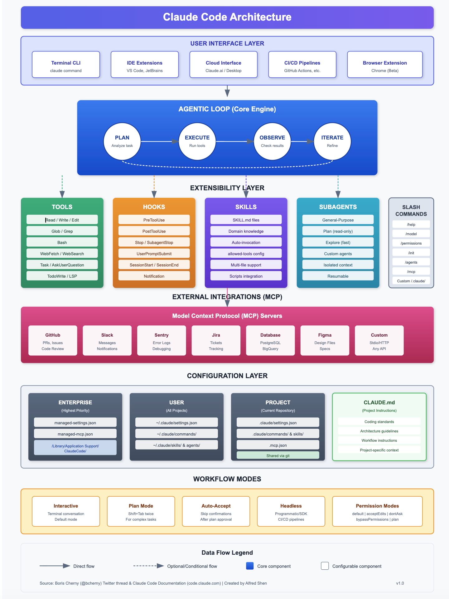

## Course Welcome

- **Course Title**: Applied Generative AI for AI Developers
- **Term**: Fall 2026 -- first class **Tuesday, September 1, 2026**
- **When/Where**: Tuesdays 8:00-10:30 AM, CBN-203 (Car Barn 203)
- **Week 1 Focus**: Generative AI foundations and AI-powered coding tools
- **Key Objectives**:
  - Understand the breadth of generative AI technologies
  - Explore core generative model architectures
  - Learn in-context learning and prompt engineering
  - Get hands-on with AI coding assistants

## Course Structure

### Key Components

- **Syllabus**: Course policies, grading, schedule
- **Weekly Lectures**: Slides and recordings (Tuesdays 8:00-10:30 AM, CBN-203)
- **Labs**: Hands-on exercises with GenAI tools
- **Assignments**: Individual coding assignments
- **Quizzes**: 6 quizzes throughout the semester
- **Capstone Project**: Team-based GenAI application

### Important Resources

- [Course Repository](https://github.com/dsan-gu/6725-fall-2026)
- [Bookmarks Repo](https://github.com/gu-dsan6725/bookmarks) - Curated GenAI links and resources

## Capstone Project Overview

### Project Guidelines

- **Team Size**: 2-4 students per team
- **Multiple teams can work on the same project idea**
- Maintain a running list of project ideas throughout the semester
- Project proposal due mid-semester
- Final presentation and deliverable at end of semester

### Deliverables

1. Project proposal with problem statement
2. Mid-project checkpoint
3. Final presentation
4. Code repository with documentation
5. Written report

## Project Ideas

### Potential Areas to Explore

- **Memory MCP Server for Coding Assistants**
  - Persistent memory layer for AI coding tools
  - Context retention across sessions

- **Semantic Layer for Data**
  - Natural language interface to databases
  - Business logic abstraction for LLMs

- **Agent Evaluations Framework**
  - Benchmarking multi-step agent tasks
  - Measuring tool use and reasoning

- **Log File Analysis with GenAI**
  - Automated anomaly detection
  - Natural language log queries

- **RAG-based Documentation Assistant**
  - Domain-specific knowledge retrieval
  - Multi-document synthesis

## What is Generative AI?

- **Definition**: AI systems that can create new content

>Generative AI can be thought of as a machine-learning model that is trained to create new data, rather than making a prediction about a specific dataset. A generative AI system is one that learns to generate more objects that look like the data it was trained on.

_Source: https://news.mit.edu/2023/explained-generative-ai-1109_

## What is Generative AI (contd.)?

- **Core Characteristics**:
  - Learning from existing data
  - Generating novel, contextually relevant outputs
  - Spanning multiple modalities (text, image, code, audio)

## The Model Landscape (2026)

1. **Frontier Multimodal Models**
   - Anthropic Claude (Sonnet 4.5, Opus 4.5)
   - OpenAI GPT-5 family and o-series reasoning models
   - Google Gemini (2.5 Pro, Gemini 3)
   - Amazon Nova (Pro, Lite, Micro)

2. **Open-Weight Models**
   - Meta Llama 4
   - DeepSeek V3 and DeepSeek-R1
   - Qwen 3
   - Mistral Large

3. **Image/Video Generation**
   - DALL-E, Stable Diffusion, Midjourney

# Transformer Architecture - Fundamental Concepts

## NLP prior to embeddings and transformers

- **Pre-Embedding NLP Representations: Bag of Words**
  - Discrete, non-contextual representation of text
  - Treats documents as unordered collections of words
  - Loses semantic meaning and word order
  - High dimensionality with sparse vectors
  - No understanding of word relationships


## Origins of Modern Embeddings
  - Word2Vec paper: [Efficient Estimation of Word Representations in Vector Space](https://arxiv.org/abs/1301.3781), [Explainer video for word embeddings](https://www.youtube.com/watch?v=wgfSDrqYMJ4)
  - Breakthrough in sequence-to-sequence learning
  - Replaced previous RNN and LSTM architectures
  - Enabled dense, contextual word representations
  - Captured semantic relationships between words

## Tokenization: How LLMs See Text

- **Tokens, not words**: Models operate on subword units produced by a tokenizer
- **Byte Pair Encoding (BPE)**: Iteratively merges frequent character pairs into a vocabulary (~50K-200K tokens)
- **Practical consequences**:
  - Pricing and context limits are measured in tokens (~4 characters per English token)
  - Rare words, code, and non-English text split into more tokens
  - Digit/character-level quirks ("how many r's in strawberry") trace back to tokenization
- **Try it**: [OpenAI Tokenizer](https://platform.openai.com/tokenizer), [Hugging Face Tokenizers](https://huggingface.co/docs/tokenizers/index)

## Core Components of Transformer Architecture

1. Introduced in "Attention Is All You Need" (Google, 2017). [Paper](https://arxiv.org/abs/1706.03762), [Explainer video](https://www.youtube.com/watch?v=iDulhoQ2pro) and also [this video](https://www.youtube.com/watch?v=5MaWmXwxFNQ)

1. **MUST READ**: [The Illustrated Transformer](https://jalammar.github.io/illustrated-transformer/)
1. **Interactive Tool**: [Transformer Explainer](https://poloclub.github.io/transformer-explainer/) - Visual, interactive exploration of transformer architecture
1. Key Building Blocks

    1. **Self-Attention Mechanism**
       - Allows model to weigh importance of different parts of input
       - Captures contextual relationships dynamically
       - Enables parallel processing of entire sequences

    1. **Positional Encoding**
       - Adds location information to input embeddings
       - Crucial for understanding sequence order
       - Enables models to understand context beyond word positioning

## Detailed Self-Attention Mechanism

### How Self-Attention Works

- **Key Components**:
  - Query (Q)
  - Key (K)
  - Value (V)

- **Attention Calculation**:
  1. Generate Q, K, V matrices
  2. Compute attention scores
  3. Apply softmax
  4. Create weighted representation

## Deep Dive: Query, Key, Value (QKV) Matrices

### Understanding QKV in Self-Attention

- **Query (Q)**: "What am I looking for?"
  - Represents the current token's search for relevant context
  - Generated by multiplying input with learned weight matrix Wq

- **Key (K)**: "What do I contain?"
  - Represents what information each token offers
  - Used to compute compatibility scores with queries

- **Value (V)**: "What should I contribute?"
  - The actual content that gets passed forward
  - Weighted by attention scores

### Resources:
- [Transformer Explainer - Interactive Visualization](https://poloclub.github.io/transformer-explainer/)
- [Understanding Q,K,V in Transformer](https://medium.com/analytics-vidhya/understanding-q-k-v-in-transformer-self-attention-9a5eddaa5960)
- [The Q, K, V Matrices Explained](https://arpitbhayani.me/blogs/qkv-matrices/)

## QKV: The Attention Calculation

### Step-by-Step Process

1. **Create QKV vectors**: Input embeddings multiplied by Wq, Wk, Wv matrices
2. **Compute attention scores**: $Attention(Q,K,V) = softmax(\frac{QK^T}{\sqrt{d_k}})V$
3. **Scale by sqrt(d_k)**: Prevents dot products from growing too large
4. **Apply softmax**: Convert scores to probabilities
5. **Multiply by V**: Get weighted combination of values

### Multi-Head Attention
- Split Q, K, V into multiple "heads" (e.g., 12 in GPT-2)
- Each head learns different relationship patterns
- Results concatenated and projected back

## Transformer Architecture Visualization

### Encoder-Decoder Structure

- **Encoder**
  - Processes input sequence
  - Generates contextual representations
- **Decoder**
  - Generates output sequence
  - Uses encoder representations
- **Multi-Head Attention**
  - Multiple attention mechanisms in parallel
  - Captures different types of dependencies
- **Decoder-only models** (GPT, Claude, Llama): today's dominant LLM architecture -- next-token prediction with causal attention

## Transformer Advantages

### Why Transformers Changed Everything

- **Parallel Processing**
  - Unlike RNNs, can process entire sequences simultaneously
- **Long-Range Dependencies**
  - Effectively capture distant contextual relationships
- **Scalability**
  - Easily parallelizable
  - Supports massive model architectures

## Limitations and Challenges

### Transformer Architecture Considerations

- **Computational Complexity**
  - Quadratic complexity with sequence length
- **Memory Requirements**
  - Large models need significant computational resources
- **Mitigation Strategies** (deep dive in Week 2: Inference)
  - Flash Attention, PagedAttention, continuous batching
  - Sparse attention and efficient transformer variants
  - Mixture of Experts (MoE) architectures
  - Model distillation and quantization
  - Extended context windows (200K+ tokens now common)

## Sampling: How Models Pick the Next Token

- The model outputs a **probability distribution** over the vocabulary; sampling turns it into text
- **Greedy decoding**: always pick the most likely token -- deterministic but repetitive
- **Temperature** (0-1+): rescales the distribution; lower = more deterministic, higher = more creative
- **Top-k**: sample only from the k most likely tokens
- **Top-p (nucleus)**: sample from the smallest set of tokens whose cumulative probability exceeds p
- **Stop sequences**: strings that terminate generation (e.g., Llama's `<|eot_id|>`)

## Inference Parameters in Practice

Users can get tailored responses using the following parameters when invoking foundation models:

  - `temperature` – Regulates the creativity of the model's responses. Use a lower temperature for more deterministic responses, higher for more creative or varied responses.
  - `top_k` – The number of most-likely candidates the model considers for the next token. Lower values limit options to more likely outputs; higher values allow less likely outputs.
  - `top_p` – Considers only the most probable token options based on a cumulative probability threshold (p). Values below 1.0 focus the model on likely choices, producing more stable, predictable completions.
  - `stop sequences` – Control where the model stops generating (model-family specific, e.g. `<|eot_id|>` for Llama).

## Reasoning Models

### A New Paradigm in AI

- **What are Reasoning Models?**
  - Models that "think" before responding
  - Extended inference-time compute for complex problems
- **Examples**:
  - OpenAI o-series and GPT-5 with reasoning effort levels
  - Anthropic Claude with extended thinking (Sonnet/Opus 4.x)
  - DeepSeek-R1, Qwen 3 thinking modes
- **Use Cases**:
  - Complex code generation and debugging
  - Multi-step problem solving
  - Mathematical and logical reasoning

# In-Context Learning and Prompt Engineering

## What is In-Context Learning (ICL)?

- **Definition**: A paradigm where models learn to perform tasks by being provided examples or instructions directly in the input (context).
- **Impact**: Reduces or eliminates the need for fine-tuning on specific tasks.
- **Analogy**: Teaching by showing examples without altering the student's core knowledge.
- **Key Feature**: Enables models to generalize without retraining.

## Hierarchy of Techniques

1. **Prompt Engineering**:
   - Easiest to implement.
   - Iterative improvement of task instructions and examples.
   - **When to use**: Small datasets, quick experiments.

2. **Fine-Tuning**:
   - Adjusts model weights for specific tasks.
   - Requires more resources (compute, labeled data).
   - **When to use**: High accuracy demands, domain-specific tasks.

3. **Continued Pre-Training (cPT)**:
   - Extends the pre-training phase with domain-specific data.
   - **When to use**: Large shifts in domain or task requirements.

## Pros and Cons of Each Technique

| Technique          | Pros                                | Cons                                   |
|--------------------|-------------------------------------|----------------------------------------|
| Prompt Engineering | Fast, low cost, no retraining.     | Limited accuracy, trial and error.    |
| Fine-Tuning        | Improved task performance.         | Requires labeled data, costly.        |
| cPT                | Handles major domain shifts well.  | Expensive, needs significant data.    |

## Prompt Engineering Overview

- **Zero-Shot Learning**:
  - No examples provided.
  - Example: "Summarize the following paragraph."

- **One-Shot Learning**:
  - One example provided.
  - Example: "Translate 'Bonjour' to English. Example: 'Hola -> Hello'. Translate 'Merci'."

- **Few-Shot Learning**:
  - Multiple examples provided.
  - Example: "Classify these reviews: 'I love this movie!' -> Positive, 'I hate this book.' -> Negative. Classify: 'This product is amazing.'"

## Few-Shot Learning Example

- **Task**: SQL Generation.
- **Prompt**:
  - "Examples:
     Input: Find all employees hired after 2020.
     Output: SELECT * FROM employees WHERE hire_date > '2020-01-01';
     Input: Count the number of departments.
     Output: SELECT COUNT(*) FROM departments;
     Input: List all customers from New York."
- **Output**: `SELECT * FROM customers WHERE city = 'New York';`
- Model outputs vary by family and by sampling parameters -- always validate generated SQL before executing it.

## Anatomy of a Prompt

- **Structure**:
  - System Message: Defines the model's role or behavior.
  - User Message: Specifies the task or query.
  - Assistant Message (optional): Provides context or prior responses.
- **Examples**:
  - System: "You are a helpful assistant."
  - User: "Summarize the following text: 'Generative AI is a game changer.'"
  - Assistant: "Generative AI is transformative."
- **Key Idea**: Clear instructions improve response quality.

## The Messages API

- **Components**:
  - `system`: Sets the model's tone and scope.
  - `user`: Contains the main prompt or task.
  - `assistant`: Used for context in iterative tasks.
- **Flow**:
  - Messages are passed as a sequence.
  - Each message builds upon the previous ones.
- **Benefits**:
  - Enhances multi-turn interactions.
  - Allows dynamic context updates.

## Example: Claude Messages API with Amazon Bedrock

- **Task**: Summarize a document.

```python
import boto3
import json

# Initialize the Bedrock Runtime client
bedrock = boto3.client('bedrock-runtime', region_name='us-east-1')

# Define messages using the Converse API
messages = [
    {
        "role": "user",
        "content": [{"text": "Summarize the following text: 'Generative AI is transforming industries by automating creative tasks.'"}]
    }
]

# Call Claude via Bedrock Converse API
response = bedrock.converse(
    modelId="anthropic.claude-sonnet-4-5-20250929-v1:0",
    messages=messages,
    system=[{"text": "You are a helpful assistant."}]
)

# Print the response
print(response["output"]["message"]["content"][0]["text"])
```

## Advanced Example: Few-Shot Learning with Claude

- **Task**: Classify sentiment.

```python
messages = [
    {
        "role": "user",
        "content": [{"text": """Examples:
Review: 'I love this product!' -> Positive
Review: 'This is the worst service ever.' -> Negative
Review: 'The delivery was on time.' ->"""}]
    }
]

response = bedrock.converse(
    modelId="anthropic.claude-sonnet-4-5-20250929-v1:0",
    messages=messages,
    system=[{"text": "You are a helpful assistant that classifies sentiment."}]
)

print(response["output"]["message"]["content"][0]["text"])
```

## Prompt Engineering Techniques

### Task Decomposition

```{.bashrc}
Break down the task of planning a vacation into smaller, manageable steps.
1. Choose a destination.
2. Set a budget.
3. Research accommodations.
4. Plan activities.
5. Book flights and accommodations.
6. Pack and prepare for the trip.
```

### Chain of Thought

```{.bashrc}
Solve the following math problem step by step.

If you have 10 apples and you give 3 apples to your friend,
then buy 5 more apples, and finally eat 2 apples,
how many apples do you have left?
```

## Prompting Best Practices

- **General Guidelines**:
  - Be specific: "Translate this sentence" vs. "Translate."
  - Avoid ambiguity: Use complete instructions.
  - Provide examples for complex tasks.

- **For GPT-5 / o-series**:
  - Use detailed instructions for creative tasks; include constraints like word limits or tone.
  - Reasoning models: let them reason; avoid "think step by step" (built-in).

- **For Claude (Sonnet 4.5, Opus 4.5)**:
  - Use XML tags to structure complex prompts.
  - Excels at reasoning tasks when examples are provided.
  - Supports extended thinking for complex problems.

- **For Llama 4 / Mistral / Qwen**:
  - Keep prompts concise; focus on factual and structured queries.
  - Use system prompts for role definition.

## Prompting Best Practices: References

| Model family | Prompt Engineering Reference |
|--------|---------------------------|
| Amazon Nova | https://docs.aws.amazon.com/nova/latest/userguide/prompting.html |
| Anthropic Claude | https://docs.anthropic.com/en/docs/build-with-claude/prompt-engineering/ |
| Meta Llama | https://www.llama.com/docs/how-to-guides/prompting/ |

## Modern Prompt Structures

### Beyond Simple Instructions

1. **XML-Tagged Sections** (Claude preferred)
```xml
<context>You are analyzing customer feedback</context>
<instructions>Classify sentiment and extract key themes</instructions>
<examples>...</examples>
<input>{{user_input}}</input>
```

2. **Structured Output Enforcement**
```
Respond in JSON format:
{"sentiment": "positive|negative|neutral", "themes": [...]}
```

3. **Chain-of-Thought Triggers**
```
Think step by step. Show your reasoning before the final answer.
```

## From Prompt Engineering to Context Engineering

### The Paradigm Shift

- **The Problem with Prompts Alone**:
  - LLMs have finite context windows
  - Flooding with irrelevant instructions dilutes important information
  - Prompts cannot compensate when the model lacks situational data

### Definition (Andrej Karpathy)

> "Context engineering is the delicate art and science of filling the context window with just the right information for each step."

- **Not just prompts** -- managing everything the model sees at runtime: retrieved documents (RAG), memory, tool definitions, prior outputs, user preferences
- We revisit context engineering throughout the course (RAG in Week 3, agents in Weeks 4-5)

# AI Coding Assistants

## AI Coding Assistants: The Landscape

- **Evolution**: From OpenAI Codex & GitHub Copilot (autocomplete) to autonomous agents.
- **Models**: Powered by Claude Sonnet/Opus 4.x, GPT-5 family, Gemini 2.5/3.
- **Main Categories**:
  - **Plugin-based**: Extensions for existing IDEs (VS Code, JetBrains).
  - **Agentic IDEs**: Standalone editors reimagined for AI collaboration.
  - **CLI agents**: Terminal-first agentic tools.

## Category 1: Plugin-based and CLI Assistants

- **Philosophy**: Enhance your existing environment (VS Code, IntelliJ, Terminal).
- **Examples**:
  - **GitHub Copilot**: The industry standard for autocomplete & chat, now with agent mode.
  - **Claude Code**: Agentic CLI tool from Anthropic (often used alongside IDEs).
  - **Aider**: A CLI tool for pair programming; edits files directly via git.
  - **Roo Code**: VS Code extension enabling autonomous task execution.

## Category 2: Agentic IDEs

- **Philosophy**: Deeply integrated AI that "sees" the whole codebase and can drive the editor.
- **Examples**:
  - **Cursor**: A VS Code fork. Famous for "Composer" (multi-file edits) and "Tab" (prediction).
  - **Windsurf**: Features "Cascade" flow and deep context awareness.
  - **Google Antigravity**: Agent-first IDE with multi-agent orchestration.
  - **AWS Kiro**: Spec-driven agentic IDE + CLI.

## Comparative Analysis

| Tool | Type | Key Strength | Link |
|------|------|--------------|------|
| **Cursor** | Agentic IDE | Best-in-class UI/UX, 'Composer' mode. | [cursor.com](https://cursor.com) |
| **Windsurf** | Agentic IDE | Deep context 'Flow', 'Cascade' agent. | [windsurf.com](https://windsurf.com) |
| **Antigravity** | Agentic IDE | Multi-agent orchestration, free for individuals. | [antigravity.google](https://antigravity.google) |
| **Claude Code** | CLI / Plugin | Research-grade agentic capabilities. | [anthropic.com](https://anthropic.com) |
| **GitHub Copilot** | Plugin | Ubiquitous, agent mode in VS Code. | [github.com/features/copilot](https://github.com/features/copilot) |
| **Aider** | CLI Tool | Best for terminal users, git-aware. | [aider.chat](https://aider.chat) |

## How Coding Assistants Work

- **Underlying Technology**: Large Language Models trained on code
- **Key Capabilities**:
  - Code completion and suggestion
  - Natural language to code translation
  - Code explanation and documentation
  - Bug detection and fixing
  - Test generation

## Agentic Coding: The Next Evolution

### From Assistants to Agents

- **Traditional Assistants**: Code completion, suggestions within IDE
- **Agentic Coding Tools**: Autonomous multi-step task execution
  - Claude Code: Terminal-based agentic coding
  - Cursor Agent: IDE-integrated autonomous coding
  - Copilot coding agent: Assign GitHub issues to an agent
- **Key Capabilities**:
  - Read and understand entire codebases
  - Execute multi-file refactoring autonomously
  - Run tests and fix failures iteratively
  - Interact with tools (git, terminal, APIs)

## Spotlight: Claude Code Architecture

### The Complete Claude Code Stack (Boris Cherny)

{width=85%}

Source: [Boris Cherny on X](https://x.com/bcherny/status/2007179832300581177)

## CLAUDE.md: The Project Brain

### What is CLAUDE.md?

- **Persistent context** that Claude automatically incorporates into every conversation
- Solves the problem of repeatedly explaining the same context
- Think of it as a configuration file for your AI pair programmer

### File Hierarchy

```
~/.claude/CLAUDE.md              # Global (all projects)
~/repos/org/CLAUDE.md            # Organization-wide
~/repos/org/project/CLAUDE.md    # Project-specific (most common)
~/repos/org/project/src/CLAUDE.md  # Subdirectory (additive)
```

**Key Insight**: Files are additive - subdirectory CLAUDE.md appends to parent, doesn't override.

## CLAUDE.md: What to Include

### Essential Sections

```markdown
# Project Overview
This is a FastAPI e-commerce backend with Stripe integration.

# Tech Stack
- Python 3.12, FastAPI, SQLAlchemy 2.0
- PostgreSQL 15, Redis for caching
- pytest for testing

# Commands
- Run tests: `uv run pytest`
- Start dev server: `uv run uvicorn main:app --reload`
- Lint: `uv run ruff check --fix . && uv run ruff format .`

# Code Style
- Use Pydantic for all data validation
- Private functions start with underscore

# Architecture Decisions
- All database queries go through repository pattern
- Use dependency injection for testability
```

## CLAUDE.md: Best Practices

### Do's

1. **Keep it concise** - Focus on high-signal instructions
2. **Focus on the "how"** - Commands, patterns, conventions
3. **Use `/init`** - Let Claude generate a starter, then refine
4. **Update regularly** - Treat as living documentation

### Don'ts

1. **Don't dump everything** - Use progressive disclosure
2. **Don't include obvious things** - Claude already knows Python syntax

### Pro Tip: Progressive Disclosure

```markdown
# For detailed API documentation, see: docs/api/README.md
# For database schema details, see: docs/schema.md
```

Tell Claude **where** to find information, not all the information itself.

## Technique: Spec-Driven Development

- **The Problem**: Vague prompts lead to hallucinated or poor code.
- **The Fix**: **Plan First / Code Later**.
- **Process**:
  1. **Draft a Spec**: Create a markdown file describing requirements (API, Data Models).
  2. **Human Review**: You review the design.
  3. **Agent Reflection**: Ask the LLM: *"Review this spec for edge cases or security flaws."*
  4. **Execute**: Only generate code once the plan is solid.

## Lab: Agentic Coding with AI Assistants

### Hands-on Exercise

- Set up an AI coding assistant: Claude Code (CLI), Cursor, or GitHub Copilot agent mode
- Create a `CLAUDE.md` (or equivalent rules file) for a starter project
- Drive an agentic workflow end-to-end:
  1. Describe a small feature in natural language
  2. Let the agent plan, edit multiple files, and run tests
  3. Review the diff and iterate
- Compare: autocomplete vs. chat vs. fully agentic mode
- Deliverable: working feature + short reflection on where the agent helped or failed

## Next Week Preview

### Week 2 Focus: Inference

- How LLMs serve tokens at scale: KV cache, Flash Attention, PagedAttention
- Continuous batching and throughput optimization
- Serving stacks: vLLM, SGLang
- Latency, throughput, and cost trade-offs

## References and Deep Dive Resources

### Foundational Papers

- "Efficient Estimation of Word Representations in Vector Space" (Mikolov et al., 2013) - [arXiv:1301.3781](https://arxiv.org/abs/1301.3781)
- "Attention Is All You Need" (Vaswani et al., 2017) - [arXiv:1706.03762](https://arxiv.org/abs/1706.03762)
- "Language Models are Few-Shot Learners" (Brown et al., 2020) - [arXiv:2005.14165](https://arxiv.org/pdf/2005.14165)
- "Chain of Thought Prompting Elicits Reasoning in Large Language Models" (Wei et al., 2022) - [arXiv:2201.11903](https://arxiv.org/pdf/2201.11903)

### Transformers and LLM Internals

- [Karpathy's nanoGPT](https://github.com/karpathy/nanoGPT) - Minimalist GPT implementation
- [Andrej Karpathy: Intro to LLMs](https://www.youtube.com/watch?v=zjkBMFhNj_g)
- [3Blue1Brown: Attention](https://www.3blue1brown.com/lessons/attention)
- [Jay Alammar's "Illustrated Transformer"](https://jalammar.github.io/illustrated-transformer/)
- [Hugging Face Transformers Documentation](https://huggingface.co/docs/transformers/en/index)

### Prompt Engineering and Coding Assistants

- [Anthropic Prompt Engineering Guide](https://docs.anthropic.com/en/docs/build-with-claude/prompt-engineering/)
- [Claude Code Docs](https://docs.anthropic.com/en/docs/claude-code)
- [Claude Code Best Practices](https://www.anthropic.com/engineering/claude-code-best-practices)
- [Cursor](https://cursor.com) | [GitHub Copilot](https://github.com/features/copilot) | [Aider](https://aider.chat)
- [Prompt Engineering Examples](https://github.com/NirDiamant/Prompt_Engineering/tree/main)
