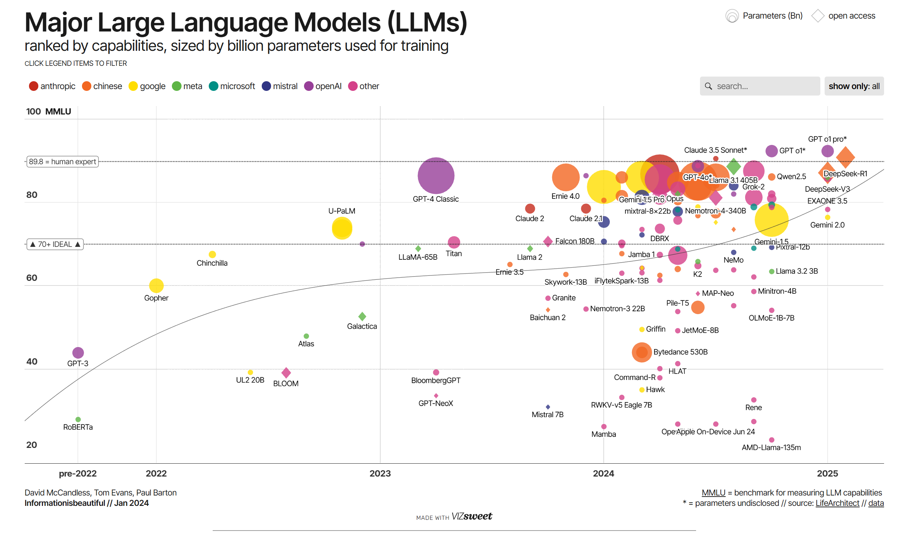
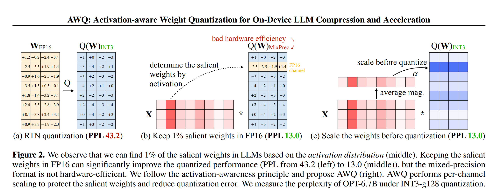
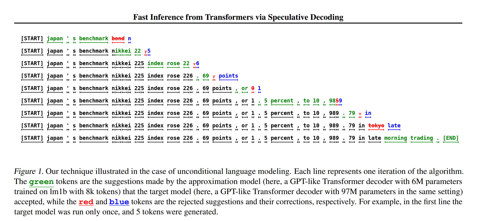
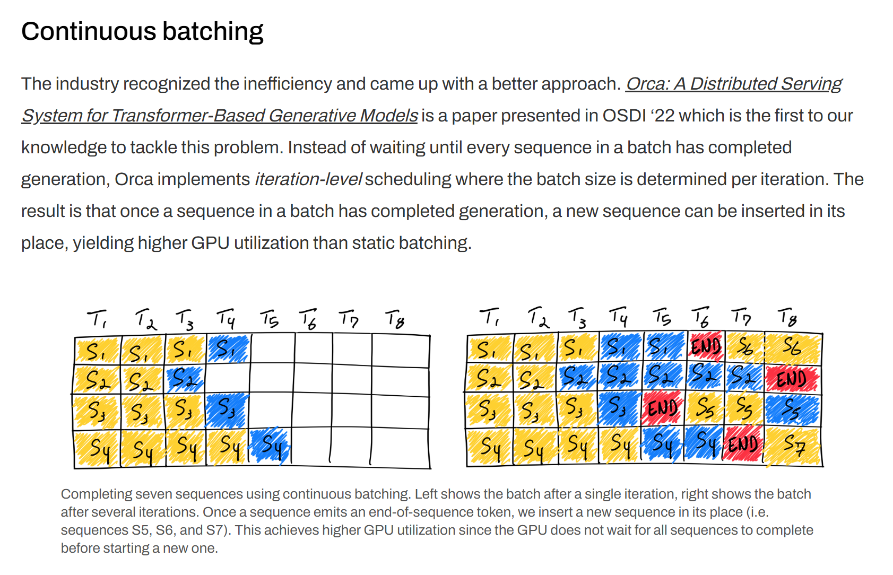

## Agenda

- Introduction to LLM Inference
- API-Based vs Self-Hosted Serving
- Inference Servers & Engines
  - vLLM, SGLang, TensorRT-LLM, Ollama
- Quantization Techniques
  - Post-Training Quantization
  - Quantization-Aware Training
  - Weight-Only Quantization
  - Activation-Aware Quantization
- Model Distillation
- Speculative Decoding
- KV Cache Optimization
- Flash Attention
- Pruning & Sparse Inference
- Tensor Parallelism & Sharding
- Continuous Batching
- Hands-on Lab
- References & Further Reading

---

## Introduction to LLM Inference

:::: {.columns}

::: {.column width="60%"}
- LLMs are computationally expensive to serve
  - Frontier models (GPT-5 family, Claude Opus 4.x, Gemini 3) run on large GPU clusters
  - Even "small" open-weight models (Llama 4, Qwen 3, DeepSeek-V3 distills) need careful serving
- Inference optimization is critical for:
  - Reducing latency
  - Decreasing memory footprint
  - Lowering deployment costs
  - Enabling edge deployment
:::

::: {.column width="40%"}

[Source: Information is beautiful](https://informationisbeautiful.net/visualizations/the-rise-of-generative-ai-large-language-models-llms-like-chatgpt/)
:::

::::

**Key metrics**: Time-to-first-token (TTFT), Time-per-output-token (TPOT), Throughput (TPS), Memory, Cost per 1M tokens

---

## Two Phases of LLM Inference

- **Prefill**: Process the entire prompt in parallel
  - Compute-bound; determines time-to-first-token (TTFT)
- **Decode**: Generate output tokens one at a time
  - Memory-bandwidth-bound; determines time-per-output-token (TPOT)
- Each generated token requires reading **all model weights** plus the **KV cache**
- Most optimization techniques target one phase or the other
  - Batching and parallelism help prefill throughput
  - Quantization, KV cache tricks, and speculative decoding help decode

---

## API-Based vs Self-Hosted Serving

| Aspect | API-Based (OpenAI, Anthropic, Bedrock, Gemini) | Self-Hosted (vLLM, SGLang, TensorRT-LLM) |
|--------|------------------------------------------------|------------------------------------------|
| **Setup** | Minutes -- API key and go | Days -- GPUs, drivers, serving stack |
| **Models** | Frontier proprietary models | Open-weight models (Llama, Qwen, DeepSeek, Mistral) |
| **Cost model** | Pay per token | Pay for GPU time (fixed capacity) |
| **Data control** | Data leaves your environment (contract-dependent) | Full control, VPC/on-prem |
| **Customization** | Prompting, some fine-tuning APIs | Full: quantization, LoRA adapters, custom decoding |
| **Scaling** | Provider handles it | You handle autoscaling, capacity planning |

**Rule of thumb**: Start with APIs; self-host when volume, latency, data residency, or customization justify the operational cost.

---

## Inference Servers & Engines {.center}

The serving layer between your model weights and your users

---

## vLLM

:::: {.columns}

::: {.column width="60%"}
- The de facto open-source LLM serving engine
- **PagedAttention**: Manages KV cache in non-contiguous blocks (like OS virtual memory)
- **Continuous batching**: Requests join/leave batches at each iteration
- OpenAI-compatible API server out of the box
- Supports quantized checkpoints (GPTQ, AWQ, FP8), LoRA adapters, tensor/pipeline parallelism, speculative decoding
:::

::: {.column width="40%"}
```bash
# Serve an open-weight model
# with an OpenAI-compatible API
vllm serve meta-llama/Llama-3.1-8B-Instruct \
  --tensor-parallel-size 2 \
  --max-model-len 8192
```

```python
from openai import OpenAI

client = OpenAI(
    base_url="http://localhost:8000/v1",
    api_key="not-needed",
)
resp = client.chat.completions.create(
    model="meta-llama/Llama-3.1-8B-Instruct",
    messages=[{"role": "user",
               "content": "Hello!"}],
)
```
:::

::::

---

## SGLang

- High-performance serving engine originally from LMSYS
- **RadixAttention**: Automatic KV cache reuse across requests via a radix tree of shared prefixes
  - Big wins for agentic workloads: shared system prompts, few-shot templates, tool schemas
- Structured generation: constrained decoding for JSON/grammar outputs
- Strong multi-GPU and large-scale deployment support; used in production for DeepSeek and Llama serving
- Also exposes an OpenAI-compatible API

**When to choose SGLang over vLLM**: Heavy prefix sharing (agents, RAG templates) and structured output workloads

---

## TensorRT-LLM and Ollama

### TensorRT-LLM (NVIDIA)
- Compiles models into optimized TensorRT engines for NVIDIA GPUs
- Best raw performance on NVIDIA hardware (kernel fusion, FP8/FP4 on newer GPUs)
- More operational complexity: engine builds per model/GPU/config
- Often paired with NVIDIA Dynamo/Triton for serving

### Ollama (local-first)
- One-command local inference: `ollama run llama3.1`
- Built on llama.cpp; runs GGUF-quantized models on CPUs and consumer GPUs (including Apple Silicon)
- Great for development, demos, and privacy-sensitive local use
- Not designed for high-throughput multi-user production serving

---

## Choosing a Serving Stack

| Scenario | Recommended |
|----------|-------------|
| Prototyping / laptop | Ollama, llama.cpp |
| Production self-hosted, general | vLLM |
| Agentic / heavy prefix reuse / structured output | SGLang |
| Maximum performance on NVIDIA fleet | TensorRT-LLM |
| No ops team, variable traffic | Managed APIs (Bedrock, OpenAI, Anthropic, Vertex) |

- All major open-source servers expose **OpenAI-compatible APIs** -- application code stays portable
- The rest of this lecture covers the **techniques these engines implement** under the hood

---

## Post-Training Quantization (PTQ)

:::: {.columns}

::: {.column width="60%"}
- Applied after model training is complete
- Reduces precision of weights/activations
  - FP32 → FP16 / BF16 / FP8 / INT8 / INT4
- No retraining required
- Minimal accuracy loss with proper calibration
- Example: NVIDIA TensorRT Model Optimizer, ONNX Runtime

**Trade-offs**: Quick to implement but may introduce accuracy degradation
:::

::: {.column width="40%"}
```python
# PyTorch example
import torch

# Original model (FP32)
model_fp32 = load_model()

# Quantize to INT8
model_int8 = torch.quantization.quantize_dynamic(
    model_fp32,
    {torch.nn.Linear},
    dtype=torch.qint8
)
```
:::

::::

---

## Quantization-Aware Training (QAT)

:::: {.columns}

::: {.column width="60%"}
- Simulates quantization effects during training
- Model learns to be robust to quantization noise
- Typically better performance than PTQ
- Requires retraining the model
- Frameworks: PyTorch, HuggingFace Optimum

**Key advantage**: Better quality-performance trade-off
:::

::: {.column width="40%"}
```python
# PyTorch QAT example
import torch

# Prepare model for QAT
model.train()
model_qat = torch.quantization.prepare_qat(
    model, 
    inplace=False
)

# Train with quantization in the loop
train_loop(model_qat, train_data)

# Convert to quantized model
model_quantized = torch.quantization.convert(
    model_qat, 
    inplace=False
)
```
:::

::::

---

## Weight-Only Quantization

:::: {.columns}

::: {.column width="60%"}
- Quantizes only the model weights, not activations
- Popular for LLMs (GPTQ, GGUF, AWQ)
- Less intrusive than full quantization
- Typical formats: INT8, INT4, or mixed precision
- Significant memory reduction with minimal quality loss
- Enables running models on consumer hardware

**Example**: An 8B model drops from ~16GB (FP16) to ~4.5GB (INT4)
:::

::: {.column width="40%"}
```python
# 4-bit loading with HuggingFace
from transformers import (
    AutoModelForCausalLM,
    BitsAndBytesConfig,
)

model = AutoModelForCausalLM.from_pretrained(
    "meta-llama/Llama-3.1-8B-Instruct",
    device_map="auto",
    quantization_config=BitsAndBytesConfig(
        load_in_4bit=True,
        bnb_4bit_quant_type="nf4",
    ),
)
```
:::

::::

---

## Activation-Aware Quantization

:::: {.columns}

::: {.column width="60%"}
- Considers activation distributions when quantizing weights
- Balances weight precision based on activation sensitivity
- Examples: Activation-aware Weight Quantization (AWQ)
- Optimizes quantization per channel/tensor
- Preserves performance on critical network paths

**Key insight**: Not all weights equally impact model performance
:::

::: {.column width="40%"}

[Source: AWQ paper](https://arxiv.org/pdf/2306.00978)

```python
# Conceptual AWQ process
# 1. Identify activation-sensitive weights
# 2. Apply higher precision to sensitive weights
# 3. Use lower precision for less sensitive weights
```
:::

::::

---

## Model Distillation

:::: {.columns}

::: {.column width="60%"}
- Transfers knowledge from larger teacher to smaller student
- Student mimics teacher's behavior, not architecture
- Types:
  - Response-based (output matching)
  - Feature-based (intermediate layers)
  - Relation-based (attention maps)
- Modern examples: DeepSeek-R1 distilled models (reasoning traces distilled into Qwen/Llama students), Gemini Flash-class models

**Results**: Large size reduction while retaining most task performance
:::

::: {.column width="40%"}
```python
# Distillation loss example
def distillation_loss(student_logits, 
                      teacher_logits, 
                      temperature=2.0):
    """
    KL divergence between teacher and 
    student softmax distributions
    """
    soft_teacher = F.softmax(
        teacher_logits / temperature, 
        dim=-1
    )
    soft_student = F.softmax(
        student_logits / temperature, 
        dim=-1
    )
    return F.kl_div(
        F.log_softmax(soft_student, dim=-1),
        soft_teacher,
        reduction='batchmean'
    ) * (temperature ** 2)
```
:::

::::

---

## Speculative Decoding

:::: {.columns}

::: {.column width="60%"}
- Uses smaller draft model to predict tokens
- Validates with larger target model in parallel
- Dramatically increases generation speed (2-3x)
- Examples: 
  - EAGLE (feature-level drafting)
  - Medusa (multiple decoding heads)
  - Lookahead decoding
- Supported natively in vLLM, SGLang, and TensorRT-LLM

**Key idea**: Smaller models can accurately predict some tokens; verification is parallel and lossless
:::

::: {.column width="40%"}

[Source: Speculative Decoding paper](https://arxiv.org/pdf/2211.17192)

1. Draft model generates K tokens
2. Target model verifies predictions
3. Accept correct predictions
4. Regenerate from first incorrect token
:::

::::

---

## KV Cache Optimization

:::: {.columns}

::: {.column width="60%"}
- KV cache: Stored key-value pairs from attention layers
- Grows linearly with sequence length
- Optimization approaches:
  - PagedAttention (vLLM) -- block-based allocation
  - Prefix caching / RadixAttention (SGLang) -- reuse across requests
  - Attention sinks (preserve important tokens)
  - Sliding window attention
  - Grouped-Query Attention (GQA) and Multi-head Latent Attention (MLA, DeepSeek) shrink the cache architecturally
  
**Impact**: KV cache, not weights, is often what limits batch size at long context
:::

::: {.column width="40%"}
```python
# Conceptual sliding window attention
def sliding_window_attention(
    query, key, value, window_size=1024
):
    seq_len = query.shape[1]
    
    if seq_len <= window_size:
        # Standard attention
        return standard_attention(query, key, value)
    
    # Only attend to recent window_size tokens
    recent_keys = key[:, -window_size:, :]
    recent_values = value[:, -window_size:, :]
    
    return standard_attention(
        query, recent_keys, recent_values
    )
```
:::

::::

---

## Pruning

:::: {.columns}

::: {.column width="60%"}
- Removes redundant weights/neurons/attention heads
- Types:
  - Unstructured: Individual weights
  - Structured: Entire neurons/heads/layers
  - Magnitude-based: Remove smallest weights
  - Importance-based: Remove least impactful units
- Iterative process: prune → fine-tune → repeat

**Results**: 30-90% parameter reduction possible
:::

::: {.column width="40%"}
```python
# PyTorch example: magnitude pruning
import torch.nn.utils.prune as prune

# Prune 30% of weights by magnitude
prune.l1_unstructured(
    module.weight, 
    name="weight", 
    amount=0.3
)

# Make pruning permanent
prune.remove(module, "weight")

# Fine-tune the pruned model
train_loop(model, train_data)
```
:::

::::

---

## Sparse Inference

:::: {.columns}

::: {.column width="60%"}
- Exploits sparsity in model architecture
- Approaches:
  - Sparse attention patterns (BigBird, Longformer)
  - Mixture of Experts (MoE) -- now mainstream: DeepSeek-V3, Llama 4, Qwen 3 MoE variants
  - Structured sparsity (block sparsity)
  - Dynamic computation paths
- Hardware acceleration: NVIDIA Sparse Tensor Cores

**Why MoE matters for inference**: Only a fraction of parameters are active per token -- large capacity at small per-token compute
:::

::: {.column width="40%"}
```python
# Mixture of Experts conceptual example
class SparselyGatedMoE(nn.Module):
    def __init__(self, input_size, output_size, 
                 num_experts=8, k=2):
        # Initialize experts and router
        self.experts = nn.ModuleList([
            nn.Linear(input_size, output_size) 
            for _ in range(num_experts)
        ])
        self.router = nn.Linear(input_size, num_experts)
        self.k = k  # Top-k experts to use
        
    def forward(self, x):
        # Get router scores and select top-k experts
        router_logits = self.router(x)
        k_logits, indices = router_logits.topk(self.k)
        # Only compute selected expert outputs
        # ...
```
:::

::::

---

## Tensor Parallelism & Sharding

:::: {.columns}

::: {.column width="60%"}
- Distributes model across multiple devices
- Types:
  - Tensor Parallelism: Split individual layers
  - Pipeline Parallelism: Different layers on different devices
  - Expert Parallelism: MoE experts on different devices
  - Zero Redundancy Optimizer (ZeRO): Shard optimizer states (training)
- Frameworks: vLLM/SGLang (serving), DeepSpeed, Megatron-LM, PyTorch FSDP

**Benefits**: Enables inference of models too large for single GPU
:::

::: {.column width="40%"}

[Source: Hugging Face](https://huggingface.co/blog/huseinzol05/tensor-parallelism)

**Example**: 
- Serving a 405B-parameter model
- 8+ GPUs with tensor parallelism
- Each GPU holds a shard of every layer
- Coordinated through collective communication
:::

::::

---

## Flash Attention

:::: {.columns}

::: {.column width="60%"}
- Optimizes attention computation for transformers
- Key benefits:
  - Reduces memory I/O cost through tiling and recomputation
  - Never materializes the full attention matrix
  - Works with causal/bidirectional/cross-attention
- FlashAttention-2 and FlashAttention-3 (Hopper GPUs): further hardware-aware optimizations
- Now the default attention implementation in most serving stacks

**Impact**: 2-4x faster attention computation, enables longer contexts
:::

::: {.column width="40%"}
```python
# Using Flash Attention in PyTorch
from flash_attn import flash_attn_func

# Replace standard attention with:
attn_output = flash_attn_func(
    q,            # query
    k,            # key
    v,            # value
    dropout_p=0.0,
    causal=True   # for decoder-only models
)

# With HuggingFace Transformers:
model = AutoModelForCausalLM.from_pretrained(
    "meta-llama/Llama-3.1-8B-Instruct",
    attn_implementation="flash_attention_2"
)
```
:::

::::

---

## Continuous Batching / Dynamic Batching

:::: {.columns}

::: {.column width="60%"}
- Traditional batching: wait for batch to fill
- Continuous batching: process requests as they arrive
- Techniques:
  - Iteration-level scheduling
  - Paged Attention (vLLM)
  - Chunked prefill (mix prefill and decode in one step)
- Dramatically improves throughput at scale

**Impact**: 2-10x throughput improvement over static batching
:::

::: {.column width="40%"}

[Continuous Batching](https://www.anyscale.com/blog/continuous-batching-llm-inference)

**Key metrics**:
- Time-to-first-token (TTFT)
- Time-per-output-token (TPOT)
- Tokens-per-second (TPS)
- Cost per 1M tokens
:::

::::

---

## Hands-on Lab

### Serving an Open-Weight Model

*Practical exercise and demonstration*

1. **Local inference**: Run a quantized model with Ollama; inspect memory usage
2. **Production serving**: Launch vLLM with an OpenAI-compatible endpoint
3. **Measure**: TTFT, TPOT, and throughput under concurrent load
4. **Compare**: Same prompts against a hosted API -- latency, cost per 1M tokens
5. **Experiment**: Toggle quantization and max batch size; observe the trade-offs

---

## References

**Serving Engines:**

- [vLLM Documentation](https://docs.vllm.ai/)
- [SGLang Documentation](https://docs.sglang.ai/)
- [NVIDIA TensorRT-LLM](https://nvidia.github.io/TensorRT-LLM/)
- [Ollama](https://ollama.com/)

**Papers & Techniques:**

- [PagedAttention / vLLM paper](https://arxiv.org/abs/2309.06180)
- [Speculative Decoding paper](https://arxiv.org/abs/2211.17192)
- [AWQ paper](https://arxiv.org/abs/2306.00978)
- [FlashAttention paper](https://arxiv.org/abs/2205.14135)

**Further Reading:**

- [Continuous Batching (Anyscale blog)](https://www.anyscale.com/blog/continuous-batching-llm-inference)
- [HuggingFace -- Quantization docs](https://huggingface.co/docs/transformers/quantization)
