## Agenda {.smaller}

- How LLMs Work: Transformer Fundamentals
  - Embeddings, self-attention, and QKV
  - Sampling and inference parameters
  - Reasoning models
- Introduction to LLM Inference
- API-Based vs Self-Hosted Serving
- Inference Servers & Engines (vLLM, SGLang, TensorRT-LLM, Ollama)
- Quantization (PTQ, weight-only, AWQ)
- Further compression: QAT, pruning, sparsity and MoE
- Model Distillation and Speculative Decoding
- KV Cache Optimization and Flash Attention
- Tensor Parallelism & Sharding, Continuous Batching
- Hands-on Lab
- References & Further Reading

# How LLMs Work: Transformer Fundamentals

## NLP prior to embeddings and transformers

- **Pre-Embedding NLP Representations: Bag of Words**
  - Discrete, non-contextual representation of text
  - Treats documents as unordered collections of words
  - Loses semantic meaning and word order
  - High dimensionality with sparse vectors
  - No understanding of word relationships


## Origins of Modern Embeddings
  - Word2Vec paper: [Efficient Estimation of Word Representations in Vector Space](https://arxiv.org/abs/1301.3781), [Explainer video for word embeddings](https://www.youtube.com/watch?v=wgfSDrqYMJ4)
  - Breakthrough in sequence-to-sequence learning
  - Replaced previous RNN and LSTM architectures
  - Enabled dense, contextual word representations
  - Captured semantic relationships between words

## Two Prerequisites for Understanding LLMs

To understand what an LLM does, you need two ideas first:

1. **Word embeddings** -- how a model turns words into numbers that carry meaning
2. **Transformers** -- the architecture that turns those numbers into predictions

The next slides explain each one at three depths, laid out left to right: start at the 100 level, then click to reveal 200 and 300.

## Prerequisite 1: Word Embeddings {.smaller}

:::: {.columns}

::: {.column width="33%"}
**100 level**

Each word becomes a vector: a list of numbers. Words with similar meanings get nearby vectors. "King" sits near "queen" and far from "carburetor".
:::

::: {.column width="33%" .fragment}
**200 level**

The space has hundreds of dimensions. The model learns the vectors from co-occurrence: words used in similar contexts land near each other. Directions carry meaning: king - man + woman lands near queen.
:::

::: {.column width="33%" .fragment}
**300 level**

Word2Vec and GloVe give each word one fixed vector, so both senses of "bank" share it. Transformers rewrite each token's vector layer by layer using context. The embedding table itself is a learned parameter.
:::

::::

::: {.fragment}
Read this slide first, then watch the [explainer video](https://www.youtube.com/watch?v=5MaWmXwxFNQ). It runs about 20 minutes.
:::

## Prerequisite 2: Transformers {.smaller}

:::: {.columns}

::: {.column width="33%"}
**100 level**

A transformer reads all tokens at once and predicts the next one. Attention lets every token look at every other token and decide which ones matter for its meaning.
:::

::: {.column width="33%" .fragment}
**200 level**

Each token emits a query, a key, and a value. Query-key matches become weights through softmax, and each token's new vector is a weighted sum of the values. Heads learn different relations; stacked layers refine the picture.
:::

::: {.column width="33%" .fragment}
**300 level**

$softmax(\frac{QK^T}{\sqrt{d_k}})V$ with a causal mask, so a token sees only its past. Each block pairs attention with an MLP inside residuals and layer norm. GPT, Claude, and Llama are decoder-only stacks of these blocks.
:::

::::

::: {.fragment}
Read this slide first, then watch the [explainer video](https://www.youtube.com/watch?v=_UVfwBqcnbM). It runs about 20 minutes.
:::

## Core Components of Transformer Architecture

1. Introduced in "Attention Is All You Need" (Google, 2017). [Paper](https://arxiv.org/abs/1706.03762), [Explainer video](https://www.youtube.com/watch?v=iDulhoQ2pro) and also [this video](https://www.youtube.com/watch?v=5MaWmXwxFNQ)

1. **MUST READ**: [The Illustrated Transformer](https://jalammar.github.io/illustrated-transformer/)
1. **Interactive Tool**: [Transformer Explainer](https://poloclub.github.io/transformer-explainer/) - Visual, interactive exploration of transformer architecture
1. Key Building Blocks

    1. **Self-Attention Mechanism**
       - Allows model to weigh importance of different parts of input
       - Captures contextual relationships dynamically
       - Enables parallel processing of entire sequences

    1. **Positional Encoding**
       - Adds location information to input embeddings
       - Crucial for understanding sequence order
       - Enables models to understand context beyond word positioning


## Example: Turning a Position into Numbers {.smaller}

:::: {.columns}

::: {.column width="40%"}
The model needs "this is word number 5" as numbers. Using 5 itself fails: the values grow without bound, and position 5 and position 50,000 land on wildly different scales.

The trick: read the position off several clocks that tick at different speeds. Each clock contributes two numbers, $\sin(t/\lambda)$ and $\cos(t/\lambda)$, for its wavelength $\lambda$.

::: {.fragment}
In the figure, position 5 reads one value off each wave; the readings together form the position vector. The fast clock separates word 5 from word 6. The slow clock says "early in the document". Every value stays between -1 and 1 no matter how long the text.
:::

::: {.fragment}
Move forward $k$ words and every clock hand turns by a fixed angle. Relative distance becomes a rotation, which the model learns to read -- and which RoPE later applies directly to queries and keys.
:::
:::

::: {.column width="60%"}
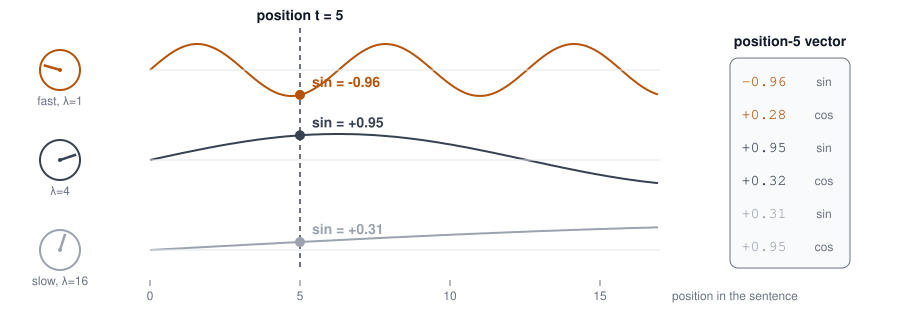{width=100%}
:::

::::

## Positional Embeddings: 100 to 300 {.smaller}

:::: {.columns}

::: {.column width="33%"}
**100 level**

Attention alone ignores word order: "man bites dog" and "dog bites man" would look identical. The fix: add a position vector to every token vector.
:::

::: {.column width="33%" .fragment}
**200 level**

The original transformer used fixed sine and cosine waves as position vectors. GPT-2 learned one vector per position instead. Both add element-wise to the token embedding before layer 1.
:::

::: {.column width="33%" .fragment}
**300 level**

Modern LLMs (Llama, Qwen, DeepSeek) use RoPE: rotate each query and key by an angle set by its position. Position becomes relative, which holds up better on long contexts.
:::

::::

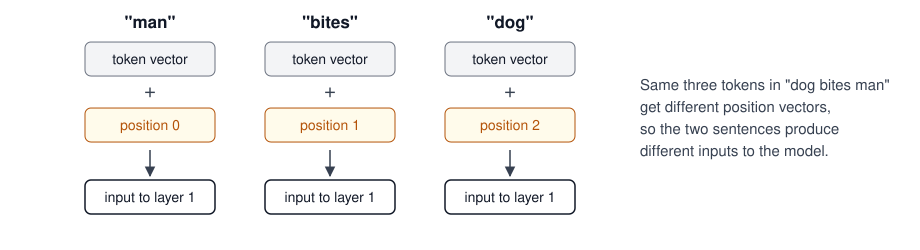{height=230 fig-align="center"}

## The Attention Mechanism: 100 to 300 {.smaller}

:::: {.columns}

::: {.column width="33%"}
**100 level**

Each token asks one question: which other tokens do I need to understand my meaning? Below, "it" attends hard to "cat" and barely to "milk".
:::

::: {.column width="33%" .fragment}
**200 level**

Query-key dot products score every token pair. Softmax turns scores into weights, and each token's new vector is the weighted sum of the values (pipeline at the right of the figure).
:::

::: {.column width="33%" .fragment}
**300 level**

Heads run in parallel and learn different relations: syntax, coreference, position. A causal mask hides future tokens. Cost grows with the square of sequence length; KV caching and Flash Attention (later today) attack exactly that.
:::

::::

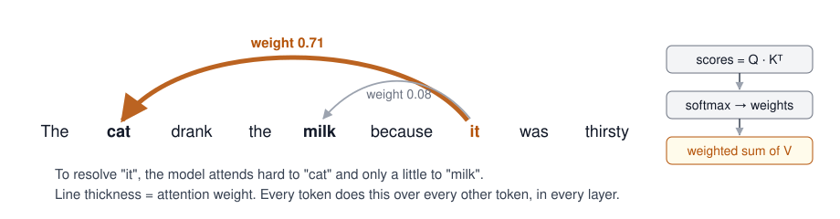{height=220 fig-align="center"}

## Example: One Attention Step, By Hand {.smaller}

Follow one token, "sat", through attention in the sentence "the cat sat". Every vector here has just 2 numbers so we can do the arithmetic ourselves.

Each token derives three vectors from its embedding $x$ using three learned weight matrices: a query $q = xW_q$ (what I am looking for), a key $k = xW_k$ (what I advertise), and a value $v = xW_v$ (the content I hand over if selected). The $v$ column in the figure is each token's value vector.

:::: {.columns}

::: {.column width="38%"}
1. "sat" asks with its query: $q = [1, 2]$
2. Every token answers with its key. The dot product $q \cdot k^T$ scores each match: "the" scores 2, "cat" scores 4, "sat" scores 3. Stack all the keys into a matrix $K$ and these scores are exactly the $QK^T$ from the attention formula

::: {.fragment}
3. Softmax turns scores into weights: 0.09, 0.67, 0.24. "sat" puts two thirds of its attention on "cat"
4. The new "sat" vector is the weighted sum of the value vectors: $[0.58, 1.82]$. Attention never mixes queries or keys into the output -- they only decide the weights; the values carry the content
:::

::: {.fragment}
A real model runs this same arithmetic with thousands of dimensions, dozens of heads, and every token at once.
:::
:::

::: {.column width="62%"}
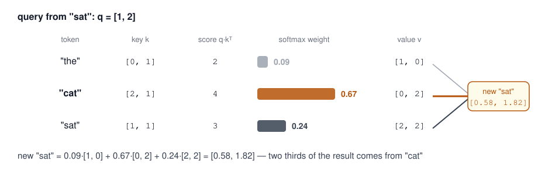{width=100%}
:::

::::

## Multi-Head Attention and the Scaling Detail

- Our by-hand example skipped one step: real attention divides every score by $\sqrt{d_k}$ before softmax
  - With hundreds of dimensions, raw dot products grow large and softmax saturates -- scaling keeps the weights spread out
  - Full formula: $Attention(Q,K,V) = softmax(\frac{QK^T}{\sqrt{d_k}})V$
- **Multi-head attention**: split Q, K, V into several heads, each with its own learned $W_q, W_k, W_v$ (GPT-2 uses 12)
  - Each head learns a different relation: syntax, coreference, position
  - Head outputs concatenate and project back to model width
- One attention "layer" is really many small attention functions running in parallel

## Transformer Architecture: Encoder and Decoder {.smaller}

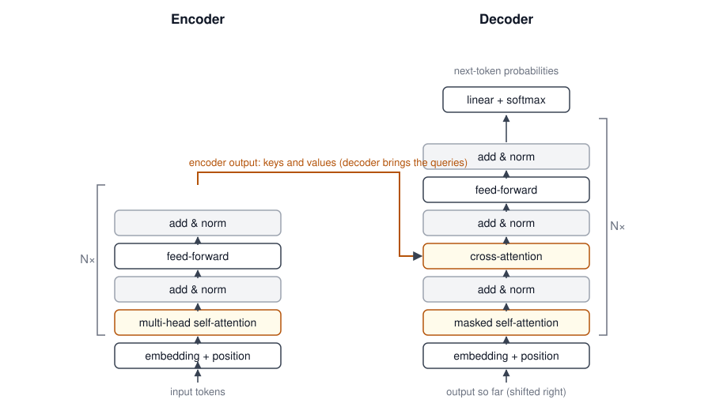{height=430 fig-align="center"}

**Decoder-only models** (GPT, Claude, Llama) keep only the right-hand stack, drop cross-attention, and predict the next token with causal attention -- today's dominant LLM architecture.

## Transformers: Strengths and Limits

:::: {.columns}

::: {.column width="50%"}
### Strengths

- Process all tokens in parallel -- RNNs could not, so training scales to trillions of tokens
- Capture relationships between distant tokens
- Scale predictably with more data and compute
:::

::: {.column width="50%"}
### Limits

- Attention cost grows with the **square** of sequence length
- Memory hungry: weights plus a KV cache that grows with context
- Mitigations -- Flash Attention, PagedAttention, continuous batching, MoE, quantization, distillation -- are the second half of this lecture
:::

::::

## Sampling: How Models Pick the Next Token {.smaller}

- The model outputs a **probability distribution** over the vocabulary; sampling turns it into text
- **Greedy decoding**: always pick the most likely token -- deterministic but repetitive
- **Temperature** (0-1+): rescales the distribution; lower = more deterministic, higher = more varied
- **Top-k**: sample only from the k most likely tokens
- **Top-p (nucleus)**: sample from the smallest set of tokens whose cumulative probability exceeds p
- **Stop sequences**: strings that end generation (e.g., Llama's `<|eot_id|>`)
- You set all of these per request: `temperature`, `top_k`, `top_p`, and `stop` are standard API parameters on every provider and serving engine

## Reasoning Models

- Models that think before answering: they spend extra inference-time compute on a chain of thought before the reply
- **Examples (H2 2026)**: OpenAI GPT-5.x reasoning modes, Anthropic Claude 5 family with extended thinking, DeepSeek-R1 lineage, Qwen thinking modes, Moonshot Kimi K3
- **Where they earn their keep**: hard code generation and debugging, multi-step problems, math and logic
- **The inference bill**: thinking tokens are output tokens
  - More latency before the answer and a larger bill per request
  - Effort controls (low/medium/high) trade quality against cost -- we price this out in Week 8 (Tokenomics)

# Inference and Serving at Scale

## Why Inference, Not Training

- This course covers **inference**. Model training is out of scope
- Training a frontier model is the domain of a handful of labs, and maybe a few very large enterprises -- thousand-GPU clusters and nine-figure runs
- Enterprises do **fine-tune** models (Week 11), but fine-tuning adapts a model that someone else already trained
- The spending tells the story: a model trains **once**, then serves **forever**
  - Training cost plateaus per model; inference spend keeps compounding -- every user, every agent loop, every reasoning token adds to it
- Inference concerns everyone who ships an AI feature: latency, throughput, and cost per token are now **your** problems -- that is the rest of today


## Introduction to LLM Inference

:::: {.columns}

::: {.column width="60%"}
- LLMs are computationally expensive to serve
  - Frontier models (GPT-5 family, Claude 5 family, Gemini 3) run on large GPU clusters
  - Even "small" open-weight models (Llama 4, Qwen 3, DeepSeek-V3 distills) need careful serving
- Inference optimization is critical for:
  - Reducing latency
  - Decreasing memory footprint
  - Lowering deployment costs
  - Enabling edge deployment
:::

::: {.column width="40%"}

[Source: Information is beautiful](https://informationisbeautiful.net/visualizations/the-rise-of-generative-ai-large-language-models-llms-like-chatgpt/)
:::

::::

**Key metrics**: Time-to-first-token (TTFT), Time-per-output-token (TPOT), Throughput (TPS), Memory, Cost per 1M tokens

---

## Two Phases of LLM Inference {.smaller}

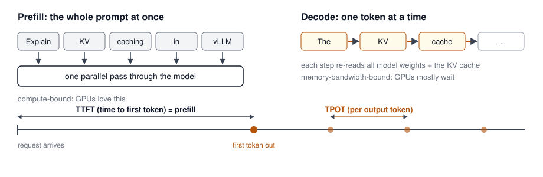{height=280 fig-align="center"}

- Most optimization techniques target one phase or the other: batching and parallelism speed up **prefill**; quantization, KV cache tricks, and speculative decoding speed up **decode**

---

## API-Based vs Self-Hosted Serving

| Aspect | API-Based (OpenAI, Anthropic, Bedrock, Gemini) | Self-Hosted (vLLM, SGLang, TensorRT-LLM) |
|--------|------------------------------------------------|------------------------------------------|
| **Setup** | Minutes -- API key and go | Days -- GPUs, drivers, serving stack |
| **Models** | Frontier proprietary models | Open-weight models (Llama, Qwen, DeepSeek, Mistral) |
| **Cost model** | Pay per token | Pay for GPU time (fixed capacity) |
| **Data control** | Data leaves your environment (contract-dependent) | Full control, VPC/on-prem |
| **Customization** | Prompting, some fine-tuning APIs | Full: quantization, LoRA adapters, custom decoding |
| **Scaling** | Provider handles it | You handle autoscaling, capacity planning |

**Rule of thumb**: Start with APIs; self-host when volume, latency, data residency, or customization justify the operational cost.

---

## Inference Servers & Engines {.center}

The serving layer between your model weights and your users

---

## vLLM

:::: {.columns}

::: {.column width="60%"}
- The default choice for open-source LLM serving
- **PagedAttention**: Manages KV cache in non-contiguous blocks (like OS virtual memory)
- **Continuous batching**: Requests join/leave batches at each iteration
- OpenAI-compatible API server out of the box
- Supports quantized checkpoints (GPTQ, AWQ, FP8), LoRA adapters, tensor/pipeline parallelism, speculative decoding
:::

::: {.column width="40%"}
```bash
# Serve an open-weight model
# with an OpenAI-compatible API
vllm serve Qwen/Qwen3-8B \
  --tensor-parallel-size 2 \
  --max-model-len 8192
```

```python
from openai import OpenAI

client = OpenAI(
    base_url="http://localhost:8000/v1",
    api_key="not-needed",
)
resp = client.chat.completions.create(
    model="Qwen/Qwen3-8B",
    messages=[{"role": "user",
               "content": "Hello!"}],
)
```
:::

::::

---

## SGLang

- High-performance serving engine originally from LMSYS
- **RadixAttention**: Automatic KV cache reuse across requests via a radix tree of shared prefixes
  - Big wins for agentic workloads: shared system prompts, few-shot templates, tool schemas
- Structured generation: constrained decoding for JSON/grammar outputs
- Strong multi-GPU and large-scale deployment support; used in production for DeepSeek and Llama serving
- Also exposes an OpenAI-compatible API

**When to choose SGLang over vLLM**: Heavy prefix sharing (agents, RAG templates) and structured output workloads

---

## TensorRT-LLM (NVIDIA)

- Compiles models into optimized TensorRT engines for NVIDIA GPUs
- Best raw performance on NVIDIA hardware (kernel fusion, FP8/FP4 on newer GPUs)
- More operational complexity: engine builds per model/GPU/config
- Often paired with NVIDIA Dynamo/Triton for serving

## Aside: Model File Formats -- Safetensors and GGUF {.smaller}

A model on disk is billions of weights plus metadata. The file format decides who can load it, how fast, and how safely.

- **Safetensors** (Hugging Face) -- the standard for GPU serving
  - Stores raw tensors and nothing else; replaced pickle-based PyTorch `.bin` files, which could run arbitrary code on load
  - Memory-mapped for fast loading; typically FP16/BF16 shards
  - What vLLM, SGLang, and `transformers` expect; quantized variants (GPTQ, AWQ, FP8) ship in it too
- **GGUF** (llama.cpp ecosystem) -- the standard for local inference
  - One self-contained file: weights, tokenizer, and metadata together
  - Built for quantized models (`Q4_K_M`, `Q8_0`, ...) on CPUs and Apple Silicon
  - What Ollama, llama.cpp, and LM Studio consume
- Same model, two containers: Qwen3-8B ships as safetensors on Hugging Face, and the community publishes GGUF conversions for local use

## Ollama

- One command to run a model on your laptop: `ollama run qwen3:8b`
- Built on llama.cpp; runs GGUF-quantized models on CPUs and consumer GPUs, including Apple Silicon
- Model library with one-line pulls; a `Modelfile` defines custom variants
- Serves an OpenAI-compatible API on `localhost:11434` -- the same client code you use everywhere else
- Built for development, demos, privacy-sensitive local work, and this week's lab
- Single-user by design: no continuous batching, so it is the wrong tool for concurrent production traffic

## Ollama vs vLLM: Which One, When?

| | Ollama | vLLM |
|---|--------|------|
| **Built for** | One developer, one machine | Many users, production serving |
| **Hardware** | CPU, Apple Silicon, consumer GPUs | Data-center GPUs |
| **Model format** | GGUF (quantized) | HF safetensors, GPTQ/AWQ/FP8 |
| **Throughput** | Single stream | Continuous batching + PagedAttention |
| **Setup** | One command | GPUs, drivers, serving config |
| **API** | OpenAI-compatible | OpenAI-compatible |

**Rule of thumb**: prototype against Ollama, deploy on vLLM -- the client code does not change. This week's lab has you do exactly this walk.

---

## Choosing a Serving Stack

| Scenario | Recommended |
|----------|-------------|
| Prototyping / laptop | Ollama, llama.cpp |
| Production self-hosted, general | vLLM |
| Agentic / heavy prefix reuse / structured output | SGLang |
| Maximum performance on NVIDIA fleet | TensorRT-LLM |
| No ops team, variable traffic | Managed APIs (Bedrock, OpenAI, Anthropic, Vertex) |

- All major open-source servers expose **OpenAI-compatible APIs** -- application code stays portable
- The rest of this lecture covers the **techniques these engines implement** under the hood

---

## Post-Training Quantization (PTQ)

:::: {.columns}

::: {.column width="60%"}
- Applied after model training is complete
- Reduces precision of weights/activations
  - FP32 → FP16 / BF16 / FP8 / INT8 / INT4
- No retraining required
- Minimal accuracy loss with proper calibration
- Tools: llm-compressor (vLLM project), NVIDIA TensorRT Model Optimizer

**Trade-offs**: Quick to implement but may introduce accuracy degradation
:::

::: {.column width="40%"}
```python
# FP8 PTQ with llm-compressor,
# then serve directly with vLLM
from llmcompressor import oneshot
from llmcompressor.modifiers.quantization import (
    QuantizationModifier,
)

oneshot(
    model="Qwen/Qwen3-8B",
    recipe=QuantizationModifier(
        targets="Linear",
        scheme="FP8_DYNAMIC",
        ignore=["lm_head"],
    ),
    output_dir="Qwen3-8B-FP8",
)
```
:::

::::

---

## Weight-Only Quantization

:::: {.columns}

::: {.column width="60%"}
- Quantizes only the model weights, not activations
- Popular for LLMs (GPTQ, GGUF, AWQ)
- Less intrusive than full quantization
- Typical formats: INT8, INT4, or mixed precision
- Significant memory reduction with minimal quality loss
- Enables running models on consumer hardware

**Example**: An 8B model drops from ~16GB (FP16) to ~4.5GB (INT4)
:::

::: {.column width="40%"}
```python
# 4-bit loading with HuggingFace
from transformers import (
    AutoModelForCausalLM,
    BitsAndBytesConfig,
)

model = AutoModelForCausalLM.from_pretrained(
    "Qwen/Qwen3-8B",
    device_map="auto",
    quantization_config=BitsAndBytesConfig(
        load_in_4bit=True,
        bnb_4bit_quant_type="nf4",
    ),
)
```
:::

::::

---

## Activation-Aware Quantization

:::: {.columns}

::: {.column width="60%"}
- Considers activation distributions when quantizing weights
- Balances weight precision based on activation sensitivity
- Examples: Activation-aware Weight Quantization (AWQ)
- Optimizes quantization per channel/tensor
- Preserves performance on critical network paths

**Key insight**: Not all weights equally impact model performance
:::

::: {.column width="40%"}

[Source: AWQ paper](https://arxiv.org/pdf/2306.00978)

```python
# Conceptual AWQ process
# 1. Identify activation-sensitive weights
# 2. Apply higher precision to sensitive weights
# 3. Use lower precision for less sensitive weights
```
:::

::::

---

## Model Distillation

:::: {.columns}

::: {.column width="60%"}
- Transfers knowledge from larger teacher to smaller student
- Student mimics teacher's behavior, not architecture
- Types:
  - Response-based (output matching)
  - Feature-based (intermediate layers)
  - Relation-based (attention maps)
- Modern examples: DeepSeek-R1 distilled models (reasoning traces distilled into Qwen/Llama students), Gemini Flash-class models

**Results**: Large size reduction while retaining most task performance
:::

::: {.column width="40%"}
```python
# Distillation loss example
def distillation_loss(student_logits, 
                      teacher_logits, 
                      temperature=2.0):
    """
    KL divergence between teacher and 
    student softmax distributions
    """
    soft_teacher = F.softmax(
        teacher_logits / temperature, 
        dim=-1
    )
    soft_student = F.softmax(
        student_logits / temperature, 
        dim=-1
    )
    return F.kl_div(
        F.log_softmax(soft_student, dim=-1),
        soft_teacher,
        reduction='batchmean'
    ) * (temperature ** 2)
```
:::

::::

---

## Speculative Decoding

:::: {.columns}

::: {.column width="60%"}
- Uses smaller draft model to predict tokens
- Validates with larger target model in parallel
- Speeds up generation 2-3x with no quality loss
- Examples: 
  - EAGLE (feature-level drafting)
  - Medusa (multiple decoding heads)
  - Lookahead decoding
- Supported natively in vLLM, SGLang, and TensorRT-LLM

**Key idea**: Smaller models can accurately predict some tokens; verification is parallel and lossless
:::

::: {.column width="40%"}

[Source: Speculative Decoding paper](https://arxiv.org/pdf/2211.17192)

1. Draft model generates K tokens
2. Target model verifies predictions
3. Accept correct predictions
4. Regenerate from first incorrect token
:::

::::

---

## What Is the KV Cache? {.smaller}

- During **prefill**, the model computes a key and value vector for every prompt token at every layer, and stores them
- During **decode**, each step attends over those stored vectors and appends one new K, V pair per generated token -- nothing is recomputed
- The payoff, in FLOPs: without the cache, every decode step is a **matrix-matrix** multiply over the whole sequence so far; with it, a **matrix-vector** multiply over one new token

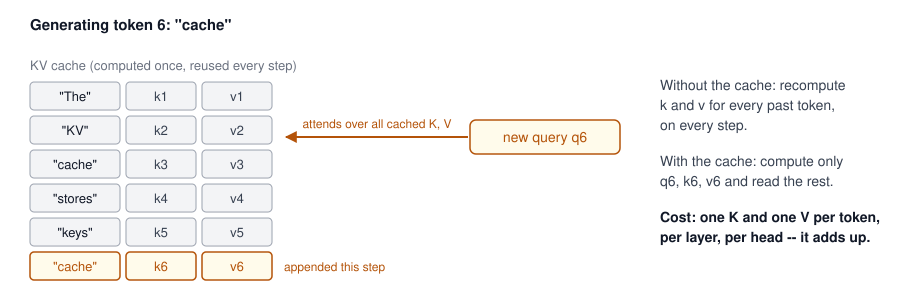{height=260 fig-align="center"}

## Why Cache K and V, but Never Q? {.smaller}

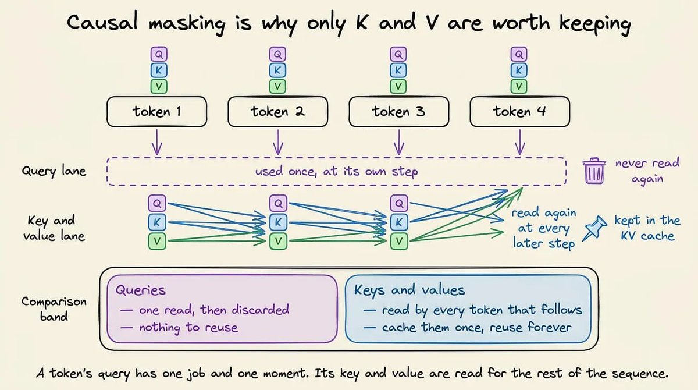{height=430 fig-align="center"}

Causal masking is the reason: a token's query fires once, at the step that token is processed, and is never read again. Its key and value are read by **every token that comes after it** -- compute them once, reuse them for the rest of the sequence. *(Diagram: "Understanding KV Cache" handbook by @techNmak.)*

## KV Cache: How Big Does It Get? {.smaller}

The handbook formula:

$$M_{KV} = 2 \times L \times T \times H_{KV} \times D_h \times b$$

2 for K and V; $L$ layers; $T$ cached tokens; $H_{KV}$ KV heads; $D_h$ head dimension; $b$ bytes per element.

::: {.fragment}
**Worked example** -- a typical 8B model with GQA: 32 layers, 8 KV heads, head dimension 128, FP16 ($b = 2$):

- Per token: $2 \times 32 \times 8 \times 128 \times 2$ = 128 KB
- One 32K-context sequence: **4 GB**. A batch of eight: **32 GB -- double the model's 16 GB of weights**
:::

::: {.fragment}
Every variable is a lever: GQA/MQA/MLA cut $H_{KV}$, sliding windows cut $T$, an FP8 cache halves $b$. That is the next slide. *(Formula: "Understanding KV Cache" handbook by @techNmak.)*
:::

## KV Cache Optimization

:::: {.columns}

::: {.column width="60%"}
- KV cache: Stored key-value pairs from attention layers
- Grows linearly with sequence length
- Optimization approaches:
  - PagedAttention (vLLM) -- block-based allocation
  - Prefix caching / RadixAttention (SGLang) -- reuse across requests
  - Attention sinks (preserve important tokens)
  - Sliding window attention
  - Grouped-Query Attention (GQA) and Multi-head Latent Attention (MLA, DeepSeek) shrink the cache architecturally
  
**Impact**: KV cache, not weights, is often what limits batch size at long context
:::

::: {.column width="40%"}
```python
# Conceptual sliding window attention
def sliding_window_attention(
    query, key, value, window_size=1024
):
    seq_len = query.shape[1]
    
    if seq_len <= window_size:
        # Standard attention
        return standard_attention(query, key, value)
    
    # Only attend to recent window_size tokens
    recent_keys = key[:, -window_size:, :]
    recent_values = value[:, -window_size:, :]
    
    return standard_attention(
        query, recent_keys, recent_values
    )
```
:::

::::

## Prefix Caching: Reusing the KV Cache Across Requests {.smaller}

- Production traffic repeats itself: every request carries the same system prompt, tool schemas, and few-shot examples, and every chat turn resends the whole conversation
- Prefix caching keeps the KV cache of a shared prefix alive and skips its prefill for the next request that starts the same way -- only the unshared tail pays
- TTFT drops sharply for agents, RAG templates, and multi-turn chat
- Implementations: vLLM automatic prefix caching; SGLang RadixAttention (a radix tree over prefixes); [LMCache](https://github.com/LMCache/LMCache) extends reuse across serving instances and to CPU/disk tiers
- Hosted APIs sell the same idea as **prompt caching**: Anthropic and OpenAI price cached input tokens at a fraction of fresh ones (more in Week 8)

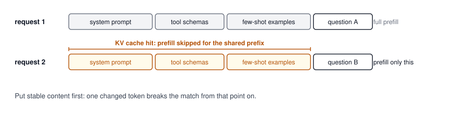{height=200 fig-align="center"}


---

## Further Compression: QAT, Pruning, Sparsity {.smaller}

- **Quantization-Aware Training (QAT)**: simulate quantization during training so the model learns to be robust to it -- better quality than PTQ, but requires retraining
- **Pruning**: remove redundant weights, neurons, or attention heads (unstructured vs. structured); iterative prune-then-fine-tune loop; 30-90% parameter reduction possible
- **Sparse inference**: only part of the network fires per token
  - Sparse attention patterns (BigBird, Longformer), block sparsity, NVIDIA Sparse Tensor Cores
  - **Mixture of Experts (MoE)** -- now mainstream (DeepSeek-V3, Llama 4, Qwen 3): a router activates only the top-k experts per token, giving large capacity at small per-token compute
- These techniques mostly matter when you own the serving stack; API users benefit from them transparently

---

## Tensor Parallelism & Sharding

:::: {.columns}

::: {.column width="60%"}
- Distributes model across multiple devices
- Types:
  - Tensor Parallelism: Split individual layers
  - Pipeline Parallelism: Different layers on different devices
  - Expert Parallelism: MoE experts on different devices
  - Zero Redundancy Optimizer (ZeRO): Shard optimizer states (training)
- Frameworks: vLLM/SGLang (serving), DeepSpeed, Megatron-LM, PyTorch FSDP

**Benefits**: Enables inference of models too large for single GPU
:::

::: {.column width="40%"}
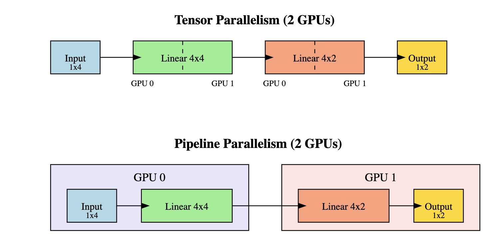
[Source: Hugging Face](https://huggingface.co/blog/huseinzol05/tensor-parallelism)

**Example**: 
- Serving a 405B-parameter model
- 8+ GPUs with tensor parallelism
- Each GPU holds a shard of every layer
- Coordinated through collective communication
:::

::::

---

## Flash Attention

:::: {.columns}

::: {.column width="60%"}
- Optimizes attention computation for transformers
- Key benefits:
  - Reduces memory I/O cost through tiling and recomputation
  - Never materializes the full attention matrix
  - Works with causal/bidirectional/cross-attention
- FlashAttention-2 and FlashAttention-3 (Hopper GPUs): further hardware-aware optimizations
- Now the default attention implementation in most serving stacks

**Impact**: 2-4x faster attention computation, enables longer contexts
:::

::: {.column width="40%"}
```python
# Using Flash Attention in PyTorch
from flash_attn import flash_attn_func

# Replace standard attention with:
attn_output = flash_attn_func(
    q,            # query
    k,            # key
    v,            # value
    dropout_p=0.0,
    causal=True   # for decoder-only models
)

# With HuggingFace Transformers:
model = AutoModelForCausalLM.from_pretrained(
    "Qwen/Qwen3-8B",
    attn_implementation="flash_attention_2"
)
```
:::

::::

---

## Continuous Batching / Dynamic Batching

:::: {.columns}

::: {.column width="60%"}
- Traditional batching: wait for batch to fill
- Continuous batching: process requests as they arrive
- Techniques:
  - Iteration-level scheduling
  - Paged Attention (vLLM)
  - Chunked prefill (mix prefill and decode in one step)
- The single biggest throughput lever in modern serving

**Impact**: 2-10x throughput improvement over static batching
:::

::: {.column width="40%"}

[Continuous Batching](https://www.anyscale.com/blog/continuous-batching-llm-inference)
:::

::::

---

## How an LLM Is Actually Built: Six Papers, in Build Order {.smaller}

:::: {.columns}

::: {.column width="45%"}
For anyone who wants to understand how an LLM is made rather than used:

1. [Attention Is All You Need](https://arxiv.org/abs/1706.03762): the architecture, obviously
2. [Chinchilla](https://arxiv.org/abs/2203.15556): how many tokens for how many parameters -- changed every training run after it
3. [FlashAttention](https://arxiv.org/abs/2205.14135): why attention stopped being the bottleneck
4. [ZeRO](https://arxiv.org/abs/1910.02054): where your training time actually goes -- almost nobody reads this one
5. [Switch Transformer](https://arxiv.org/abs/2101.03961): the sparse MoE idea every frontier model now runs
6. [PagedAttention](https://arxiv.org/abs/2309.06180): how the thing gets served without wasting most of your KV cache

Read in that order: each one answers a question the previous one creates.
:::

::: {.column width="55%"}
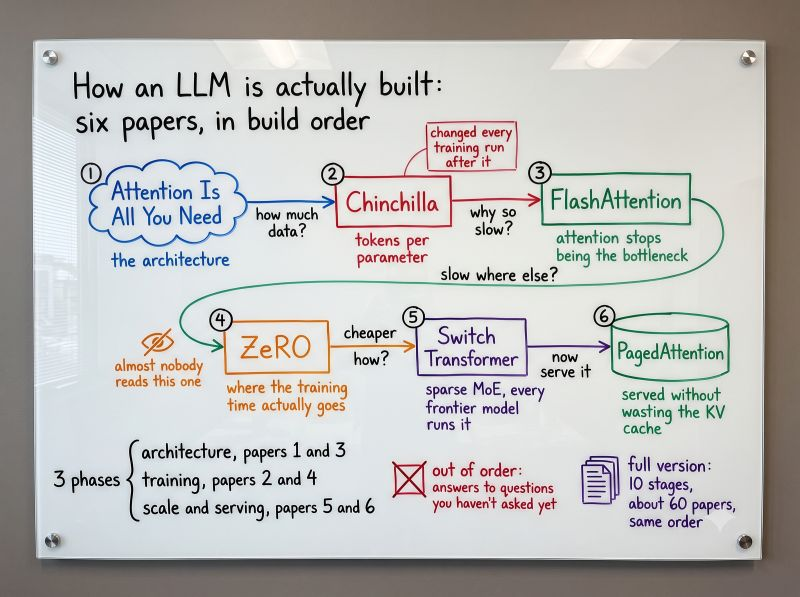{width=100%}
:::

::::

## Turn the Six Papers into a Podcast {.smaller}

- One way to consume this content at the 100 level -- and I do recommend it -- is to drop all six links into [NotebookLM](https://notebooklm.google.com/) and ask it to generate a **long-form podcast** from them
- The hosts will walk the build order, argue about the ideas, and give you the shape of the field in about an hour of listening

::: {.idea-callout}
**Who is volunteering? Bonus assignment, 25 points.** Feed the six papers to NotebookLM and produce your own podcast episode. Get creative with the prompts you give it: pick an audience, a tone, a question to chase -- steer the hosts. Share your episode and your prompts on Slack.
:::

- The fun part: several of you will do this with the same six papers, and every podcast will come out different. Listening across them -- and seeing which prompts produced which shows -- is itself a lesson in steering LLMs

## Hands-on Lab

### Serving an Open-Weight Model

*Practical exercise and demonstration*

1. **Local inference**: Run a quantized model with Ollama; inspect memory usage
2. **Production serving**: Launch vLLM with an OpenAI-compatible endpoint
3. **Measure**: TTFT, TPOT, and throughput under concurrent load
4. **Compare**: Same prompts against a hosted API -- latency, cost per 1M tokens
5. **Experiment**: Toggle quantization and max batch size; observe the trade-offs

---

## Stuff We Could Not Get To {.smaller}

Super interesting things that did not fit -- our class is 2.5 hours, not 25.

| Resource | One line |
|----------|----------|
| [OpenViking](https://github.com/volcengine/OpenViking) | Self-evolving context database for AI agents -- unifies agent memory, knowledge RAG, and skills (ByteDance/Volcengine) |
| [kimi-k3-in-c](https://github.com/FareedKhan-dev/kimi-k3-in-c) | A 2.78-trillion-parameter Kimi K3 running inference on a single CPU in 8.24 GB of RAM -- portable C99, no BLAS, no GPU |
| [open-code-review](https://github.com/alibaba/open-code-review) | Alibaba's battle-tested code review tool -- deterministic pipelines plus an LLM agent, precise line-level comments |
| [10 repos to run AI locally](https://x.com/hasantoxr/status/2098422529677521196) | A thread of 10 GitHub repos for running AI models on your own machine |
| [Transformer architecture visualizer](https://transformer-architecture.petergostev.chatgpt.site/) | Interactive side-by-side of the 2017 transformer and DeepSeek V4.1 Flash -- animate the structural differences |
| [OpenUI](https://github.com/thesysdev/openui) | The open standard for generative UI -- interfaces that LLMs generate on the fly |

## References

**Serving Engines:**

- [vLLM Documentation](https://docs.vllm.ai/)
- [SGLang Documentation](https://docs.sglang.ai/)
- [NVIDIA TensorRT-LLM](https://nvidia.github.io/TensorRT-LLM/)
- [Ollama](https://ollama.com/)

**Transformer Fundamentals:**

- [The Illustrated Transformer](https://jalammar.github.io/illustrated-transformer/)
- [Understanding Q,K,V in Transformer](https://medium.com/analytics-vidhya/understanding-q-k-v-in-transformer-self-attention-9a5eddaa5960)
- [The Q, K, V Matrices Explained](https://arpitbhayani.me/blogs/qkv-matrices/)

**Papers & Techniques:**

- [PagedAttention / vLLM paper](https://arxiv.org/abs/2309.06180)
- [Speculative Decoding paper](https://arxiv.org/abs/2211.17192)
- [AWQ paper](https://arxiv.org/abs/2306.00978)
- [FlashAttention paper](https://arxiv.org/abs/2205.14135)

**KV Caching:**

- [KV Caching Explained (Avi Chawla)](https://x.com/_avichawla/article/2093265776266637739)
- [LMCache -- KV cache layer for enterprise serving](https://github.com/LMCache/LMCache)

**Further Reading:**

- [Continuous Batching (Anyscale blog)](https://www.anyscale.com/blog/continuous-batching-llm-inference)
- [HuggingFace -- Quantization docs](https://huggingface.co/docs/transformers/quantization)
