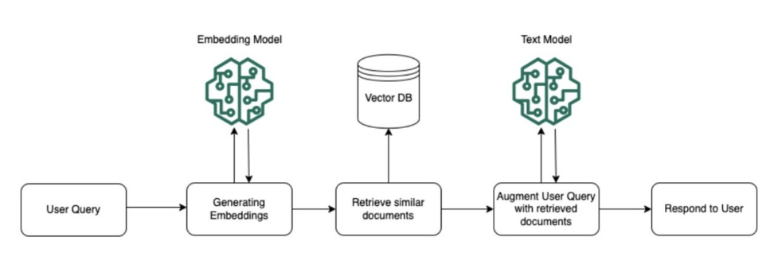

## What is RAG? {.center}

RAG = Retrieval Augmented Generation
A generative AI approach where the model combines external knowledge retrieval with text generation to provide more accurate and contextually rich responses.

## Why RAG?

- **Augments LLM responses with relevant context**: Instead of relying solely on the LLM's training data, RAG retrieves and incorporates specific, up-to-date information into responses.

- **Helps ground responses in factual information**: By providing relevant context from trusted sources, RAG ensures responses are based on actual facts rather than model-generated content.

- **Reduces hallucinations**: With access to specific, retrieved information, the model is less likely to generate incorrect or fabricated responses.

- **Enables use of private/proprietary data**: Organizations can leverage their internal documents, knowledge bases, and proprietary information that wasn't part of the LLM's training data.

- **Provides source attribution**: RAG systems can track where information comes from, making responses more transparent and verifiable.

## Simple RAG Architecture

::: {.callout}

:::

Key Components:

  - **Document Processing**: Converts raw documents into chunks and creates embeddings for efficient retrieval.
  - **Vector Storage**: Stores document embeddings and enables similarity search.
  - **Query Processing**: Converts user questions into embeddings and finds relevant documents.
  - **Response Generation**: Combines retrieved context with LLM capabilities to generate accurate answers.

# Embeddings: The Foundation of Semantic Retrieval

## What are Vector Embeddings?

- **Definition**: Numerical representations of text, images, or other data
- **Purpose**: Capture semantic meaning in vector space
- **Applications**: Search, recommendations, classification, RAG retrieval

### Representation Learning

- **Semantic Similarity**: Similar concepts have similar vectors
- **Vector Space**: High-dimensional representations (typically 384-3072 dimensions)
- **Distance Metrics**: Cosine similarity, Euclidean distance, dot product

## Embeddings Deep Dive

Key Considerations:

  - **Model selection criteria**: Consider factors like accuracy, speed, cost, and dimension size when choosing an embedding model.

  - **Dimensionality impact**: Higher dimensions can capture more information but increase storage costs and retrieval time.

  - **Multi-lingual support**: Choose models like Cohere multilingual or Amazon Titan if your application needs to handle multiple languages.

  - **Domain-specific needs**: Consider fine-tuning embedding models for specialized domains like medical or legal text. Fine-tuning using [Sentence Transformers](https://huggingface.co/blog/train-sentence-transformers).

## Popular Embeddings Models

  - **Hugging Face**: Huge collection of open embedding models (check the [MTEB leaderboard](https://huggingface.co/spaces/mteb/leaderboard)), e.g. [BGE-large-en-v1.5](https://huggingface.co/BAAI/bge-large-en-v1.5), Sentence Transformers (SBERT, MPNet)
  - **OpenAI embeddings**: text-embedding-3-small/large; excellent general-purpose performance but can be expensive for large-scale applications.
  - **Cohere embeddings**: Strong multilingual support and competitive performance.
  - **Amazon Titan**: Integrated well with AWS ecosystem, good multilingual capabilities.
  - **Voyage AI**: Recommended by Anthropic, state-of-the-art performance with domain-specific models for finance, healthcare, and code.
  - **ColBERTv2**: Late interaction model -- independently encodes queries and documents, then uses "MaxSim" for fine-grained token-level similarity. [Paper](https://arxiv.org/pdf/2112.01488), [HuggingFace](https://huggingface.co/colbert-ir/colbertv2.0), [LangChain example](https://python.langchain.com/docs/integrations/retrievers/ragatouille/).

## Fine-tuning Embedding Models

### Why Fine-tune?

- **Domain Adaptation**: Specific vocabulary and concepts (medical, legal, financial)
- **Improved Accuracy**: Task-specific retrieval performance
- **Custom Requirements**: Unique business needs
- **How**: Contrastive training on (query, relevant passage) pairs with [Sentence Transformers](https://huggingface.co/blog/train-sentence-transformers)

# Building RAG Pipelines

## Building a Basic RAG App

1. **Prepare documents**: Clean and preprocess your source documents, removing irrelevant content and standardizing format.

2. **Create embeddings**: Convert text chunks into numerical vectors using embedding models like [BGE-large-en-v1.5](https://huggingface.co/BAAI/bge-large-en-v1.5), Amazon Titan embeddings, OpenAI text-embedding-3, or Cohere embed-multilingual.

3. **Store in vector database**: Upload embeddings to a vector store like Pinecone, Weaviate, or FAISS for efficient similarity search.

4. **Process user query**: Convert the user's question into an embedding using the same embedding model.

5. **Retrieve relevant context**: Perform similarity search to find the most relevant document chunks.

6. **Generate response**: Combine retrieved context with an LLM prompt to generate an accurate, contextual response.

## Chunking Strategies

>Reference: [Chunking techniques with LangChain and LlamaIndex](https://blog.lancedb.com/chunking-techniques-with-langchain-and-llamaindex/)

- **Document segmentation approaches**: Choose between fixed-size chunks, semantic chunking, or paragraph-based splitting depending on your content structure.

- **Chunk size considerations**: Balance between too large (dilutes relevance) and too small (loses context) - typically 256-1024 tokens works well.

- **Overlap between chunks**: Include some overlap (10-20%) between consecutive chunks to maintain context across boundaries.

- **Maintaining context**: Preserve important metadata and hierarchical information when splitting documents.

- **Structured vs unstructured data**: Adapt chunking strategy based on whether you're dealing with free text, tables, or structured documents.

## The Problem with Naive Chunking

Traditional RAG chunks documents and embeds each chunk independently. This **loses context**:

```
Original document:
"Acme Corp revenue grew 15% in Q3. The company attributed
this growth to their new AI product line launched in Q2."

Chunk 2 (after splitting):
"The company attributed this growth to their new AI product line
launched in Q2."
```

**Problem**: Which company? What growth? The chunk is orphaned from its context.

## Contextual Retrieval: The Solution

Anthropic's approach: use Claude to **prepend chunk-specific context** to each chunk before embedding.

```
Contextual Chunk 2:
"This chunk is from Acme Corp's Q3 earnings report. It discusses
revenue growth of 15%. The company attributed this growth to
their new AI product line launched in Q2."
```

### Results

- **49% reduction** in failed retrievals with contextual embeddings alone
- **67% reduction** when combined with reranking
- Uses **prompt caching** to keep costs manageable (pennies per document)

### Key Insight

For knowledge bases under **200K tokens**, you may not need RAG at all -- just put the entire context in the prompt window.

Source: [Anthropic Blog - Contextual Retrieval](https://www.anthropic.com/news/contextual-retrieval)

## Late Chunking

An alternative approach from Jina AI to preserve context during chunking.

**Traditional approach** (chunk-then-embed):

```
Document -> Split into chunks -> Embed each chunk independently
```

**Late chunking** (embed-then-chunk):

```
Document -> Feed entire doc into long-context embedding model
         -> Get token-level embeddings WITH full context
         -> THEN split into chunks
```

### Why It Matters

- Pronouns and references retain their meaning ("The company" knows it means "Acme Corp")
- Each chunk embedding is aware of the full document context
- No need for an extra LLM call (unlike contextual retrieval)
- Trade-off: requires a long-context embedding model

Source: [Late Chunking Paper (arXiv:2409.04701)](https://arxiv.org/pdf/2409.04701), [Weaviate Blog](https://weaviate.io/blog/late-chunking)

## Hybrid Search: BM25 + Embeddings

The production standard for enterprise RAG combines **lexical** and **semantic** search.

```
                    User Query
                    /        \
                   /          \
            BM25 Search    Vector Search
           (keyword match)  (semantic match)
                   \          /
                    \        /
              Reciprocal Rank Fusion (RRF)
                       |
                  Merged Results
                       |
                   Reranker
                       |
                  Final Results
```

### Why Hybrid?

- **BM25 alone** misses semantic similarity ("car" vs "automobile")
- **Embeddings alone** miss exact keyword matches (product IDs, error codes, names)
- **Together**: best of both worlds

Recommended starting weight: **30% BM25 / 70% embedding** (tune for your domain).

Source: [Superlinked - Optimizing RAG with Hybrid Search](https://superlinked.com/vectorhub/articles/optimizing-rag-with-hybrid-search-reranking)

## Query Rewriting

Retrieval quality depends as much on the **query** as on the index.

- **Query expansion**: Add synonyms and related terms before searching
- **Query decomposition**: Split complex questions into simpler sub-queries
- **HyDE (Hypothetical Document Embeddings)**: Ask the LLM to write a hypothetical answer, then embed *that* for retrieval -- documents match documents better than questions match documents
- **Conversational rewriting**: Resolve pronouns and references from chat history ("what about its pricing?" -> "what is Pinecone's pricing?")
- **Entity extraction**: Pull out names, IDs, and filters to combine vector search with metadata filtering

# Vector Databases

## Vector Databases

Features to Consider:

  - **Scalability**: Ability to handle millions or billions of vectors efficiently.

  - **Query performance**: Fast similarity search with support for approximate nearest neighbors (ANN) algorithms.

  - **Similarity search algorithms**: Support for different distance metrics (cosine, euclidean) and indexing methods.

  - **Metadata filtering**: Ability to combine vector similarity search with metadata filters.

  - **Cost considerations**: Balance between hosting costs, query costs, and storage requirements.

## Examples of Vector Databases

- **Pinecone**:
  - Scalable and high-performance vector database.
  - Designed for real-time search with high availability and easy integration.
  - Offers fully managed services with automatic scaling and monitoring.

- **Weaviate**:
  - Open-source vector search engine with support for hybrid search (text + vector).
  - Schema-free or schema-driven, flexible for various data types.
  - Built-in ML model hosting and extensible through modules like transformers.

- **Milvus**:
  - Cloud-native vector database optimized for high-throughput and low-latency vector retrieval.
  - Open-source with strong community support and enterprise-grade features.
  - Supports massive-scale data management for AI and analytics applications.

## Examples of Vector Databases (contd.)

- **Qdrant**:
  - Feature-rich, open-source vector database with support for filtering and hybrid search.
  - Integrates easily with other tools like LangChain and Python.
  - Designed for both small-scale and production-grade deployments.

- **OpenSearch**:
  - Open-source search and analytics platform with vector search support using k-NN.
  - Enables hybrid search across text, vector embeddings, and metadata.

- **FAISS (by Meta AI)**:
  - A library rather than a traditional database, optimized for similarity search and clustering.
  - Limited to in-memory computation but extremely efficient.

- **Chroma**:
  - Lightweight and developer-friendly embedding store.
  - Designed for rapid prototyping and easy integration with LLM applications.

- **PostgreSQL (with pgvector)**:
  - Extends PostgreSQL to store and retrieve high-dimensional vector embeddings.
  - Suitable for teams already using PostgreSQL for traditional relational data.

# Advanced RAG

## Beyond Embeddings: Agentic Search {.center}

What if embeddings-based RAG is not the best approach for every use case?

## The Case Against Embeddings-Only RAG

The Anthropic engineering team discovered that for **Claude Code**, using Unix tools (`grep`, `ripgrep`, `find`) over codebases gives **better results** than embeddings-based approaches.

> "We did use vector embeddings initially. They're really tricky to maintain because you have to continuously re-index... Claude is really good at agentic search. You can get to the same accuracy level with agentic search and it's just a much cleaner deployment story."
>
> -- Cat Wu, PM for Claude Code ([Latent Space Podcast](https://www.latent.space/p/claude-code))

Boris Cherny (Lead Engineer, Claude Code) described the tool as **"not a product as much as it's a Unix utility"** -- fitting Anthropic's product principle of **"do the simple thing first."**

## Agentic Search vs Semantic Search

From [Anthropic's official engineering blog](https://www.anthropic.com/engineering/claude-code-best-practices):

> "Semantic search is usually faster than agentic search, but **less accurate, more difficult to maintain, and less transparent**. It involves 'chunking' the relevant context, embedding these chunks as vectors, and then searching for concepts by querying those vectors. Given its limitations, we suggest **starting with agentic search**, and only adding semantic search if you need faster results or more variations."

**Agentic search** = An AI agent iteratively uses tools like `grep`, `find`, `cat`, and `ls` to locate relevant information, reasoning about what to search for next based on what it has found so far.

### When Does Each Approach Win?

| Approach | Best For |
|----------|----------|
| **Agentic Search** (grep/find) | Codebases, structured text, precise lookups |
| **Semantic Search** (embeddings) | Large unstructured corpora, fuzzy matching |
| **Hybrid** (both as tools) | Agent chooses the right tool per query |

The takeaway: expose **both** as tools and let the agent decide.

## Corrective RAG (CRAG)

CRAG adds a **retrieval evaluator** that assesses document quality before generation.

### How It Works

1. Retrieve documents as usual
2. A lightweight evaluator scores each document: **Correct / Incorrect / Ambiguous**
3. Based on the assessment:
   - **Correct**: Refine and use the document
   - **Incorrect**: Discard and fall back to **web search**
   - **Ambiguous**: Combine refined document with web search results

### Why It Matters

- **Plug-and-play**: Works with any existing RAG pipeline
- **Self-correcting**: Does not blindly trust retrieved documents
- **Web search fallback**: Handles cases where local knowledge base is insufficient

Source: [CRAG Paper (arXiv:2401.15884)](https://arxiv.org/abs/2401.15884), [LangGraph CRAG Tutorial](https://langchain-ai.github.io/langgraph/tutorials/rag/langgraph_crag/)

## Self-RAG

Self-RAG teaches the model to **reflect** during generation, dynamically deciding when and what to retrieve.

### Self-RAG Process

```
Input query
  |
  v
Should I retrieve? (reflection token)
  |
  YES --> Retrieve documents
  |         |
  |         v
  |       Is this document relevant? (reflection token)
  |         |
  |        YES --> Generate with this evidence
  |         |         |
  |         |         v
  |         |       Is my response supported? (reflection token)
  |         |         |
  |         |        YES --> Return response
  |         |         NO --> Try next document
  |         |
  |        NO --> Skip this document
  |
  NO --> Generate without retrieval
```

### CRAG + Self-RAG Together

- **CRAG** cleans the retrieval inputs (better documents in)
- **Self-RAG** refines the generation outputs (better answers out)
- Complementary approaches that can be combined

## RAG vs Long Context: The Trade-offs

| Factor | RAG | Long Context |
|--------|-----|-------------|
| **Cost per query** | Low (retrieve only what's needed) | High (pay for every token, every query) |
| **Query latency** | Low | Grows with context length |
| **Accuracy (QA benchmarks)** | Good | Slightly better on single-document tasks |
| **Scales to millions of docs** | Yes | No |
| **"Lost in the Middle" problem** | Minimal | Significant |
| **Requires indexing pipeline** | Yes | No |
| **Real-time data updates** | Easy | Requires re-prompting |

Source: [Long Context vs. RAG for LLMs (arXiv:2501.01880)](https://arxiv.org/abs/2501.01880)

## When to Use Which Approach

### Use RAG When:

- Knowledge base is **larger than the context window**
- You need **real-time updates** (new documents added frequently)
- **Cost matters** at query volume
- You need **source attribution** and traceability
- Working with **millions of documents**

### Use Long Context When:

- Entire corpus fits in the context window (< 200K tokens)
- You need the model to reason **across the entire document**
- Summarization or analysis of a **single long document**
- Prototyping before building a full RAG pipeline

### The Answer: Context Engineering

The field is moving toward **context engineering** -- dynamically assembling the most effective context per query, mixing RAG retrieval, long context, and cached context as appropriate.

## RAG Evaluation with RAGAS

[RAGAS](https://docs.ragas.io/en/stable/) is the industry-standard open-source framework for evaluating RAG pipelines.

### Core Metrics

| Metric | What It Measures |
|--------|-----------------|
| **Context Precision** | Are the retrieved documents actually relevant? |
| **Context Recall** | Did we retrieve all the relevant documents? |
| **Faithfulness** | Is the generated answer supported by the retrieved context? |
| **Answer Relevancy** | Does the answer actually address the question? |

### The Key Insight

RAG evaluation requires measuring **two separate things**:

1. **Retrieval quality**: Did we find the right documents? (Context Precision + Recall)
2. **Generation quality**: Did we produce a good answer from those documents? (Faithfulness + Relevancy)

We go deep on evals and observability in Week 6.

Source: [RAGAS Paper (arXiv:2309.15217)](https://arxiv.org/abs/2309.15217), [RAGAS Documentation](https://docs.ragas.io/en/stable/)

## Amazon Bedrock Knowledge Bases

A fully managed service that handles the entire RAG pipeline -- from document ingestion to retrieval-augmented generation.

### Key Features

- **Advanced chunking**: Semantic, hierarchical, and fixed-size chunking strategies
- **Multiple vector stores**: Aurora PostgreSQL, OpenSearch Serverless, Neptune, MongoDB Atlas, Pinecone, Redis Enterprise
- **Multimodal retrieval**: Supports images, audio, and video alongside text
- **Contextual retrieval**: Integrates Anthropic's contextual retrieval technique

### APIs

- **RetrieveAndGenerate**: End-to-end RAG in a single API call
- **Retrieve**: Get relevant chunks without generation (bring your own LLM)

Source: [Amazon Bedrock Knowledge Bases](https://aws.amazon.com/bedrock/knowledge-bases/), [Documentation](https://docs.aws.amazon.com/bedrock/latest/userguide/knowledge-base.html)

## Beyond Vector Similarity: Graph RAG and SQL RAG

- Vector similarity is not the only retrieval strategy:
  - **Graph RAG**: Represents knowledge as **entities and relationships**; retrieval via graph traversal (Neo4j, Memgraph, Amazon Neptune, Microsoft GraphRAG). Wins for multi-hop questions over highly connected data ("Who were Bohr's collaborators and what did they work on?").
  - **SQL RAG**: Natural language to SQL over relational databases; the only option for aggregate questions ("average trip distance on 2024-12-11") that neither vector nor graph retrieval can answer.
- **Coming in Week 7**: Deep dive on Graph RAG, ontologies, and the semantic layer -- modeling your data so LLMs can reason over it.

Source: [Microsoft GraphRAG](https://www.microsoft.com/en-us/research/project/graphrag/), [Paper (arXiv:2404.16130)](https://arxiv.org/abs/2404.16130)

# Intro to AI Agents

## What is an AI Agent?

- **Definition**: An LLM-powered system that **autonomously decides** what actions to take to accomplish a goal
- **Workflow vs. Agent** (Anthropic's distinction):
  - **Workflow**: LLMs and tools orchestrated through predefined code paths
  - **Agent**: The LLM dynamically directs its own process and tool usage
- **Core ingredients**:
  - A model (the brain)
  - Tools (the hands: search, code execution, APIs)
  - A loop (observe -> think -> act -> repeat)
  - Memory/context (what it knows so far)

Source: [Anthropic: Building Effective Agents](https://www.anthropic.com/engineering/building-effective-agents)

## Tool Use / Function Calling

The foundation of every agent: the LLM decides **when** to call a function and **what arguments** to pass.

```python
tools = [{
    "toolSpec": {
        "name": "get_stock_price",
        "description": "Get current stock price for a ticker symbol",
        "inputSchema": {
            "json": {
                "type": "object",
                "properties": {
                    "ticker": {"type": "string", "description": "Stock ticker symbol"}
                },
                "required": ["ticker"]
            }
        }
    }
}]

response = bedrock.converse(
    modelId="anthropic.claude-sonnet-4-5-20250929-v1:0",
    messages=[{"role": "user", "content": [{"text": "What's Apple's stock price?"}]}],
    toolConfig={"tools": tools}
)
# LLM returns: tool_use with {"ticker": "AAPL"}
```

- **You** execute the function and return results to the LLM
- The LLM incorporates results into its response -- or calls another tool

## The Agent Loop

```
        +---------------------------+
        |        User Goal          |
        +------------+--------------+
                     |
                     v
        +------------+--------------+
   +--->|   LLM reasons about       |
   |    |   next action             |
   |    +------------+--------------+
   |                 |
   |        tool call | final answer
   |                 v              \
   |    +------------+------------+  \
   |    |  Execute tool           |   +--> Return to user
   |    |  (search, SQL, code,    |
   |    |   API, file ops)        |
   |    +------------+------------+
   |                 |
   |                 v
   |    +------------+------------+
   +----+  Observe result, add    |
        |  to context             |
        +-------------------------+
```

- Loop until the model decides it has enough to answer (or hits a step/cost budget)
- Every agentic product -- Claude Code, Cursor, deep research tools -- is this loop with good tools and context engineering

## Agentic RAG: RAG Meets the Agent Loop

Traditional RAG follows a **fixed pipeline**: retrieve, then generate. Agentic RAG puts the agent in charge of retrieval decisions.

```
Traditional RAG:
  Query -> Retrieve -> Generate -> Done

Agentic RAG:
  Query -> Agent decides what to fetch
       -> Agent calls tools (vector search, SQL, API, grep)
       -> Agent evaluates results
       -> Agent decides: enough? or search again?
       -> Agent may rewrite query and retry
       -> Agent generates answer with citations
```

### Key Capabilities

- **Query planning**: Decomposes complex questions into sub-queries
- **Tool selection**: Chooses between vector search, keyword search, SQL, APIs
- **Self-correction**: Evaluates retrieved documents and retries if quality is low

Source: [Agentic RAG Survey (arXiv:2501.09136)](https://arxiv.org/abs/2501.09136)

## Why Agents Need a Protocol

- Every tool integration used to be bespoke: N models x M tools = N*M connectors
- **Model Context Protocol (MCP)**: An open standard (Anthropic, 2024) for connecting LLMs to external data and tools
  - One server exposes tools/resources; any MCP-capable client can use them
  - Adopted across Claude, IDEs, and agent frameworks
- **Agent-to-agent communication**: When multiple agents collaborate, they need their own protocols (A2A)
- This is where the course goes next

## Preview: The Agents Arc

- **Week 4 -- Agentic RAG and MCP**: Build retrieval agents; expose your data and tools via Model Context Protocol servers
- **Week 5 -- Agent Architectures**: Planning, memory, multi-agent patterns (orchestrator/workers, evaluator/optimizer), frameworks
- **Week 10 -- A2A**: Agent-to-agent protocols and cross-agent interoperability
- Everything builds on today's foundations: retrieval + tool use + the agent loop

## Lab: Build a RAG Pipeline

### Hands-on Exercise

- Ingest a small document corpus: chunk, embed, and index it
- Compare embedding models (an open BGE model vs. a hosted API model)
- Store vectors in a local vector store (Chroma or FAISS; pgvector optional)
- Implement retrieval + generation with source citations
- Experiment: chunk size, overlap, top-k, hybrid (BM25 + vector) retrieval
- Stretch goal: add a tool-calling step so the LLM decides *whether* to retrieve -- your first taste of agentic RAG

## References & Further Reading

### Retrieval Approaches

1. [Anthropic Engineering: Claude Code Best Practices (Agentic Search)](https://www.anthropic.com/engineering/claude-code-best-practices)
1. [Latent Space Podcast: Claude Code](https://www.latent.space/p/claude-code) -- Cat Wu and Boris Cherny on grep vs embeddings
1. [Anthropic Blog: Contextual Retrieval](https://www.anthropic.com/news/contextual-retrieval)
1. [Late Chunking Paper (arXiv:2409.04701)](https://arxiv.org/pdf/2409.04701)
1. [Weaviate: Late Chunking](https://weaviate.io/blog/late-chunking)
1. [Superlinked: Optimizing RAG with Hybrid Search & Reranking](https://superlinked.com/vectorhub/articles/optimizing-rag-with-hybrid-search-reranking)
1. [Chunking Techniques with LangChain and LlamaIndex](https://blog.lancedb.com/chunking-techniques-with-langchain-and-llamaindex/)

### Advanced RAG Techniques

1. [Agentic RAG Survey (arXiv:2501.09136)](https://arxiv.org/abs/2501.09136)
1. [Corrective RAG Paper (arXiv:2401.15884)](https://arxiv.org/abs/2401.15884)
1. [LangGraph CRAG Tutorial](https://langchain-ai.github.io/langgraph/tutorials/rag/langgraph_crag/)
1. [Microsoft GraphRAG](https://www.microsoft.com/en-us/research/project/graphrag/) and [Paper (arXiv:2404.16130)](https://arxiv.org/abs/2404.16130)
1. [ColBERTv2 Paper (arXiv:2112.01488)](https://arxiv.org/abs/2112.01488)
1. [Long Context vs. RAG (arXiv:2501.01880)](https://arxiv.org/abs/2501.01880)

### Embeddings

1. [MTEB Leaderboard](https://huggingface.co/spaces/mteb/leaderboard)
1. [Training Sentence Transformers](https://huggingface.co/blog/train-sentence-transformers)
1. [OpenAI Embeddings Guide](https://platform.openai.com/docs/guides/embeddings)

### Agents

1. [Anthropic: Building Effective Agents](https://www.anthropic.com/engineering/building-effective-agents)
1. [Model Context Protocol](https://modelcontextprotocol.io/)
1. [Anthropic Tool Use Documentation](https://docs.anthropic.com/en/docs/build-with-claude/tool-use)

### RAG Evaluation & AWS

1. [RAGAS Documentation](https://docs.ragas.io/en/stable/) and [Paper (arXiv:2309.15217)](https://arxiv.org/abs/2309.15217)
1. [Amazon Bedrock Knowledge Bases](https://aws.amazon.com/bedrock/knowledge-bases/)
1. [Amazon Bedrock Knowledge Bases Documentation](https://docs.aws.amazon.com/bedrock/latest/userguide/knowledge-base.html)

### Course Resources

1. [Course Bookmarks: RAG](https://github.com/gu-dsan6725/bookmarks/tree/main?tab=readme-ov-file#rag)
