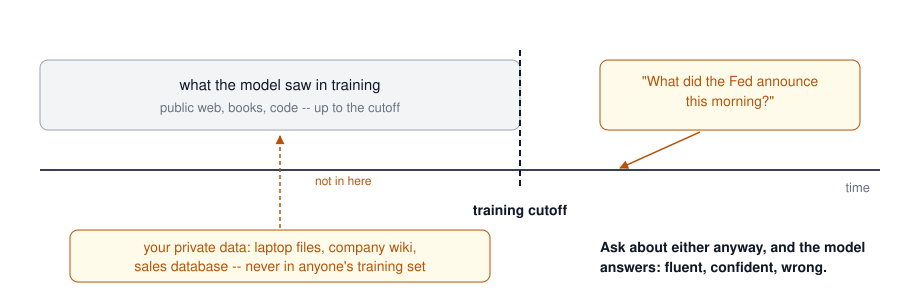
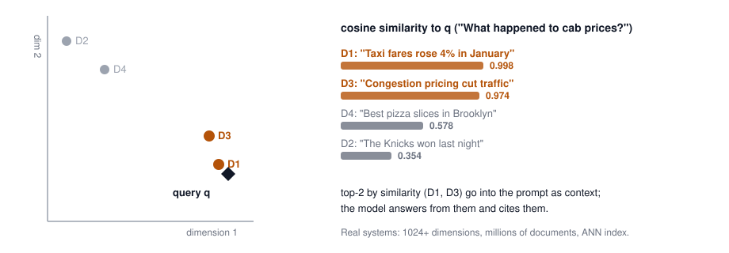
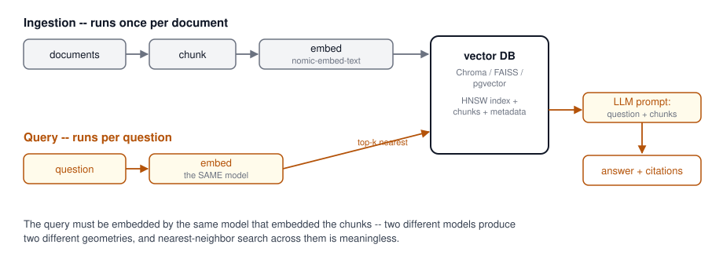
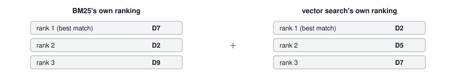
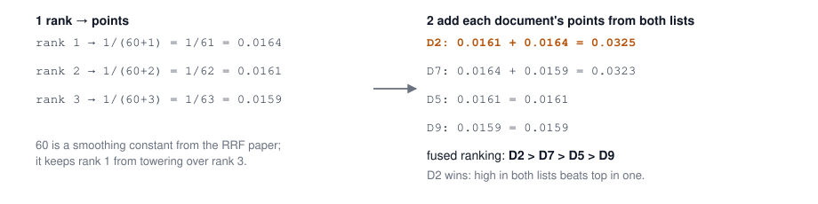
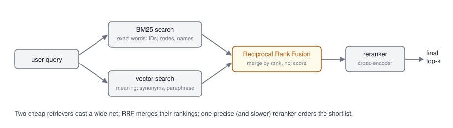
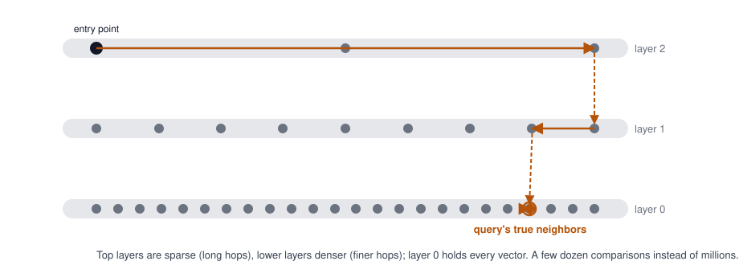
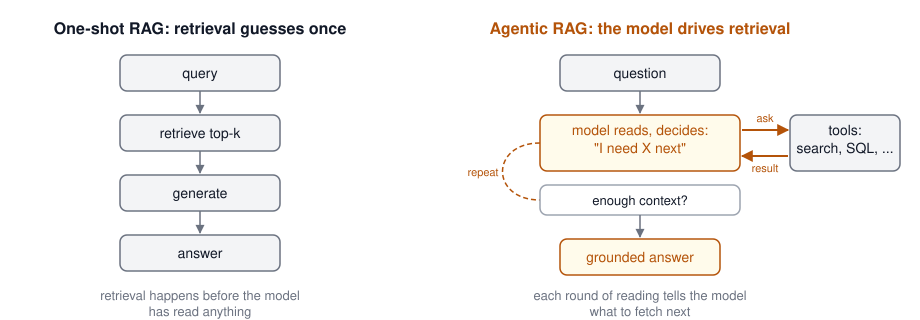

## Agenda {.smaller}

- Why RAG: training cutoffs, private data, and hallucinations
- RAG in one pipeline: embed, index, retrieve, generate
- Embeddings and vector databases
- Chunking: naive, contextual, late
- Hybrid search, query rewriting, reranking
- Advanced RAG: agentic search, CRAG, Self-RAG, RAG vs long context *(overflow, moves to Week 4)*
- Evaluating RAG with RAGAS; managed RAG; Graph and SQL RAG *(overflow, moves to Week 4)*
- Intro to agents: tool use, the agent loop, agentic RAG
- Lab: build a RAG pipeline

# The Problem: What an LLM Cannot Know

## Frozen in Time {.smaller}

An LLM's knowledge stops at its **training cutoff**. Everything it will ever "know" was fixed the day training ended.

{height=250 fig-align="center"}

Two kinds of questions live outside that region: **your data** (laptop files, company wiki, sales database -- never in any training set) and **anything after the cutoff** (this morning's outage, yesterday's earnings call). Answering them from nothing is a **hallucination**.

::: {.idea-callout}
Models from two or three years ago really would answer these questions with confident fiction. Almost any LLM today tells you it does not have the information. Hallucination is not solved, though -- it moved to subtler places: plausible-but-wrong details, misattributed quotes, invented citations.
:::

## The Fix: Bring Your Own Context

- The model cannot know your data, but it is excellent at **reading**
- So at question time, we fetch the relevant information and put it **into the prompt** -- we call that added information **context**
- The generic recipe:
  1. **Retrieve** data relevant to the question
  2. **Augment** the prompt with it
  3. **Generate** the answer from it
- That recipe is **Retrieval Augmented Generation (RAG)** -- and because the model now quotes sources instead of reciting memory, you get **attribution** for free

## Context Comes in Three Shapes

| Shape | Examples | Retrieved by |
|-------|----------|--------------|
| **Unstructured** | Documents, PDFs, wikis, tickets, email | Semantic search over embeddings (today) |
| **Structured** | Tables, spreadsheets, databases | Text-to-SQL (Week 7) |
| **Graph** | Entities and relationships | Graph traversal (Week 7) |

Today is mostly the first row -- it is where RAG started and where most production systems live. But keep all three in mind: the best systems pick the right shape per question.

## What is RAG? {.center}

RAG = Retrieval Augmented Generation
A generative AI approach where the model combines external knowledge retrieval with text generation to provide more accurate and contextually rich responses.

## Simple RAG Architecture {.smaller}

::: {style="text-align: center;"}
{height=360}
:::

Key Components:

  - **Document Processing**: Converts raw documents into chunks and creates embeddings for efficient retrieval.
  - **Vector Storage**: Stores document embeddings and enables similarity search.
  - **Query Processing**: Converts user questions into embeddings and finds relevant documents.
  - **Response Generation**: Combines retrieved context with LLM capabilities to generate accurate answers.

## RAG: 100 to 300 {.smaller}

:::: {.columns}

::: {.column width="33%"}
**100 level**

Before the model answers, look up the relevant documents and paste them into the prompt. The model reads them and answers from what it read, citing sources.
:::

::: {.column width="33%" .fragment}
**200 level**

Embed every chunk of your corpus once; embed the query at ask time; nearest-neighbor search returns the top-k chunks; they go into the prompt as context. An approximate index (HNSW) keeps search fast at millions of chunks -- HNSW and friends are explained later in this deck, with vector databases.
:::

::: {.column width="33%" .fragment}
**300 level**

Production RAG layers on: hybrid lexical+semantic search, rerankers, query rewriting, contextual chunking, and metadata filters -- then measures itself with retrieval and generation metrics (RAGAS). Each layer exists because a failure mode demanded it; the rest of today walks them.
:::

::::

# Embeddings: The Foundation of Semantic Retrieval

## What are Vector Embeddings?

- **Definition**: Numerical representations of text, images, or other data
- **Purpose**: Capture semantic meaning in vector space
- **Applications**: Search, recommendations, classification, RAG retrieval

### Representation Learning

- **Semantic Similarity**: Similar concepts have similar vectors
- **Vector Space**: High-dimensional representations (typically 384-3072 dimensions)
- **Distance Metrics**: Cosine similarity, Euclidean distance, dot product

## Example: Retrieval By Hand {.smaller}

Four tiny "documents," each embedded to just 2 numbers so we can compute everything ourselves. The query gets embedded by the same model.

{height=300 fig-align="center"}

The query lands next to the documents that share its meaning -- no keyword overlap required ("cab prices" matches "taxi fares").

## Choosing an Embedding Model

Key Considerations:

  - **Model selection**: Weigh accuracy, speed, cost, and dimension count.

  - **Dimensions**: More dimensions capture more meaning and cost more to store and search.

  - **Languages**: For multilingual corpora, pick a multilingual model (Cohere multilingual, Qwen3-Embedding).

  - **Domains**: Medical and legal text often needs a fine-tuned model -- see [Sentence Transformers](https://huggingface.co/blog/train-sentence-transformers).

## Getting Embeddings: Self-Host or Call an API {.smaller}

Whatever model you pick, there are exactly two ways to consume it:

:::: {.columns}

::: {.column width="50%"}
### Self-host

You run the model; text never leaves your infrastructure.

- **Ollama** -- what we did in the Week 2 lab: `ollama pull nomic-embed-text`, then POST to `/api/embed`
- **vLLM** -- production-grade: `vllm serve BAAI/bge-large-en-v1.5 --task embed`
- **SGLang** -- launch with `--is-embedding`
- vLLM and SGLang both expose the OpenAI-compatible `/v1/embeddings` endpoint, so client code stays portable
:::

::: {.column width="50%"}
### Call an API

You send text, they send back vectors; you host nothing.

- OpenAI (`text-embedding-3`), Cohere, Voyage AI, Gemini
- Pay per token; zero ops
- Your text goes to the provider -- a real consideration for sensitive corpora
- Latency and rate limits are theirs, not yours
:::

::::

The trade is the same one as LLM serving in Week 2: control and privacy vs. zero operations.

## Popular Embeddings Models

  - **nomic-embed-text**: What you already ran in the Week 2 lab -- 768 dimensions, 260 MB, runs locally via Ollama. Our course workhorse.
  - **Hugging Face**: Huge collection of open embedding models (check the [MTEB leaderboard](https://huggingface.co/spaces/mteb/leaderboard)), e.g. [BGE-large-en-v1.5](https://huggingface.co/BAAI/bge-large-en-v1.5), Sentence Transformers (SBERT, MPNet)
  - **OpenAI embeddings**: text-embedding-3-small/large; excellent general-purpose performance but can be expensive for large-scale applications.
  - **Cohere embeddings**: Strong multilingual support and competitive performance.
  - **Qwen3-Embedding / Gemini embedding**: Current leaders on the MTEB leaderboard -- open-weight and hosted respectively.
  - **Voyage AI**: Recommended by Anthropic, state-of-the-art performance with domain-specific models for finance, healthcare, and code.
  - **ColBERTv2**: Late interaction model -- independently encodes queries and documents, then uses "MaxSim" for fine-grained token-level similarity. [Paper](https://arxiv.org/pdf/2112.01488), [HuggingFace](https://huggingface.co/colbert-ir/colbertv2.0), [LangChain example](https://python.langchain.com/docs/integrations/retrievers/ragatouille/).

## Fine-tuning Embedding Models

### Why Fine-tune?

- **Domain Adaptation**: Specific vocabulary and concepts (medical, legal, financial)
- **Improved Accuracy**: Task-specific retrieval performance
- **Custom Requirements**: Unique business needs
- **How**: Contrastive training on (query, relevant passage) pairs with [Sentence Transformers](https://huggingface.co/blog/train-sentence-transformers)

# Building RAG Pipelines

## Building a Basic RAG App {.smaller}

{height=310 fig-align="center"}

Six steps, two pipelines: **prepare** and chunk documents, **embed** the chunks, **store** them in a vector database (ingestion, once) -- then **embed** the user's question with the same model, **retrieve** the nearest chunks, and **generate** the answer from them (query, every request).

::: {.fragment}
The pipeline works, end to end. **What is missing?**
:::

## What Is Missing: Evaluation {.center}

### How do we know the answers are grounded in the context we provide?

::: {.fragment}
And one step earlier: how do we know retrieval found the right documents at all? A RAG pipeline without measurement is a demo, not a system.

We measure both -- retrieval quality and generation quality. The metrics and tooling (RAGAS) open next week's lecture, and evaluation gets a full week of its own (Week 6).
:::

## Chunking Strategies

>Reference: [Chunking techniques with LangChain and LlamaIndex](https://blog.lancedb.com/chunking-techniques-with-langchain-and-llamaindex/)

- **Document segmentation approaches**: Choose between fixed-size chunks, semantic chunking, or paragraph-based splitting depending on your content structure.

- **Chunk size considerations**: Balance between too large (dilutes relevance) and too small (loses context) - typically 256-1024 tokens works well.

- **Overlap between chunks**: Include some overlap (10-20%) between consecutive chunks to maintain context across boundaries.

- **Maintaining context**: Preserve important metadata and hierarchical information when splitting documents.

- **Structured vs unstructured data**: Adapt chunking strategy based on whether you're dealing with free text, tables, or structured documents.

## The Problem with Naive Chunking

Traditional RAG splits documents and embeds each chunk on its own. Context gets lost:

```
Original document:
"Acme Corp revenue grew 15% in Q3. The company attributed
this growth to their new AI product line launched in Q2."

Chunk 2 (after splitting):
"The company attributed this growth to their new AI product line
launched in Q2."
```

**Problem**: Which company? What growth? The chunk is orphaned from its context.

## Contextual Retrieval: The Solution

Anthropic's approach: use Claude to **prepend chunk-specific context** to each chunk before embedding.

```
Contextual Chunk 2:
"This chunk is from Acme Corp's Q3 earnings report. It discusses
revenue growth of 15%. The company attributed this growth to
their new AI product line launched in Q2."
```

### Results

- **49% reduction** in failed retrievals with contextual embeddings alone
- **67% reduction** when combined with reranking
- Uses **prompt caching** to keep costs manageable (pennies per document)

### Key Insight

For knowledge bases under **200K tokens**, you may not need RAG at all -- just put the entire context in the prompt window.

Every token you put in context costs money, on every request. So be smart about *what* goes in and *how* you extract it from the source. For a huge document, a model running in an agent harness can say "I need these three facts" and call tools that grep and extract just the relevant pieces -- pennies instead of dollars. That pattern is agentic RAG, coming later today.

Source: [Anthropic Blog - Contextual Retrieval](https://www.anthropic.com/news/contextual-retrieval)

## Why One Retriever Is Not Enough

Two queries, two failure modes:

:::: {.columns}

::: {.column width="50%"}
### "error E4021 in billing"

Embeddings blur exact tokens -- E4021 and E4012 land nearly on top of each other in vector space. Keyword search finds the literal string every time.

**Exact words win**: product IDs, error codes, names, legal citations.
:::

::: {.column width="50%"}
### "car won't start"

The manual says "vehicle ignition failure" -- zero words in common, same meaning. Keyword search returns nothing. Embeddings match it easily.

**Meaning wins**: synonyms, paraphrase, cross-language.
:::

::::

::: {.fragment}
Production RAG runs **both** and merges the results. That is hybrid search -- the next three slides.
:::

## BM25: Keyword Search, Done Properly {.smaller}

**BM25 = "Best Matching 25"** -- a ranking algorithm, the 25th iteration of the scoring function from the Okapi retrieval system (Robertson et al., 1990s). It is the lexical scorer inside Elasticsearch, OpenSearch, and every Lucene descendant. For each query term in a document, it multiplies three signals:

- **Rarity (IDF)**: "E4021" appearing in 3 documents out of a million tells you a lot; "the" tells you nothing
- **Term frequency, with saturation**: a document that mentions "taxi" five times beats one that mentions it once -- but the fiftieth mention adds almost nothing
- **Length normalization**: a term hit in a 100-word memo counts for more than the same hit buried in a 100-page manual

Sum over the query terms and you have the document's score. No training, no vectors, no GPU -- it has run the world's search boxes since the 1990s, and it is still the strongest baseline in retrieval benchmarks.

::: {.def-callout}
**IDF, inverse document frequency**: count how many of your $N$ documents contain a term ($df$), then invert it: $idf(t) \approx \log(N/df)$. A term in every document scores near zero; a term in 3 documents out of a million scores high. Computed once at index time, it is how a search engine knows "E4021" matters and "the" does not.
:::

## Reciprocal Rank Fusion: Merging Two Rankings {.smaller}

Each retriever sorts **its own** results: rank 1 is its best match, rank 2 the next best, and so on. The scores behind those ranks (BM25 points, cosine similarity) live on different scales and cannot be compared -- but a rank is just a rank.

{height=140 fig-align="center"}

::: {.fragment}
RRF fuses the two rankings in two moves: convert every rank to points with $\frac{1}{60 + rank}$, then add up each document's points across both lists.

{height=220 fig-align="center"}
:::

## Hybrid Search: The Full Pipeline {.smaller}

{height=240 fig-align="center"}

- The **reranker** is a cross-encoder: it reads query and document together, scoring relevance far better than either retriever -- too slow for millions of documents, perfect for a merged shortlist of 50
- Starting weights when your stack supports weighting: 30% BM25 / 70% vector; tune on your own queries

Source: [Superlinked - Optimizing RAG with Hybrid Search](https://superlinked.com/vectorhub/articles/optimizing-rag-with-hybrid-search-reranking)

## Query Rewriting

Retrieval quality depends as much on the **query** as on the index.

- **Query expansion**: Add synonyms and related terms before searching
- **Query decomposition**: Split complex questions into simpler sub-queries
- **HyDE (Hypothetical Document Embeddings)**: Ask the LLM to write a hypothetical answer, then embed *that* for retrieval -- documents match documents better than questions match documents
- **Conversational rewriting**: Resolve pronouns and references from chat history ("what about its pricing?" -> "what is Pinecone's pricing?")
- **Entity extraction**: Pull out names, IDs, and filters to combine vector search with metadata filtering

# Vector Databases

## Why a Vector Database at All? {.smaller}

- Retrieval means: given a query vector, find the closest vectors among **millions**
- Brute force computes the similarity against every stored vector, per query -- fine at 10,000 chunks, hopeless at 50 million with users waiting
- **Approximate Nearest Neighbor (ANN)** search is the escape: give up a tiny bit of recall (find *almost always* the true neighbors) for orders-of-magnitude speed
- A vector database packages the pieces you would otherwise build yourself:
  - An ANN index (HNSW is the workhorse -- next slide)
  - Metadata filtering ("only documents from 2026", "only this tenant")
  - The database parts: persistence, updates, replication, access control

## HNSW: How ANN Search Actually Works {.smaller}

**Hierarchical Navigable Small World** -- the index behind most vector databases (Pinecone, Qdrant, Weaviate, pgvector, OpenSearch).

{height=290 fig-align="center"}

- **The idea**: a highway system for vectors. Sparse top layers make long hops toward the right region; each lower layer is denser and refines the position; layer 0 holds every vector
- **300-level notes**: greedy best-first search per layer; build-time parameter M (links per node) and ef (search width) trade recall against speed and memory; alternatives include IVF (cluster-then-probe) and product quantization (compress vectors), often combined at billion scale

## Vector Databases

Features to Consider:

  - **Scale**: Handles millions to billions of vectors.

  - **Query speed**: ANN search answers in milliseconds at scale.

  - **Search options**: Distance metrics (cosine, euclidean, dot product) and index types.

  - **Metadata filtering**: Combines similarity search with filters (date, tenant, source).

  - **Cost**: Hosting, per-query, and storage costs pull in different directions.

## Examples of Vector Databases

- **Pinecone**: Managed service; you never run a server. Strong choice when you want zero ops.

- **turbopuffer**: Serverless search on object storage -- vectors and full-text in one engine, priced by what you store and query. Powers search in Cursor and Notion.

- **Weaviate**: Open source, hybrid search (text + vector) built in, optional managed cloud.

- **Milvus**: Open source, built for billion-vector deployments; the heavyweight of the group.

## Examples of Vector Databases (contd.)

- **Qdrant**: Open source, rich filtering and hybrid search; runs from laptop to production.

- **OpenSearch**: Full-text search platform with k-NN vectors added; one engine for text, vectors, and metadata.

- **FAISS (Meta)**: A library, not a database -- in-memory, fast, no persistence or filtering. Great for labs and prototypes.

- **Chroma**: Small, embeddable store; two lines of Python to first query. Our lab default.

- **PostgreSQL + pgvector**: Vectors inside the database you already run -- often the right answer for teams on Postgres.

# Advanced RAG (Overflow: Moves to Week 4)

## Week 3 Overflow {.smaller}

We will not reach this section today. The slides stay here so you can read ahead, and **Week 4 opens with them**:

- Agentic search vs. semantic search -- why Claude Code uses grep, not embeddings
- Corrective RAG (CRAG) and Self-RAG
- RAG vs. long context, and when to use which
- **RAG evaluation with RAGAS** -- the answer to today's "what is missing?"
- Managed RAG services
- **Graph RAG and SQL RAG** -- retrieval beyond vector similarity, for structured and connected data

If today's lab raises retrieval-quality questions, save them; they belong exactly here.


## Beyond Embeddings: Agentic Search {.center}

What if embeddings-based RAG is not the best approach for every use case?

## The Case Against Embeddings-Only RAG

The Anthropic engineering team discovered that for **Claude Code**, using Unix tools (`grep`, `ripgrep`, `find`) over codebases gives **better results** than embeddings-based approaches.

> "We did use vector embeddings initially. They're really tricky to maintain because you have to continuously re-index... Claude is really good at agentic search. You can get to the same accuracy level with agentic search and it's just a much cleaner deployment story."
>
> -- Cat Wu, PM for Claude Code ([Latent Space Podcast](https://www.latent.space/p/claude-code))

Boris Cherny (Lead Engineer, Claude Code) described the tool as **"not a product as much as it's a Unix utility"** -- fitting Anthropic's product principle of **"do the simple thing first."**

## Agentic Search vs Semantic Search

From [Anthropic's official engineering blog](https://www.anthropic.com/engineering/claude-code-best-practices):

> "Semantic search is usually faster than agentic search, but **less accurate, more difficult to maintain, and less transparent**. It involves 'chunking' the relevant context, embedding these chunks as vectors, and then searching for concepts by querying those vectors. Given its limitations, we suggest **starting with agentic search**, and only adding semantic search if you need faster results or more variations."

**Agentic search** = An AI agent iteratively uses tools like `grep`, `find`, `cat`, and `ls` to locate relevant information, reasoning about what to search for next based on what it has found so far.

### When Does Each Approach Win?

| Approach | Best For |
|----------|----------|
| **Agentic Search** (grep/find) | Codebases, structured text, precise lookups |
| **Semantic Search** (embeddings) | Large unstructured corpora, fuzzy matching |
| **Hybrid** (both as tools) | Agent chooses the right tool per query |

The takeaway: expose **both** as tools and let the agent decide.

## Corrective RAG (CRAG)

CRAG adds a **retrieval evaluator** that assesses document quality before generation.

### How It Works

1. Retrieve documents as usual
2. A lightweight evaluator scores each document: **Correct / Incorrect / Ambiguous**
3. Based on the assessment:
   - **Correct**: Refine and use the document
   - **Incorrect**: Discard and fall back to **web search**
   - **Ambiguous**: Combine refined document with web search results

### Why It Matters

- Works with any existing RAG pipeline, no retraining
- Does not trust retrieved documents on faith
- Falls back to web search when the local knowledge base comes up short

Source: [CRAG Paper (arXiv:2401.15884)](https://arxiv.org/abs/2401.15884), [LangGraph CRAG Tutorial](https://langchain-ai.github.io/langgraph/tutorials/rag/langgraph_crag/)

## Self-RAG

Self-RAG teaches the model to **reflect** during generation, dynamically deciding when and what to retrieve.

### Self-RAG Process

```
Input query
  |
  v
Should I retrieve? (reflection token)
  |
  YES --> Retrieve documents
  |         |
  |         v
  |       Is this document relevant? (reflection token)
  |         |
  |        YES --> Generate with this evidence
  |         |         |
  |         |         v
  |         |       Is my response supported? (reflection token)
  |         |         |
  |         |        YES --> Return response
  |         |         NO --> Try next document
  |         |
  |        NO --> Skip this document
  |
  NO --> Generate without retrieval
```

### CRAG + Self-RAG Together

- **CRAG** cleans the retrieval inputs (better documents in)
- **Self-RAG** refines the generation outputs (better answers out)
- Complementary approaches that can be combined

## RAG vs Long Context: The Trade-offs

| Factor | RAG | Long Context |
|--------|-----|-------------|
| **Cost per query** | Low (retrieve only what's needed) | High (pay for every token, every query) |
| **Query latency** | Low | Grows with context length |
| **Accuracy (QA benchmarks)** | Good | Slightly better on single-document tasks |
| **Scales to millions of docs** | Yes | No |
| **"Lost in the Middle" problem** | Minimal | Significant |
| **Requires indexing pipeline** | Yes | No |
| **Real-time data updates** | Easy | Requires re-prompting |

Source: [Long Context vs. RAG for LLMs (arXiv:2501.01880)](https://arxiv.org/abs/2501.01880)

## When to Use Which Approach

### Use RAG When:

- Knowledge base is **larger than the context window**
- You need **real-time updates** (new documents added frequently)
- **Cost matters** at query volume
- You need **source attribution** and traceability
- Working with **millions of documents**

### Use Long Context When:

- Entire corpus fits in the context window (< 200K tokens)
- You need the model to reason **across the entire document**
- Summarization or analysis of a **single long document**
- Prototyping before building a full RAG pipeline

### The Answer: Context Engineering

The field is moving toward **context engineering** -- dynamically assembling the most effective context per query, mixing RAG retrieval, long context, and cached context as appropriate.

## RAG Evaluation with RAGAS

[RAGAS](https://docs.ragas.io/en/stable/) is the industry-standard open-source framework for evaluating RAG pipelines.

### Core Metrics

| Metric | What It Measures |
|--------|-----------------|
| **Context Precision** | Are the retrieved documents actually relevant? |
| **Context Recall** | Did we retrieve all the relevant documents? |
| **Faithfulness** | Is the generated answer supported by the retrieved context? |
| **Answer Relevancy** | Does the answer actually address the question? |

### The Key Insight

RAG evaluation requires measuring **two separate things**:

1. **Retrieval quality**: Did we find the right documents? (Context Precision + Recall)
2. **Generation quality**: Did we produce a good answer from those documents? (Faithfulness + Relevancy)

We go deep on evals and observability in Week 6.

Source: [RAGAS Paper (arXiv:2309.15217)](https://arxiv.org/abs/2309.15217), [RAGAS Documentation](https://docs.ragas.io/en/stable/)

## Managed RAG: Buy Instead of Build {.smaller}

Every major provider now sells the pipeline we just built as a managed service -- ingestion, chunking, embedding, retrieval, and citations behind one API:

| Service | Notes |
|---------|-------|
| OpenAI file search | Vector stores + retrieval built into the Responses API |
| Anthropic Files / RAG via tools | Bring retrieval as a tool; contextual retrieval technique |
| Amazon Bedrock Knowledge Bases | Managed ingestion to vector store, RetrieveAndGenerate API |
| Google Vertex AI RAG Engine | Managed corpora + retrieval on Vertex |
| Pinecone Assistant, LlamaCloud | Vector-DB-native and framework-native managed RAG |

- **When to buy**: standard document Q&A, small team, no retrieval expertise on staff
- **When to build**: custom chunking/reranking, hybrid search tuning, data residency, cost control at scale -- everything this lecture taught you to reason about

## Beyond Vector Similarity: Graph RAG and SQL RAG

- Vector similarity is not the only retrieval strategy:
  - **Graph RAG**: Represents knowledge as **entities and relationships**; retrieval via graph traversal (Neo4j, Memgraph, Amazon Neptune, Microsoft GraphRAG). Wins for multi-hop questions over highly connected data ("Who were Bohr's collaborators and what did they work on?").
  - **SQL RAG**: Natural language to SQL over relational databases; the only option for aggregate questions ("average trip distance on 2024-12-11") that neither vector nor graph retrieval can answer.
- **Coming in Week 7**: Graph RAG, ontologies, and the semantic layer in full -- modeling your data so LLMs can reason over it.

Source: [Microsoft GraphRAG](https://www.microsoft.com/en-us/research/project/graphrag/), [Paper (arXiv:2404.16130)](https://arxiv.org/abs/2404.16130)

# From One-Shot RAG to Agentic RAG

## Why One Retrieval Is Not Enough

Everything so far retrieves **once, up front** -- before the model has read a single word. That works for simple questions and breaks for real ones:

- **You have to guess what to fetch before reading anything** -- the query's wording rarely matches the documents' wording
- **Complex questions take multiple hops**: "How did our Q3 compare to Acme's?" needs our report, then theirs, then a comparison -- no single retrieval returns all of it
- **The first document tells you what to read next** (it cites a contract, mentions a ticket) -- a fixed pipeline cannot follow that thread
- **Retrieval fails silently**: if the top-k chunks are wrong, generation proceeds anyway, ungrounded

::: {.fragment}
The fix: context cannot be a one-time delivery. **Run the model in a loop and let it tell us what it needs.** We fetch that with tools, hand it back, and repeat until it has enough to answer.
:::

## One-Shot vs. Agentic RAG {.smaller}

{height=300 fig-align="center"}

This loop -- a model that decides, acts through tools, observes, and repeats -- is called an **agent**. Today: just enough agents to build agentic RAG. Next week onward: agents in full.

## What is an AI Agent?

- **Definition**: An LLM-powered system that **autonomously decides** what actions to take to accomplish a goal
- **Workflow vs. Agent** (Anthropic's distinction):
  - **Workflow**: LLMs and tools orchestrated through predefined code paths
  - **Agent**: The LLM dynamically directs its own process and tool usage
- **Core ingredients**:
  - A model (the brain)
  - Tools (the hands: search, code execution, APIs)
  - A loop (observe -> think -> act -> repeat)
  - Memory/context (what it knows so far)

Source: [Anthropic: Building Effective Agents](https://www.anthropic.com/engineering/building-effective-agents)

## Tool Use / Function Calling

The foundation of every agent: the LLM decides **when** to call a function and **what arguments** to pass.

```python
import anthropic

client = anthropic.Anthropic()  # or OpenAI, Groq, ... -- every provider has this shape

tools = [{
    "name": "get_stock_price",
    "description": "Get current stock price for a ticker symbol",
    "input_schema": {
        "type": "object",
        "properties": {
            "ticker": {"type": "string", "description": "Stock ticker symbol"}
        },
        "required": ["ticker"],
    },
}]

response = client.messages.create(
    model="claude-opus-5",
    max_tokens=1024,
    tools=tools,
    messages=[{"role": "user", "content": "What is Apple's stock price?"}],
)
# response.stop_reason == "tool_use"; the block's input is {"ticker": "AAPL"}
```

- **You** execute the function and return results to the LLM
- The LLM incorporates results into its response -- or calls another tool

## The Agent Loop

```
        +---------------------------+
        |        User Goal          |
        +------------+--------------+
                     |
                     v
        +------------+--------------+
   +--->|   LLM reasons about       |
   |    |   next action             |
   |    +------------+--------------+
   |                 |
   |        tool call | final answer
   |                 v              \
   |    +------------+------------+  \
   |    |  Execute tool           |   +--> Return to user
   |    |  (search, SQL, code,    |
   |    |   API, file ops)        |
   |    +------------+------------+
   |                 |
   |                 v
   |    +------------+------------+
   +----+  Observe result, add    |
        |  to context             |
        +-------------------------+
```

- Loop until the model decides it has enough to answer (or hits a step/cost budget)
- Every agentic product -- Claude Code, Cursor, deep research tools -- is this loop with good tools and context engineering

## Agentic RAG: RAG Meets the Agent Loop

Traditional RAG follows a **fixed pipeline**: retrieve, then generate. Agentic RAG puts the agent in charge of retrieval decisions.

```
Traditional RAG:
  Query -> Retrieve -> Generate -> Done

Agentic RAG:
  Query -> Agent decides what to fetch
       -> Agent calls tools (vector search, SQL, API, grep)
       -> Agent evaluates results
       -> Agent decides: enough? or search again?
       -> Agent may rewrite query and retry
       -> Agent generates answer with citations
```

### Key Capabilities

- **Query planning**: Decomposes complex questions into sub-queries
- **Tool selection**: Chooses between vector search, keyword search, SQL, APIs
- **Self-correction**: Evaluates retrieved documents and retries if quality is low

Source: [Agentic RAG Survey (arXiv:2501.09136)](https://arxiv.org/abs/2501.09136)

## Why Agents Need a Protocol

- Every tool integration used to be bespoke: N models x M tools = N*M connectors
- **Model Context Protocol (MCP)**: An open standard (Anthropic, 2024) for connecting LLMs to external data and tools
  - One server exposes tools/resources; any MCP-capable client can use them
  - Adopted across Claude, IDEs, and agent frameworks
- **Agent-to-agent communication**: When multiple agents collaborate, they need their own protocols (A2A)
- This is where the course goes next

## Preview: The Agents Arc

- **Week 4 -- Agentic RAG and MCP**: Build retrieval agents; expose your data and tools via Model Context Protocol servers
- **Week 5 -- Agent Architectures**: Planning, memory, multi-agent patterns (orchestrator/workers, evaluator/optimizer), frameworks
- **Week 10 -- A2A**: Agent-to-agent protocols and cross-agent interoperability
- Everything builds on today's foundations: retrieval + tool use + the agent loop

## Lab: Build a RAG Pipeline

### Hands-on Exercise -- same stack as the Week 2 lab

- Models you already have running: **nomic-embed-text** for embeddings and **MiniCPM5-2B** for generation, both local via Ollama (cloud models via Groq/OpenAI/Anthropic as fallback)
- Ingest a small document corpus: chunk, embed, and index it
- Store vectors in a local vector store (Chroma or FAISS; pgvector optional)
- Implement retrieval + generation with source citations
- Experiment: chunk size, overlap, top-k, hybrid (BM25 + vector) retrieval
- Stretch goal: add a tool-calling step so the LLM decides *whether* to retrieve -- your first taste of agentic RAG

## References & Further Reading

### Retrieval Approaches

1. [Anthropic Engineering: Claude Code Best Practices (Agentic Search)](https://www.anthropic.com/engineering/claude-code-best-practices)
1. [Latent Space Podcast: Claude Code](https://www.latent.space/p/claude-code) -- Cat Wu and Boris Cherny on grep vs embeddings
1. [Anthropic Blog: Contextual Retrieval](https://www.anthropic.com/news/contextual-retrieval)
1. [Superlinked: Optimizing RAG with Hybrid Search & Reranking](https://superlinked.com/vectorhub/articles/optimizing-rag-with-hybrid-search-reranking)
1. [Chunking Techniques with LangChain and LlamaIndex](https://blog.lancedb.com/chunking-techniques-with-langchain-and-llamaindex/)

### Advanced RAG Techniques

1. [Agentic RAG Survey (arXiv:2501.09136)](https://arxiv.org/abs/2501.09136)
1. [Corrective RAG Paper (arXiv:2401.15884)](https://arxiv.org/abs/2401.15884)
1. [LangGraph CRAG Tutorial](https://langchain-ai.github.io/langgraph/tutorials/rag/langgraph_crag/)
1. [Microsoft GraphRAG](https://www.microsoft.com/en-us/research/project/graphrag/) and [Paper (arXiv:2404.16130)](https://arxiv.org/abs/2404.16130)
1. [ColBERTv2 Paper (arXiv:2112.01488)](https://arxiv.org/abs/2112.01488)
1. [Long Context vs. RAG (arXiv:2501.01880)](https://arxiv.org/abs/2501.01880)

### Embeddings

1. [MTEB Leaderboard](https://huggingface.co/spaces/mteb/leaderboard)
1. [Training Sentence Transformers](https://huggingface.co/blog/train-sentence-transformers)
1. [OpenAI Embeddings Guide](https://platform.openai.com/docs/guides/embeddings)

### Agents

1. [Anthropic: Building Effective Agents](https://www.anthropic.com/engineering/building-effective-agents)
1. [Model Context Protocol](https://modelcontextprotocol.io/)
1. [Anthropic Tool Use Documentation](https://docs.anthropic.com/en/docs/build-with-claude/tool-use)

### RAG Evaluation & AWS

1. [RAGAS Documentation](https://docs.ragas.io/en/stable/) and [Paper (arXiv:2309.15217)](https://arxiv.org/abs/2309.15217)
1. [Amazon Bedrock Knowledge Bases](https://aws.amazon.com/bedrock/knowledge-bases/)
1. [Amazon Bedrock Knowledge Bases Documentation](https://docs.aws.amazon.com/bedrock/latest/userguide/knowledge-base.html)

### Course Resources

1. [Course Bookmarks: RAG](https://github.com/gu-dsan6725/bookmarks/tree/main?tab=readme-ov-file#rag)
