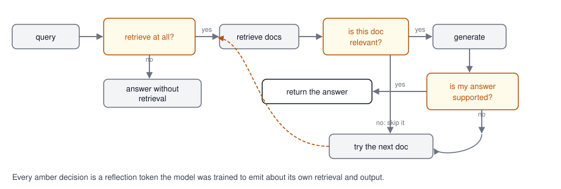
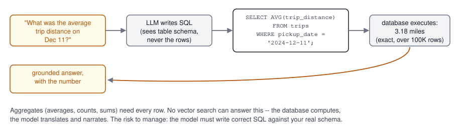
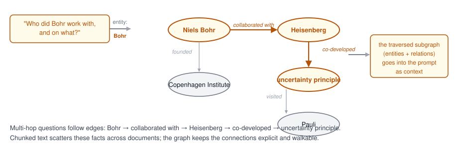
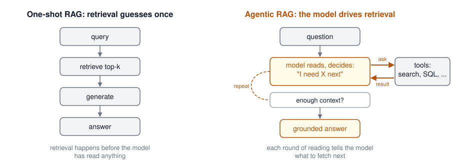
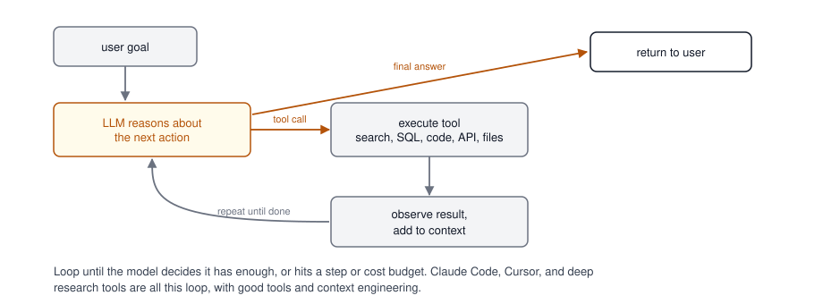
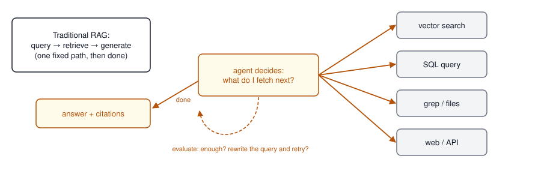
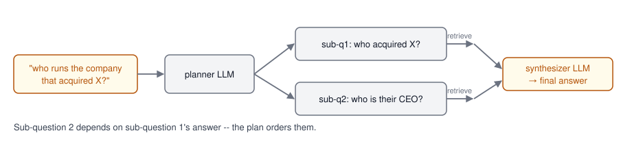
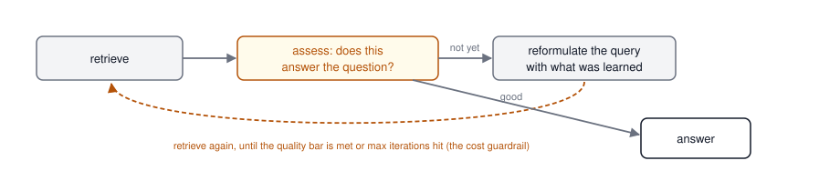

## Agenda {.smaller}

- Answering last week's cliffhanger: evaluating RAG with RAGAS
- Smarter retrieval: agentic search, Corrective RAG, Self-RAG
- RAG vs long context, and when to use which
- Managed RAG services
- Retrieval beyond vectors: **SQL RAG** and **Graph RAG**
- **Agentic RAG**: the model drives retrieval in a loop
- Where this leads: agents need a protocol (MCP, next)

## Last Week, and the Question We Left Open

- You built the full pipeline: chunk, embed, index, retrieve, generate -- and broke it, and fixed it in the lab
- We ended on a question: **how do we know the answers are grounded in the context we provide?**
- Today opens with the answer, then goes past the single vector pipeline: smarter retrieval, other shapes of data, and retrieval driven by the model itself

## RAG Evaluation with RAGAS

[RAGAS](https://docs.ragas.io/en/stable/) is the industry-standard open-source framework for evaluating RAG pipelines.

### Core Metrics

| Metric | What It Measures |
|--------|-----------------|
| **Context Precision** | Are the retrieved documents actually relevant? |
| **Context Recall** | Did we retrieve all the relevant documents? |
| **Faithfulness** | Is the generated answer supported by the retrieved context? |
| **Answer Relevancy** | Does the answer actually address the question? |

### The Key Insight

RAG evaluation requires measuring **two separate things**:

1. **Retrieval quality**: Did we find the right documents? (Context Precision + Recall)
2. **Generation quality**: Did we produce a good answer from those documents? (Faithfulness + Relevancy)

We go deep on evals and observability in Week 6.

Source: [RAGAS Paper (arXiv:2309.15217)](https://arxiv.org/abs/2309.15217), [RAGAS Documentation](https://docs.ragas.io/en/stable/)

## The Case Against Embeddings-Only RAG

The Anthropic engineering team discovered that for **Claude Code**, using Unix tools (`grep`, `ripgrep`, `find`) over codebases gives **better results** than embeddings-based approaches.

> "We did use vector embeddings initially. They're really tricky to maintain because you have to continuously re-index... Claude is really good at agentic search. You can get to the same accuracy level with agentic search and it's just a much cleaner deployment story."
>
> -- Cat Wu, PM for Claude Code ([Latent Space Podcast](https://www.latent.space/p/claude-code))

Boris Cherny (Lead Engineer, Claude Code) described the tool as **"not a product as much as it's a Unix utility"** -- fitting Anthropic's product principle of **"do the simple thing first."**

## Agentic Search vs Semantic Search

From [Anthropic's official engineering blog](https://www.anthropic.com/engineering/claude-code-best-practices):

> "Semantic search is usually faster than agentic search, but **less accurate, more difficult to maintain, and less transparent**. It involves 'chunking' the relevant context, embedding these chunks as vectors, and then searching for concepts by querying those vectors. Given its limitations, we suggest **starting with agentic search**, and only adding semantic search if you need faster results or more variations."

**Agentic search** = An AI agent iteratively uses tools like `grep`, `find`, `cat`, and `ls` to locate relevant information, reasoning about what to search for next based on what it has found so far.

### When Does Each Approach Win?

| Approach | Best For |
|----------|----------|
| **Agentic Search** (grep/find) | Codebases, structured text, precise lookups |
| **Semantic Search** (embeddings) | Large unstructured corpora, fuzzy matching |
| **Hybrid** (both as tools) | Agent chooses the right tool per query |

The takeaway: expose **both** as tools and let the agent decide.

## Corrective RAG (CRAG)

CRAG adds a **retrieval evaluator** that assesses document quality before generation.

### How It Works

1. Retrieve documents as usual
2. A lightweight evaluator scores each document: **Correct / Incorrect / Ambiguous**
3. Based on the assessment:
   - **Correct**: Refine and use the document
   - **Incorrect**: Discard and fall back to **web search**
   - **Ambiguous**: Combine refined document with web search results

### Why It Matters

- Works with any existing RAG pipeline, no retraining
- Does not trust retrieved documents on faith
- Falls back to web search when the local knowledge base comes up short

Source: [CRAG Paper (arXiv:2401.15884)](https://arxiv.org/abs/2401.15884), [LangGraph CRAG Tutorial](https://langchain-ai.github.io/langgraph/tutorials/rag/langgraph_crag/)

## Self-RAG {.smaller}

Self-RAG teaches the model to **reflect** during generation, dynamically deciding when and what to retrieve.

### Self-RAG Process

{height=290 fig-align="center"}

### CRAG + Self-RAG Together

- **CRAG** cleans the retrieval inputs (better documents in)
- **Self-RAG** refines the generation outputs (better answers out)
- Complementary approaches that can be combined

## RAG vs Long Context: The Trade-offs

| Factor | RAG | Long Context |
|--------|-----|-------------|
| **Cost per query** | Low (retrieve only what's needed) | High (pay for every token, every query) |
| **Query latency** | Low | Grows with context length |
| **Accuracy (QA benchmarks)** | Good | Slightly better on single-document tasks |
| **Scales to millions of docs** | Yes | No |
| **"Lost in the Middle" problem** | Minimal | Significant |
| **Requires indexing pipeline** | Yes | No |
| **Real-time data updates** | Easy | Requires re-prompting |

Source: [Long Context vs. RAG for LLMs (arXiv:2501.01880)](https://arxiv.org/abs/2501.01880)

## When to Use Which Approach

### Use RAG When:

- Knowledge base is **larger than the context window**
- You need **real-time updates** (new documents added frequently)
- **Cost matters** at query volume
- You need **source attribution** and traceability
- Working with **millions of documents**

### Use Long Context When:

- Entire corpus fits in the context window (< 200K tokens)
- You need the model to reason **across the entire document**
- Summarization or analysis of a **single long document**
- Prototyping before building a full RAG pipeline

### The Answer: Context Engineering

The field is moving toward **context engineering** -- dynamically assembling the most effective context per query, mixing RAG retrieval, long context, and cached context as appropriate.

## Managed RAG: Buy Instead of Build {.smaller}

Every major provider now sells the pipeline we just built as a managed service -- ingestion, chunking, embedding, retrieval, and citations behind one API:

| Service | Notes |
|---------|-------|
| [OpenAI file search](https://platform.openai.com/docs/guides/tools-file-search) | Hosted [vector stores](https://platform.openai.com/docs/guides/retrieval) + retrieval built into the Responses API; OpenAI chunks, embeds, and runs hybrid search for you |
| [Anthropic: retrieval as a tool](https://www.anthropic.com/news/contextual-retrieval) | No end-to-end service; the [Files API](https://docs.claude.com/en/docs/build-with-claude/files) plus retrieval tools, and the contextual retrieval technique |
| [Amazon Bedrock Knowledge Bases](https://aws.amazon.com/bedrock/knowledge-bases/) | Managed ingestion to a vector store; RetrieveAndGenerate API |
| [Google Vertex AI RAG Engine](https://cloud.google.com/vertex-ai/generative-ai/docs/rag-engine/rag-overview) | Managed corpora + retrieval on Vertex |
| [Pinecone Assistant](https://www.pinecone.io/product/assistant/), [LlamaCloud](https://www.llamaindex.ai/llamacloud) | Vector-DB-native and framework-native managed RAG (LlamaCloud adds parsing for messy PDFs) |

- **When to buy**: standard document Q&A, small team, no retrieval expertise on staff
- **When to build**: custom chunking/reranking, hybrid search tuning, data residency, cost control at scale -- everything this lecture taught you to reason about

# Retrieval Beyond Vectors

## Three Shapes of RAG

| Shape | Data | Retrieval | Answers questions like |
|-------|------|-----------|------------------------|
| **Vector RAG** (last week) | Unstructured text | Embedding similarity | "What does the contract say about termination?" |
| **SQL RAG** | Tables, databases | LLM-written SQL | "What was the average trip distance in December?" |
| **Graph RAG** | Entities + relationships | Graph traversal | "Who did Bohr work with, and on what?" |

One question type per shape -- and the failure mode is using the wrong shape: no amount of vector search answers an aggregate, and no SQL query explains a paragraph.

## SQL RAG: The Database Computes, the Model Narrates {.smaller}

{height=250 fig-align="center"}

- The model receives the **schema**, not the data -- it writes the query, the database does the work
- The only shape that answers **aggregates**: averages, counts, sums, group-bys over millions of rows
- Guardrails in practice: read-only credentials, allow-listed tables, query validation before execution


## SQL RAG in Practice {.smaller}

What makes the model write *correct* SQL against *your* schema:

- **Schema in context**: table definitions and a few sample rows -- the model never sees the data, only its shape
- **The RAG part**: retrieve similar past question-to-SQL pairs and inject them as few-shot examples -- this is how [Vanna](https://github.com/vanna-ai/vanna) works, and accuracy rises with every verified pair you add
- **Execution feedback**: run the query; if the database errors, hand the error back and let the model repair its own SQL -- one retry fixes most failures
- **Guardrails, non-negotiable**: read-only credentials, allow-listed tables, statement validation before execution -- the model writes queries, it never gets write access

::: {.hot-callout}
**The vocabulary gap**: "revenue" might be `SUM(line_total) WHERE status='closed'` -- mapping business terms to data is the semantic-layer problem. This is one of the hottest things in AI in the fall of 2026, if not *the* hottest. The mapping is called an **ontology**, and it is what creates a **context layer** over your data. Week 7 is devoted to it.
:::

## SQL RAG: Tools and Reading {.smaller}

| Project | What it is |
|---------|------------|
| [Vanna](https://github.com/vanna-ai/vanna) | The most-starred text-to-SQL RAG framework: trains on your schema, docs, and verified query pairs |
| [WrenAI](https://github.com/Canner/WrenAI) | Open-source "GenBI": governed text-to-SQL through a semantic layer, 20+ data sources |
| [PandasAI](https://github.com/sinaptik-ai/pandas-ai) | Chat with dataframes and databases; lighter-weight, analysis-oriented |
| [defog sqlcoder](https://github.com/defog-ai/sqlcoder) | Open-weight models fine-tuned specifically for SQL generation |

Reading:

- [Spider 2.0](https://spider2-sql.github.io/) and [BIRD](https://bird-bench.github.io/) -- the benchmarks that measure text-to-SQL against real, messy enterprise databases
- [Outstanding Text2SQL open source projects (Medium)](https://medium.com/@tubelwj/several-outstanding-text2sql-chat2sql-open-source-projects-237de8496b93) -- a survey of the ecosystem


## Graph RAG: Following the Connections {.smaller}

{height=290 fig-align="center"}

Built by extracting entities and relations from documents into a graph (Neo4j, Amazon Neptune, [Microsoft GraphRAG](https://www.microsoft.com/en-us/research/project/graphrag/)). Wins on **multi-hop** questions over connected data; costs an extraction pipeline you must build and maintain. Week 7 covers this in full, with ontologies and the semantic layer.


## Graph RAG in Practice {.smaller}

- **Building the graph**: an LLM reads your corpus once and extracts entities and relations into a graph store -- this extraction is the expensive part (LLM calls over every document)
- **Two retrieval modes** (Microsoft GraphRAG's split):
  - **Local search**: start at an entity, walk its neighborhood -- "who did Bohr work with?"
  - **Global search**: pre-summarized **communities** (clusters of related entities) answer corpus-wide questions -- "what are the main research themes?" -- which vector RAG cannot do at all
- **The temporal twist**: [Graphiti](https://github.com/getzep/graphiti) builds the graph **incrementally as facts arrive**, with validity intervals on every edge -- facts that change over time stay correct, which is why it has become the standard for **agent memory** (Week 5)
- **The honest trade**: better multi-hop and corpus-wide answers, at the cost of an extraction pipeline you build, pay for, and keep in sync with the source data

## Graph RAG: Tools and Reading {.smaller}

| Project | What it is |
|---------|------------|
| [Microsoft GraphRAG](https://github.com/microsoft/graphrag) | The reference implementation: entity extraction, communities, local + global search |
| [Graphiti](https://github.com/getzep/graphiti) (Zep) | Real-time, temporally-aware graphs built for agent memory -- incremental, no batch recompute |
| [LightRAG](https://github.com/HKUDS/LightRAG) | GraphRAG stripped to essentials: most of the quality at a fraction of the indexing cost |
| [neo4j-graphrag-python](https://github.com/neo4j/neo4j-graphrag-python) | Neo4j's official package: KG construction plus a library of retrievers |

Reading:

- [GraphRAG paper (arXiv:2404.16130)](https://arxiv.org/abs/2404.16130) -- where community summaries came from
- [Graphiti: knowledge graph memory for an agentic world (Neo4j blog)](https://neo4j.com/blog/developer/graphiti-knowledge-graph-memory/)
- [Graph RAG in production: GraphRAG vs LightRAG vs Graphiti](https://www.paperclipped.de/en/blog/graph-rag-production/) -- cost and architecture compared
- [awesome-graphrag](https://github.com/graphrag/awesome-graphrag) -- the curated list

## Cypher: How the Industry Queries Graphs {.smaller}

Once facts live in a graph, you need a query language. **Cypher** is the SQL of
graphs: you draw the pattern you want, in the shape the data has.

```cypher
MATCH (p:Person)-[:COLLABORATED_WITH]->(q:Person)
WHERE p.name = 'Niels Bohr'
RETURN q.name
```

- Nodes in parentheses, relationships in arrows -- the query looks like the
  diagram from earlier in this lecture
- Multi-hop is just a longer arrow chain: `(a)-[:MENTORED]->(b)-[:BUILT]->(c)`
- And the move you already know from SQL RAG applies here too: **an LLM can
  write Cypher** from a question plus the graph schema -- text-to-Cypher is
  SQL RAG's graph twin

**Engines that speak it**: [Neo4j](https://neo4j.com/) and
[Memgraph](https://memgraph.com/) (servers), Amazon Neptune (openCypher),
[Kuzu](https://github.com/kuzudb/kuzu) -- the embedded "SQLite of graphs,"
acquired by Apple in 2025 with the repo archived but still pip-installable --
and [LadybugDB](https://github.com/ColinLeeo/kuzu), its community fork.
Hands-on in Week 7, with ontologies and the semantic layer.

# Agentic RAG

## Why One Retrieval Is Not Enough

Everything so far retrieves **once, up front** -- before the model has read a single word. That works for simple questions and breaks for real ones:

- **You have to guess what to fetch before reading anything** -- the query's wording rarely matches the documents' wording
- **Complex questions take multiple hops**: "How did our Q3 compare to Acme's?" needs our report, then theirs, then a comparison -- no single retrieval returns all of it
- **The first document tells you what to read next** (it cites a contract, mentions a ticket) -- a fixed pipeline cannot follow that thread
- **Retrieval fails silently**: if the top-k chunks are wrong, generation proceeds anyway, ungrounded

::: {.fragment}
The fix: context cannot be a one-time delivery. **Run the model in a loop and let it tell us what it needs.** We fetch that with tools, hand it back, and repeat until it has enough to answer.
:::

## One-Shot vs. Agentic RAG {.smaller}

{height=300 fig-align="center"}

This loop -- a model that decides, acts through tools, observes, and repeats -- is called an **agent**. Today: just enough agents to build agentic RAG. Next week onward: agents in full.

## What is an AI Agent?

- **Definition**: An LLM-powered system that **autonomously decides** what actions to take to accomplish a goal
- **Workflow vs. Agent** (Anthropic's distinction):
  - **Workflow**: LLMs and tools orchestrated through predefined code paths
  - **Agent**: The LLM dynamically directs its own process and tool usage
- **Core ingredients**:
  - A model (the brain)
  - Tools (the hands: search, code execution, APIs)
  - A loop (observe -> think -> act -> repeat)
  - Memory/context (what it knows so far)

Source: [Anthropic: Building Effective Agents](https://www.anthropic.com/engineering/building-effective-agents)

## Tool Use / Function Calling

The foundation of every agent: the LLM decides **when** to call a function and **what arguments** to pass.

```python
import anthropic

client = anthropic.Anthropic()  # or OpenAI, Groq, ... -- every provider has this shape

tools = [{
    "name": "get_stock_price",
    "description": "Get current stock price for a ticker symbol",
    "input_schema": {
        "type": "object",
        "properties": {
            "ticker": {"type": "string", "description": "Stock ticker symbol"}
        },
        "required": ["ticker"],
    },
}]

response = client.messages.create(
    model="claude-opus-5",
    max_tokens=1024,
    tools=tools,
    messages=[{"role": "user", "content": "What is Apple's stock price?"}],
)
# response.stop_reason == "tool_use"; the block's input is {"ticker": "AAPL"}
```

- **You** execute the function and return results to the LLM
- The LLM incorporates results into its response -- or calls another tool

## The Agent Loop

{height=320 fig-align="center"}


## Agentic RAG: RAG Meets the Agent Loop

Traditional RAG follows a **fixed pipeline**: retrieve, then generate. Agentic RAG puts the agent in charge of retrieval decisions.

{height=270 fig-align="center"}

### Key Capabilities

- **Query planning**: Decomposes complex questions into sub-queries
- **Tool selection**: Chooses between vector search, keyword search, SQL, APIs
- **Self-correction**: Evaluates retrieved documents and retries if quality is low

Source: [Agentic RAG Survey (arXiv:2501.09136)](https://arxiv.org/abs/2501.09136)

## Query Planning and Decomposition

The agent treats a complex question as a **plan**, not a single lookup:

1. **Decompose**: Break the question into sub-questions
   - "Compare policies A and B" → retrieve A, retrieve B, then compare
2. **Order**: Decide which sub-questions depend on earlier answers
   - "Who is the CEO of the company that acquired X?" → find acquirer first
3. **Retrieve per sub-question**: Each sub-query gets its own targeted retrieval
4. **Synthesize**: Combine intermediate answers into the final response

{height=190 fig-align="center"}

---

## Multi-Source Routing

The agent selects from **multiple knowledge sources**, per query:

| Query type | Routed to |
|------------|-----------|
| "What does our onboarding doc say about VPN?" | Vector store (internal docs) |
| "How many orders shipped last week?" | SQL database (text-to-SQL tool) |
| "What is the latest vLLM release?" | Web search |
| "What is the status of ticket 4312?" | Ticketing API |

- Routing is a **classification decision** made by the LLM (or a small router model)
- Descriptions of each source act like tool schemas -- write them carefully
- Falls back to "no retrieval" when parametric knowledge suffices

---

## Iterative Retrieval

Single-pass retrieval often misses. Agentic RAG **loops**:

{height=180 fig-align="center"}

- **Assess**: Do the retrieved chunks actually answer the question?
- **Reformulate**: Rewrite the query using what was learned
  - Add synonyms, entity names, or constraints discovered in round 1
- **Stop condition**: Quality threshold met, or max iterations reached (cost guardrail)
- Related technique: **HyDE** -- generate a hypothetical answer, embed *that* for retrieval

**Trade-off**: Better answers vs more tokens and latency -- budget the loop.

---

## Agentic RAG vs. Traditional RAG

| Aspect | Traditional RAG | Agentic RAG |
|--------|----------------|-------------|
| **Retrieval** | Fixed pipeline, always retrieves | Agent decides when to retrieve |
| **Query** | User query passed as-is | Agent plans, decomposes, reformulates |
| **Sources** | Single knowledge base | Multiple sources, dynamically selected |
| **Evaluation** | No self-assessment | Agent evaluates result quality |
| **Iteration** | Single pass | Multiple rounds until satisfied |
| **Tools** | Retrieval only | Retrieval + code execution + APIs |
| **Cost/latency** | Low, predictable | Higher, variable |

---

## When to Use Agentic RAG

**Use classic RAG when:**

- Queries are simple, single-hop factual lookups
- One well-curated corpus covers the domain
- Latency and cost budgets are tight

**Use agentic RAG when:**

- Questions are multi-hop or comparative
- Knowledge is spread across heterogeneous sources (docs + DBs + APIs)
- Answer quality matters more than latency
- You already have an agent -- retrieval becomes **just another tool**

That last point is the bridge to Part 2: agents need a **standard way to reach tools and data**. Enter MCP.

---

## Why Agents Need a Protocol

- Every tool integration used to be bespoke: N models x M tools = N*M connectors
- **Model Context Protocol (MCP)**: An open standard (Anthropic, 2024) for connecting LLMs to external data and tools
  - One server exposes tools/resources; any MCP-capable client can use them
  - Adopted across Claude, IDEs, and agent frameworks
- **Agent-to-agent communication**: When multiple agents collaborate, they need their own protocols (A2A)
- This is where the course goes next

## Preview: The Agents Arc

- **Week 4 -- Agentic RAG and MCP**: Build retrieval agents; expose your data and tools via Model Context Protocol servers
- **Week 5 -- Agent Architectures**: Planning, memory, multi-agent patterns (orchestrator/workers, evaluator/optimizer), frameworks
- **Week 10 -- A2A**: Agent-to-agent protocols and cross-agent interoperability
- Everything builds on today's foundations: retrieval + tool use + the agent loop

## References {.smaller}

### Advanced RAG Techniques

1. [Agentic RAG Survey (arXiv:2501.09136)](https://arxiv.org/abs/2501.09136)
1. [Corrective RAG Paper (arXiv:2401.15884)](https://arxiv.org/abs/2401.15884)
1. [LangGraph CRAG Tutorial](https://langchain-ai.github.io/langgraph/tutorials/rag/langgraph_crag/)
1. [Microsoft GraphRAG](https://www.microsoft.com/en-us/research/project/graphrag/) and [Paper (arXiv:2404.16130)](https://arxiv.org/abs/2404.16130)
1. [ColBERTv2 Paper (arXiv:2112.01488)](https://arxiv.org/abs/2112.01488)
1. [Long Context vs. RAG (arXiv:2501.01880)](https://arxiv.org/abs/2501.01880)

### SQL and Graph RAG

1. [Microsoft GraphRAG](https://www.microsoft.com/en-us/research/project/graphrag/) and [Paper (arXiv:2404.16130)](https://arxiv.org/abs/2404.16130)
1. [RAGAS Documentation](https://docs.ragas.io/en/stable/) and [Paper (arXiv:2309.15217)](https://arxiv.org/abs/2309.15217)

### Agents

1. [Anthropic: Building Effective Agents](https://www.anthropic.com/engineering/building-effective-agents)
1. [Model Context Protocol](https://modelcontextprotocol.io/)
1. [Anthropic Tool Use Documentation](https://docs.anthropic.com/en/docs/build-with-claude/tool-use)
