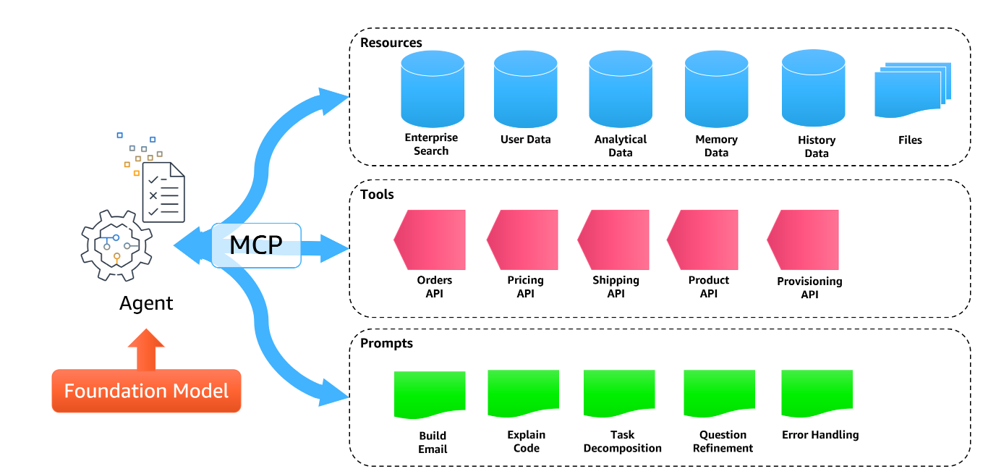
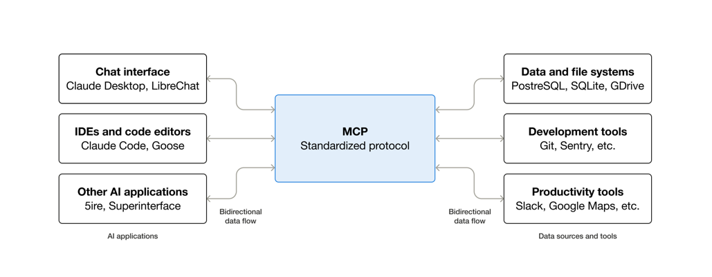
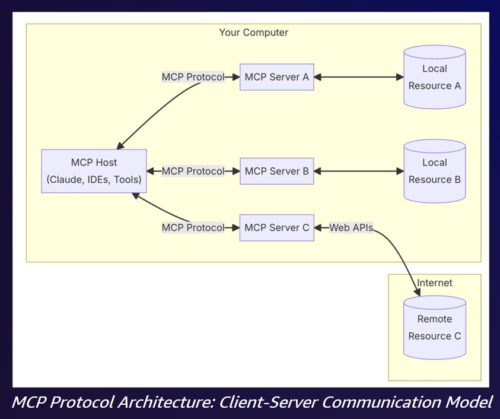

## Agenda

- **Part 1: Agentic RAG**
  - From classic RAG pipelines to agent-driven retrieval
  - Query planning, decomposition, and routing
  - Iterative retrieval and self-reflection
  - Corrective RAG (CRAG)
- **Part 2: Model Context Protocol (MCP)**
  - MCP architecture and primitives
  - Building and deploying MCP servers
  - Authentication and security
  - Local vs remote deployment
- Hands-on Lab
- References

---

## Agentic RAG {.center}

When retrieval becomes an agent capability, not just a pipeline step

---

## Recap: The Classic RAG Pipeline

From Week 3 -- a **fixed, single-pass** pipeline:

```
User query → Embed → Retrieve top-k chunks → Stuff into prompt → Generate
```

- Every query follows the **same path**, whether it needs retrieval or not
- One retrieval attempt -- no second chances if the results are poor
- One knowledge source -- the vector store you wired in
- The LLM never gets to say "these documents don't answer the question"

Classic RAG works well for simple factual lookups over a single corpus.

---

## Where Classic RAG Breaks Down

- **Complex questions**: "Compare our Q3 and Q4 refund policies and summarize what changed" -- needs multiple retrievals and synthesis
- **Ambiguous queries**: User phrasing doesn't match document vocabulary → poor embedding match
- **Wrong source**: The answer lives in a SQL database or an API, not the vector store
- **Irrelevant retrievals**: Top-k chunks are topically similar but don't actually answer the question -- the model hallucinates around them
- **No retrieval needed**: "Write a haiku" still triggers a pointless (and costly) retrieval

**Root cause**: The pipeline has no decision-making. Fix: put an **agent** in charge of retrieval.

---

## What is Agentic RAG?

**Traditional RAG**: A fixed pipeline -- query → retrieve → generate

**Agentic RAG**: The agent **decides** when and how to retrieve information

Key differences:

- **Query Routing**: Agent selects the right data source for each query
- **Query Reformulation**: Agent rewrites queries for better retrieval
- **Self-Reflection**: Agent evaluates retrieved results and decides if they are sufficient
- **Iterative Retrieval**: Agent performs multiple rounds of retrieval, refining each time
- **Tool-Augmented Retrieval**: Agent combines retrieval with other tools (calculators, APIs, code execution)

---

## Query Planning and Decomposition

The agent treats a complex question as a **plan**, not a single lookup:

1. **Decompose**: Break the question into sub-questions
   - "Compare policies A and B" → retrieve A, retrieve B, then compare
2. **Order**: Decide which sub-questions depend on earlier answers
   - "Who is the CEO of the company that acquired X?" → find acquirer first
3. **Retrieve per sub-question**: Each sub-query gets its own targeted retrieval
4. **Synthesize**: Combine intermediate answers into the final response

```
Question → [Planner LLM] → sub-q1, sub-q2, sub-q3
             → retrieve each → [Synthesizer LLM] → answer
```

---

## Multi-Source Routing

The agent selects from **multiple knowledge sources**, per query:

| Query type | Routed to |
|------------|-----------|
| "What does our onboarding doc say about VPN?" | Vector store (internal docs) |
| "How many orders shipped last week?" | SQL database (text-to-SQL tool) |
| "What is the latest vLLM release?" | Web search |
| "What is the status of ticket 4312?" | Ticketing API |

- Routing is a **classification decision** made by the LLM (or a small router model)
- Descriptions of each source act like tool schemas -- write them carefully
- Falls back to "no retrieval" when parametric knowledge suffices

---

## Iterative Retrieval

Single-pass retrieval often misses. Agentic RAG **loops**:

```
retrieve → assess → reformulate → retrieve again → ... → answer
```

- **Assess**: Do the retrieved chunks actually answer the question?
- **Reformulate**: Rewrite the query using what was learned
  - Add synonyms, entity names, or constraints discovered in round 1
- **Stop condition**: Quality threshold met, or max iterations reached (cost guardrail)
- Related technique: **HyDE** -- generate a hypothetical answer, embed *that* for retrieval

**Trade-off**: Better answers vs more tokens and latency -- budget the loop.

---

## Self-Reflection and Corrective RAG

### Self-reflective RAG
- The agent **grades its own retrievals and drafts**
- "Is this document relevant?" / "Is my answer supported by the sources?"
- Unsupported claims trigger re-retrieval or abstention ("I don't know")

### Corrective RAG (CRAG)
- A lightweight **evaluator grades retrieved documents** for relevance
- **Correct** → use them; **Ambiguous** → refine and supplement; **Incorrect** → discard and fall back to web search or another source
- Prevents the classic failure mode: confidently generating from bad context

---

## Agentic RAG vs. Traditional RAG

| Aspect | Traditional RAG | Agentic RAG |
|--------|----------------|-------------|
| **Retrieval** | Fixed pipeline, always retrieves | Agent decides when to retrieve |
| **Query** | User query passed as-is | Agent plans, decomposes, reformulates |
| **Sources** | Single knowledge base | Multiple sources, dynamically selected |
| **Evaluation** | No self-assessment | Agent evaluates result quality |
| **Iteration** | Single pass | Multiple rounds until satisfied |
| **Tools** | Retrieval only | Retrieval + code execution + APIs |
| **Cost/latency** | Low, predictable | Higher, variable |

---

## When to Use Agentic RAG

**Use classic RAG when:**

- Queries are simple, single-hop factual lookups
- One well-curated corpus covers the domain
- Latency and cost budgets are tight

**Use agentic RAG when:**

- Questions are multi-hop or comparative
- Knowledge is spread across heterogeneous sources (docs + DBs + APIs)
- Answer quality matters more than latency
- You already have an agent -- retrieval becomes **just another tool**

That last point is the bridge to Part 2: agents need a **standard way to reach tools and data**. Enter MCP.

---

## Model Context Protocol (MCP) {.center}

A standardized protocol for connecting AI models with external tools and data sources

---

## What is MCP?

- **Model Context Protocol (MCP)**: An open protocol that standardizes how AI applications connect to external data sources and tools

- **Created by Anthropic**: Released in November 2024, now an open source project hosted by The Linux Foundation

- **Broad industry adoption**: Supported across the ecosystem -- Anthropic (Claude), OpenAI, Google, Microsoft, AWS, and major IDEs/agent frameworks ship MCP client support

- **Universal Standard**: Like USB-C for AI -- one protocol to connect any AI to any tool

- **Key Benefit**: Build once, use everywhere -- no more custom integrations for each AI application

---

## MCP Architecture Overview

::: {.callout}

:::

MCP exposes three core primitives to AI agents:

- **Resources**: Data sources (databases, files, enterprise search, user data)
- **Tools**: Executable functions (APIs for orders, pricing, shipping, products)
- **Prompts**: Pre-defined templates (email building, code explanation, task decomposition)

---

## MCP as a Standardized Protocol

::: {.callout}

:::

**Bidirectional data flow** between:

- **AI Applications**: Chat interfaces (Claude Desktop), IDEs (Claude Code, Goose), other AI apps
- **Data Sources & Tools**: Databases (PostgreSQL, SQLite), dev tools (Git, Sentry), productivity tools (Slack, Google Maps)

---

## The M x N Problem

::: {.callout}

:::

**Without MCP**: 3 Agents x 3 Systems = 9 custom integrations

**With MCP**: 3 Clients + 3 Servers = 6 components

MCP reduces integration complexity from **O(M x N)** to **O(M + N)**

---

## MCP Protocol Architecture

::: {.callout}

:::

- **MCP Host**: The AI application (Claude Desktop, IDEs, custom tools)
- **MCP Servers**: Lightweight programs exposing specific capabilities
- **Transport**: Communication via stdio (local) or Streamable HTTP (remote)
- **Resources**: Local files, databases, or remote APIs via web

---

## MCP Core Primitives {.center}

The building blocks that servers expose to AI clients

---

## Server Primitives: Tools, Resources, Prompts {.smaller}

### Tools (Server → Client)
- **Executable functions** the AI can invoke to perform actions
- **Can have side effects**: write files, call APIs, modify databases
- Example: `create_issue(title, body)`, `send_email(to, subject, message)`

### Resources (Server → Client)
- **Read-only data sources** accessible to the AI (like GET endpoints)
- Provide context without side effects
- URI-based addressing: `file:///path`, `db://table/id`, `api://endpoint`
- Example: `config://settings`, `data://users/{id}`

### Prompts (Server → Client)
- **Pre-defined templates** for common interaction patterns
- Standardize how the AI approaches specific tasks
- Include placeholders for dynamic content
- Example: `code_review`, `summarize_document`, `generate_tests`

---

## Advanced Primitives: Sampling, Elicitation, Notifications {.smaller}

### Sampling (Client ← Server)
- **Reverse flow**: Server requests LLM completions from the client
- Enables agentic patterns where tools need AI reasoning mid-execution
- Server sends sampling request → Client runs LLM → Returns result to server

### Elicitation (Client ← Server)
- Server requests **user input** when information is missing
- Client prompts user and returns their response to server
- Example: "Which project ID should I query?" or "Confirm deletion?"
- Enables interactive workflows without hardcoding parameters

### Notifications (Server → Client)
- **One-way messages** from server to client (no response expected)
- Progress updates for long-running operations, log messages, status changes
- Example: `progress: 50%`, `log: Processing file 3 of 10`

---

## MCP Primitive Summary

| Primitive | Direction | Purpose | Side Effects |
|-----------|-----------|---------|--------------|
| **Tools** | Server → Client | Execute actions | Yes |
| **Resources** | Server → Client | Provide data | No (read-only) |
| **Prompts** | Server → Client | Template interactions | No |
| **Sampling** | Client ← Server | Request LLM completion | No |
| **Elicitation** | Client ← Server | Request user input | No |
| **Notifications** | Server → Client | Send updates/logs | No |

**Key insight**: MCP is bidirectional -- servers can request things from clients too!

---

## MCP and Agentic RAG Together

MCP makes agentic RAG **practical** -- every knowledge source becomes a standard tool:

- Vector store search → an MCP **tool** (`search_docs(query)`)
- SQL database → an MCP server exposing `query_database`
- Web search → an MCP server (e.g., a search-provider server)
- File system, tickets, wikis → existing off-the-shelf MCP servers

The agent's router/planner simply **selects among MCP tools** -- no custom integration code per source, and the same servers work in Claude Desktop, your IDE, and your production agent.

---

## Challenges with Using MCP at Scale

**Discovery & Configuration**:

- **Tool Discovery**: How do agents find available MCP servers?
- **Configuration Sprawl**: Managing server configs across environments
- **Dynamic Capabilities**: Tools that change over time

**Security & Governance**:

- **Authentication Complexity**: OAuth, API keys, tokens across services
- **Credential Management**: Secure storage and rotation
- **Multi-Tenant Access**: Isolating data between users/organizations
- **Governance & Compliance**: Audit trails, access controls, data policies

**Operations**:

- **Performance & Reliability**: Latency, uptime, error handling at scale

---

## MCP Gateway and Registry

::: {.callout}

:::

**Solving scale challenges** with centralized management:

- **Server Registry**: Discover and catalog available MCP servers
- **Health Monitoring**: Track server status and reliability
- **Access Control**: Manage who can use which servers
- **Analytics**: Usage statistics and performance metrics

> Source: [MCP Gateway Registry](https://github.com/agentic-community/mcp-gateway-registry)

---

## MCP Server Types

### Local MCP Servers

- Run on the same machine as the client
- Use **stdio** transport (standard input/output)
- Fast, low-latency communication
- Examples: filesystem access, local databases, git operations

### Remote MCP Servers

- Deployed as cloud services
- Use **Streamable HTTP** transport (SSE deprecated in March 2025)
- Enable shared access across users
- Examples: API wrappers, SaaS integrations, enterprise tools

---

## Building MCP Servers

### Key Concepts

- **Tools**: Functions that the AI can call (with input schema and execution logic)
- **Resources**: Data sources the AI can read (files, database records, API responses)
- **Prompts**: Pre-defined prompt templates for common tasks
- **Transport**: How client and server communicate (stdio, Streamable HTTP)

### Python SDK Example (FastMCP)

```python
from mcp.server.fastmcp import FastMCP

mcp = FastMCP("my-mcp-server")

@mcp.tool()
def get_weather(city: str) -> str:
    """Get current weather for a city."""
    return f"Weather in {city}: Sunny, 72F"

if __name__ == "__main__":
    mcp.run()
```

---

## MCP Server Examples

### Common Use Cases

- **API Wrappers**: Expose REST APIs as MCP tools (Slack, GitHub, Jira)
- **Database Connections**: Query databases via natural language
- **File System Access**: Safe, sandboxed file operations
- **Development Tools**: Git operations, build systems, deployment
- **Custom Business Logic**: Domain-specific tools for your organization

### Popular MCP Servers

- **Filesystem**: Read/write local files
- **PostgreSQL/SQLite**: Database queries
- **GitHub**: Repository operations
- **Brave Search**: Web search capabilities
- **Puppeteer**: Browser automation

---

## MCP in Claude Code

Claude Code uses MCP extensively:

```json
{
  "mcpServers": {
    "filesystem": {
      "command": "npx",
      "args": ["-y", "@modelcontextprotocol/server-filesystem", "/path"]
    },
    "github": {
      "command": "npx",
      "args": ["-y", "@modelcontextprotocol/server-github"],
      "env": {
        "GITHUB_TOKEN": "your-token"
      }
    }
  }
}
```

Configure in `~/.claude.json` (user scope) or project-level `.mcp.json` (project scope)

---

## Deployment Patterns

### Local Development

- MCP servers run as subprocesses
- Configuration in local settings files
- Fast iteration and debugging

### Production Deployment

- Remote MCP servers as microservices
- Centralized registry for discovery
- Authentication and rate limiting
- Monitoring and observability

### Hybrid Approaches

- Local servers for sensitive operations
- Remote servers for shared resources
- Gateway for routing and access control

---

## Security Considerations {.smaller}

### Authentication

- **API Keys**: Simple but less secure
- **OAuth 2.0**: The spec's standard for remote servers (authorization code flow with PKCE)
- **mTLS**: For service-to-service auth

### Authorization

- Tool-level permissions
- Resource access controls
- Audit logging

### Best Practices

- Never expose MCP servers to public internet without auth
- Use environment variables for secrets
- Beware **tool poisoning / prompt injection** via untrusted server descriptions -- vet third-party servers
- Implement rate limiting
- Log all tool invocations for audit

---

## Hands-on Lab

### Building an Agentic RAG Workflow with MCP

*Practical exercise and demonstration*

1. **Setup**: Install MCP Python SDK
2. **Define Tools**: Expose a document-search tool and a SQL-query tool as MCP servers
3. **Add Resources**: Expose data sources
4. **Test Locally**: Use MCP Inspector or Claude Desktop
5. **Go Agentic**: Let the agent route between the two sources, grade retrievals, and retry with reformulated queries

```bash
# Install MCP SDK
uv add mcp

# Run MCP Inspector for testing
npx @modelcontextprotocol/inspector
```

---

## References {.smaller}

**Agentic RAG:**

- [Anthropic -- Building Effective Agents](https://www.anthropic.com/research/building-effective-agents)
- [Corrective RAG (CRAG) paper](https://arxiv.org/abs/2401.15884)
- [Self-RAG paper](https://arxiv.org/abs/2310.11511)
- [LangGraph -- Agentic RAG tutorials](https://langchain-ai.github.io/langgraph/tutorials/rag/langgraph_agentic_rag/)

**Official MCP Resources:**

- [Model Context Protocol Documentation](https://modelcontextprotocol.io/)
- [MCP Specification Repository](https://github.com/modelcontextprotocol/modelcontextprotocol)
- [MCP Python SDK](https://github.com/modelcontextprotocol/python-sdk)
- [MCP TypeScript SDK](https://github.com/modelcontextprotocol/typescript-sdk)
- [Official MCP Servers Collection](https://github.com/modelcontextprotocol/servers)

**Additional Resources:**

- [Anthropic MCP Announcement](https://www.anthropic.com/news/model-context-protocol)
- [MCP Gateway Registry](https://github.com/agentic-community/mcp-gateway-registry)
- [Why MCP Deprecated SSE for Streamable HTTP](https://modelcontextprotocol.io/specification/2025-03-26/basic/transports)
