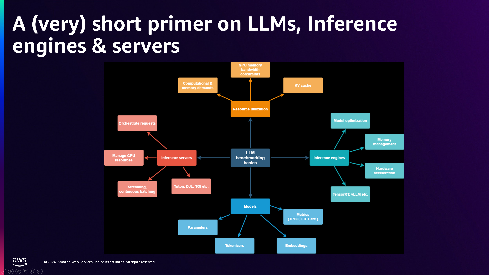
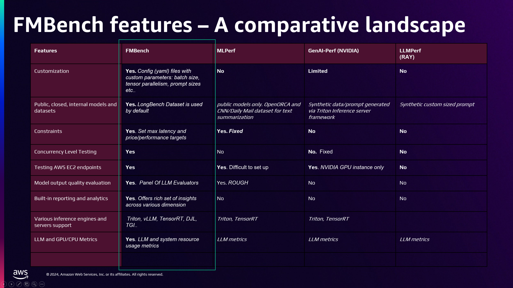
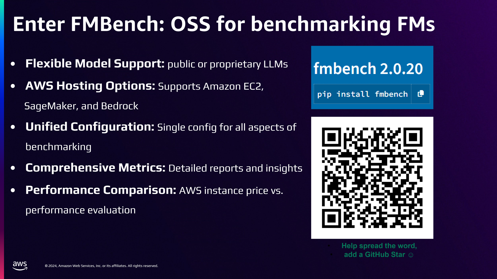

## Agenda

- What is tokenomics?
- Token pricing: input, output, cached
- Cost drivers in LLM applications
- Cost levers: caching, batching, routing
- Cost-per-task vs. cost-per-token
- Build vs. buy economics
- Benchmarking: price, performance, accuracy
- Latency percentiles and throughput
- Benchmarking tools: MLPerf, LLMPerf, FMBench
- Hands-on lab

---

## What is Tokenomics?

::: {.incremental}
- **Tokenomics**: the economics of building on token-metered models
- Every LLM call is a purchase: you pay per **token in** and per **token out**
- Small design decisions (prompt length, model choice, retry policy) compound into the largest line item of a GenAI product
- The developer's job: deliver **required quality at the lowest cost-per-task**, not the lowest cost-per-token
:::

---

## How API Pricing Works

- Providers price per **million tokens**, split three ways:

| Meter | What it covers | Typical relative price |
|-------|----------------|------------------------|
| **Input tokens** | Prompt: system, context, history, tools | Baseline |
| **Output tokens** | Generated completion | ~3–5× input |
| **Cached input tokens** | Previously-seen prompt prefix | ~0.1–0.25× input |

- Consequence: **verbose outputs are the most expensive thing you can ask for**
- Batch/asynchronous tiers typically offer ~50% discounts for non-interactive work

---

## Cost Drivers in Real Applications

::: {.incremental}
- **Context stuffing**: RAG chunks, long system prompts, full conversation history resent every turn
- **Tool schemas**: every tool definition rides along in *every* request
- **Agent loops**: one user request → many model calls (plan, act, reflect, retry)
- **Reasoning tokens**: extended-thinking modes bill hidden intermediate tokens as output
- **Retries and fallbacks**: failures you pay for twice
- **Fan-out**: multi-agent systems multiply all of the above
:::

---

## Anatomy of a Request's Cost

```
cost = (input_tokens   × input_price)
     + (cached_tokens  × cached_price)
     + (output_tokens  × output_price)

task_cost = Σ requests per task   ← the number that matters
```

- Instrument **per-task token accounting** from day one
- An agent that makes 25 calls at $0.01 each is a $0.25 agent — price it like one

---

## Lever 1: Prompt Caching

::: {.incremental}
- Providers cache **stable prompt prefixes** (system prompt, tool schemas, few-shot examples, large documents)
- Cache hits are billed at a fraction of input price (and are faster)
- Design rule: **stable content first, volatile content last** — any change invalidates everything after it
- Biggest wins: agents (same system prompt + tools every call), long-document Q&A, chat with long history
:::

---

## Lever 2: Batching

- **Batch APIs**: submit jobs asynchronously, get results within hours, pay ~50% less
- Ideal for: evaluation runs, document pipelines, embedding generation, nightly enrichment
- Self-hosted equivalent: **continuous batching** in vLLM/SGLang raises GPU utilization → more tokens per dollar of compute
- Ask of every workload: *does anyone need this answer in real time?*

---

## Lever 3: Model Routing and Cascades

::: {.incremental}
- **Routing**: classify the request, send it to the cheapest model that can handle it
  - Small/fast model (e.g., Haiku-class, Flash-class, small open models) for extraction and classification
  - Frontier model (e.g., Claude Opus-class, GPT-5-class) for hard reasoning
- **Cascade**: try cheap first; escalate only on low confidence or failed validation
- **Model gateways** (LiteLLM, OpenRouter, Bedrock) centralize routing, fallback, and spend tracking
- Routing typically cuts spend far more than prompt tweaking — most traffic is easy traffic
:::

---

## More Cost Levers {.smaller}

- **Output discipline**: max-token limits, terse formats (JSON, not prose), "answer only" instructions
- **Context management**: summarize or truncate history; retrieve less but better
- **Distillation / fine-tuning**: move a high-volume narrow task from a frontier model to a small tuned model (Week 11)
- **Quantization** (self-hosted): more throughput per GPU (Week 2)
- **Semantic response caching**: identical/near-identical questions answered from cache, zero tokens

---

## Cost-per-Task vs. Cost-per-Token

::: {.incremental}
- Cost-per-token comparisons across models are **misleading**:
  - A cheaper model that needs 3 attempts and a human review costs more
  - A pricier model that one-shots the task may be the bargain
- Define the task, measure **end-to-end**: tokens × calls × success rate
- `effective cost = task_cost / success_rate`
- This is why **evaluation (Week 6) and tokenomics are inseparable**: you can't optimize cost without measuring quality
:::

---

## Build vs. Buy Economics

| | **API (buy)** | **Self-hosted (build)** |
|---|--------------|------------------------|
| Cost shape | Pure variable (per token) | Fixed (GPUs) + ops |
| Utilization risk | None | You pay for idle GPUs |
| Breakeven | Low/spiky volume | High, steady volume |
| Also consider | Data egress, rate limits | Talent, upgrades, model refresh cadence |

- Open-weight models (Llama 4, Qwen 3, DeepSeek) on vLLM/SGLang shift the curve — but only at sustained high utilization
- Full treatment of open-weight vs. frontier trade-offs: **Week 12**

---

## From Cost to Benchmarking

- You cannot reason about tokenomics without **measured** performance
- Benchmarking answers, for *your* workload:
  - What does a request **cost**?
  - How **fast** is it (latency)?
  - How **much** can the system handle (throughput)?
  - Is the output **good enough** (accuracy)?
- Enables **fair comparisons** across models, providers, instance types, and serving stacks

---

## Back to Basics: Inference Performance



---

## The Metrics That Matter

| Metric | Definition | Who cares |
|--------|-----------|-----------|
| **TTFT** | Time to first token | Interactive UX |
| **TPOT / ITL** | Time per output token | Streaming smoothness |
| **E2E latency** | Full request round-trip | Batch & agent steps |
| **Throughput** | Tokens/sec or requests/min | Capacity planning |
| **Cost per 1M tokens** | $ normalized to volume | Finance |
| **Accuracy** | Task-specific quality score | Everyone |

---

## Latency Percentiles

::: {.incremental}
- **Never report averages alone** — LLM latency is long-tailed
- Report **p50 / p90 / p99**:
  - p50: typical experience
  - p99: what your angriest users see; what your SLA is written against
- Tail latency worsens under load (queueing, batching effects) — measure at realistic **concurrency**, not with one sequential client
- Agent pipelines compound tails: 5 sequential calls at p90 each ≈ a coin flip of at least one slow step
:::

---

## Benchmarking Methodology

1. **Fix the workload**: real prompt/response length distributions from your app — not synthetic short prompts
2. **Sweep concurrency**: 1 → N clients; find where latency degrades
3. **Measure everything per run**: TTFT, TPOT, E2E, throughput, errors, $
4. **Hold accuracy constant**: a faster config that degrades quality isn't faster, it's worse
5. **Repeat runs**; report percentiles with configs pinned (model version, quantization, instance)

---

## Key Benchmarking Tools

| Tool | Scope | Focus areas |
|------|-------|-------------|
| **MLCommons MLPerf** | Training & inference benchmarks across ML tasks | Standardized comparisons of GPUs, CPUs, accelerators |
| **Ray LLMPerf** | LLM-specific load testing | Scalability, latency, output correctness |
| **FMBench** | Foundation-model benchmarking on AWS | Cost, latency, throughput, LLM-judge evaluations |

---

## MLPerf

- **Industry standard** from MLCommons, backed by NVIDIA and other hardware vendors
- Benchmarks AI **training and inference** performance across GPUs, TPUs, CPUs
- Key suites:
  - **MLPerf Training**: time-to-accuracy on standard tasks
  - **MLPerf Inference**: latency and throughput
  - **MLPerf Edge**: efficiency on edge devices
- Use it for **hardware selection**: comparing accelerator generations for cloud or on-prem

---

## Ray LLMPerf

- Purpose-built for benchmarking **LLM serving endpoints**
- Key features:
  - **Load testing**: simulates concurrent user requests, measures TTFT/ITL under load
  - **Correctness testing**: sanity-checks model outputs
  - **Multi-node benchmarking**: for distributed inference
- Use it to **tune serving stacks** (vLLM, SGLang, managed endpoints) before production traffic

---

## FMBench: Foundation Model Benchmarking on AWS

- Benchmarks models deployed on **SageMaker, Bedrock, EKS, and EC2**
- Works with open-source, proprietary, and third-party models
- Key capabilities:
  1. **Performance metrics**: latency, throughput, and **cost per request**
  2. **LLM-based evaluation**: a panel of LLM judges scores response quality
  3. **Bring your own dataset**: benchmark on your domain data
  4. **Flexible serving**: mirrors your real deployment options

---

## FMBench: LLM Judges and BYOD

- **Why LLM judges?** Automates quality scoring at benchmark scale; reduces manual annotation
- Panel of judge models scores **relevance, correctness, coherence**
- **Bring Your Own Dataset**: upload domain-specific data (legal, medical, finance) so price/performance numbers reflect *your* task — not a leaderboard's
- Directly supports the **cost-per-task** view: quality and cost measured on the same run

---

## Comparing MLPerf, LLMPerf, and FMBench



---

## Case Study: Instance-Type Benchmarking {.smaller}

- **Objective**: pick the best price/performance instance type for a mid-size open-weight model on a Q&A workload
- **Methodology** (FMBench):
  - Long-context Q&A dataset (~3000–4000 tokens per request)
  - Measured latency per request, throughput (requests/min), **cost per 1M tokens** per instance type
- **Findings pattern**:
  - Larger instances → lower latency, but cost per 1M tokens varies **non-monotonically**
  - The cheapest instance per hour is rarely the cheapest per token
- Takeaway: the price/performance frontier must be **measured, not assumed**

---

## How to Get Started with FMBench



---

## Hands-on Lab

### Measuring Cost and Performance

*Practical exercise and demonstration*

1. **Instrument**: log input/output/cached tokens per request in a small agent app
2. **Price it**: compute cost-per-task from provider price sheets
3. **Cache**: enable prompt caching; measure the cost delta
4. **Route**: add a cheap-model route for easy requests; compare effective cost at equal quality
5. **Load test**: run LLMPerf against an endpoint; plot p50/p90/p99 vs. concurrency

---

## Key Takeaways

::: {.incremental}
1. Tokens are the unit of spend: output ≫ input ≫ cached — design prompts accordingly
2. The biggest levers are architectural: **caching, batching, routing/cascades** — not prompt micro-tuning
3. Optimize **cost-per-task at target quality**, never cost-per-token
4. Build vs. buy is a utilization question: APIs for variable load, self-hosting for sustained volume
5. Benchmark with **your workload**, report **percentiles under concurrency**, and keep accuracy in the loop
:::

---

## References

- [OpenAI API Pricing](https://platform.openai.com/pricing)
- [Anthropic Pricing](https://www.anthropic.com/pricing)
- [Anthropic Docs: Prompt Caching](https://docs.anthropic.com/en/docs/build-with-claude/prompt-caching)
- [Amazon Bedrock Pricing](https://aws.amazon.com/bedrock/pricing/)
- [MLCommons MLPerf](https://mlcommons.org/benchmarks/)
- [Ray LLMPerf](https://github.com/ray-project/llmperf)
- [FMBench GitHub Repository](https://github.com/aws-samples/foundation-model-benchmarking-tool)
- [Netflix talk on FMBench at re:Invent 2024](https://www.youtube.com/watch?v=zUjWhiRrp0Y)
- [vLLM Documentation](https://docs.vllm.ai/)
