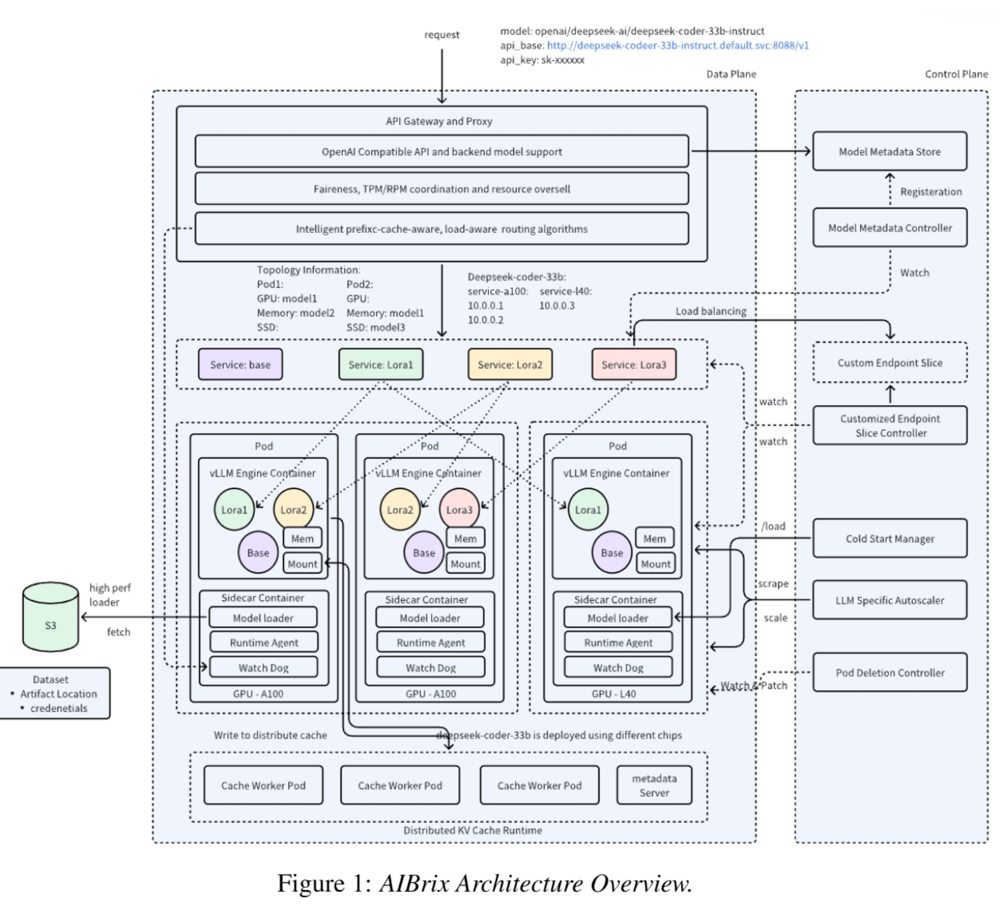

## Agenda

- Platform thinking vs. app thinking
- Why do we need agentic platforms?
- Key components of a GenAI/agent platform
- Agent runtimes and deployment patterns
- Shared services: auth, observability, model gateway
- Reference architectures
- Real-world examples
- Implementation considerations

## Platform vs. App Thinking

::: {.incremental}
- **App thinking**: one team, one agent, one deployment — fast to ship, impossible to scale across an org
- **Platform thinking**: shared foundation that *many* teams build agents on
- The platform owns the **undifferentiated heavy lifting**: auth, model access, observability, guardrails, deployment
- Teams own only their **agent logic and domain knowledge**
- Same shift as DevOps → internal developer platforms, now for agents
:::

## Why Do We Need Agentic Platforms?

::: {.incremental}
- **Complexity Management**: LLMs and agents require specialized infrastructure and workflows
- **Resource Optimization**: Efficient utilization of compute resources
- **Governance & Security**: Control access, usage, and ensure compliance
- **Scalability**: Handle variable workloads across the organization
- **Standardization**: Create consistent development patterns
- **Cost Control**: Manage and monitor cloud resource usage
:::

## The Challenge Without a Platform

Individual implementations lead to:

::: {.incremental}
- Duplicated infrastructure
- Inconsistent security practices
- Lack of reusable components
- No centralized monitoring
- Variable user experiences
- Higher overall costs
- Knowledge silos
:::

## Key Components of an Agentic Platform {.smaller}

::: {.incremental}
1. **Model Management Layer**
2. **Agent Runtime**
3. **Data Processing & Orchestration**
4. **Development Environments**
5. **Security & Governance**
6. **Monitoring & Observability**
7. **User Interfaces & APIs**
8. **Infrastructure Management**
:::

## Model Management Layer {.smaller}

::: {.incremental}
- **Model Repository**: Version-controlled storage for models
- **Model Registry**: Metadata, lineage, and deployment tracking
- **Model Serving**: Scalable inference endpoints
- **Model Evaluation**: Benchmarking and quality assessment
- **Model Selection**: Optimal model routing based on task requirements
- **Multi-model Orchestration**: Managing chains of models working together
:::

## Agent Runtime {.smaller}

The layer that actually *hosts* agents:

::: {.incremental}
- **Session management**: isolated, stateful sessions per user/task
- **Long-running execution**: agents that work for minutes or hours, survive restarts
- **Memory services**: short-term and long-term memory as a managed capability
- **Tool/MCP connectivity**: managed connections to tools, MCP servers, and A2A peers
- **Sandboxing**: code execution and browser use in isolated environments
- Examples (name level): **Amazon Bedrock AgentCore**, **LangGraph Platform**, Vertex AI Agent Engine, Azure AI Foundry Agent Service
:::

## Deployment Patterns for Agents {.smaller}

| Pattern | Fit | Trade-off |
|---------|-----|-----------|
| **Managed agent runtime** | Fastest path, built-in state/memory | Less control, vendor coupling |
| **Containers/Kubernetes** | Full control, existing platform teams | You build session state, scaling, sandboxing |
| **Serverless functions** | Spiky, short-lived tasks | Timeouts hurt long-running agents |
| **Embedded (in-app)** | Simple copilots | No central governance |

- Key differences from stateless microservices: **long-lived sessions, human-in-the-loop pauses, tool credentials**

## Data Processing & Orchestration {.smaller}

::: {.incremental}
- **Vector Databases**: For retrieval-augmented generation (RAG)
- **Data Connectors**: Integration with enterprise data sources
- **ETL Pipelines**: Data preparation and transformation
- **Caching Layer**: Response caching for efficiency
- **Workflow Management**: Orchestrating complex LLM pipelines
- **Prompt Management**: Version control and optimization for prompts
:::

## Development Environments {.smaller}

::: {.incremental}
- **SDKs & Libraries**: Language-specific toolkits
- **Notebooks**: Interactive development environments
- **IDE Integrations**: Code completion, testing tools
- **Templates & Patterns**: Reusable architectural patterns
- **CI/CD Pipelines**: Automated testing and deployment
- **Debugging Tools**: LLM-specific debugging capabilities
:::

## Shared Service: Model Gateway {.smaller}

::: {.incremental}
- Single, governed entry point for **all** model calls across the org
- **Unified API** across providers (Anthropic, OpenAI, Bedrock, self-hosted vLLM)
- **Routing & fallback**: cheapest capable model; automatic failover
- **Rate limiting & quotas**: per team, per application
- **Spend tracking**: cost attribution per model, endpoint, and team (Week 8 tokenomics, operationalized)
- Examples (name level): LiteLLM, OpenRouter, Bedrock as gateway
:::

## Shared Service: Identity & Auth {.smaller}

::: {.incremental}
- **Authentication & Authorization**: Role-based access control for users *and* agents
- **Agent identity**: agents get scoped credentials, never shared super-user keys
- **Delegated access**: agent acts *on behalf of* a user — permissions follow the user
- **Tool credential vaulting**: secrets injected at runtime, never in prompts or code
- **Audit Logging**: Tracking all interactions
:::

## Security & Governance {.smaller}

::: {.incremental}
- **PII Detection & Redaction**: Protecting sensitive information
- **Prompt Injection Protection**: Defending against attacks
- **Input/Output Filtering**: Content moderation and safety (central guardrails, Week 6)
- **Policy as code**: which teams may use which models, tools, and data
- **Compliance Frameworks**: Industry-specific regulatory compliance
- **Approval workflows**: human sign-off for high-risk agent actions
:::

## Shared Service: Monitoring & Observability {.smaller}

::: {.incremental}
- **Performance Metrics**: Latency, throughput, availability
- **Cost Tracking**: Per-model, per-endpoint, per-application
- **Quality Monitoring**: Accuracy, relevance, hallucination rates
- **Trace-level visibility**: every agent step, tool call, and token (OpenTelemetry-style traces)
- **Usage Analytics**: User patterns and common use cases
- **Drift Detection**: Identifying model degradation
- **Alerting Systems**: Proactive notification of issues
:::

## User Interfaces & APIs {.smaller}

::: {.incremental}
- **API Gateway**: Unified API access with rate limiting
- **Web Interfaces**: For non-technical users
- **CLI Tools**: For developers and operations
- **Custom UX Components**: Specialized interfaces for different use cases
- **Integration Points**: Connections to existing enterprise systems
- **SDK Extensions**: Custom connectors for business applications
:::

## Infrastructure Management {.smaller}

::: {.incremental}
- **Compute Resources**: GPU provisioning
- **Auto-scaling**: Adjusting resources based on demand
- **High Availability**: Redundancy and failover
- **Network Optimization**: Low-latency data transfer
- **Storage Management**: Efficient data access patterns
- **Cost Optimization**: Right-sizing and resource scheduling
:::


## Reference Architecture: Enterprise Agentic Platform {.smaller}

```{mermaid}
flowchart TB
    subgraph "Foundation"
      A[Compute Infrastructure]
      B[Storage & Databases]
      C[Networking]
      D[Identity & Access]
    end

    subgraph "Model Management"
      E[Model Gateway]
      F[Model Serving]
      G[Model Monitoring]
    end

    subgraph "Agent Runtime"
      H[Sessions & Memory]
      I[Tool / MCP Connectivity]
      J[Sandboxed Execution]
    end

    subgraph "Data Management"
      K[Data Connectors]
      L[Vector Stores]
      M[Knowledge Bases]
    end

    subgraph "Application Layer"
      N[API Gateway]
      O[Web Applications]
      P[Chat Interfaces]
      Q[Document Processing]
    end

    subgraph "Governance"
      R[Security Controls]
      S[Audit & Compliance]
      T[Cost Management]
    end

    A --> E
    E --> H
    H --> N
    K --> L
    L --> H
    D --> H
    R --> E
    R --> H
    R --> N
```


## Managed Agent Platforms (Name Level) {.smaller}

::: {.incremental}
- **Amazon Bedrock AgentCore**: managed runtime, memory, identity, gateway, and observability services for agents on AWS
- **LangGraph Platform**: deployment and management for LangGraph agents — persistence, streaming, task queues
- **Google Vertex AI Agent Engine** and **Azure AI Foundry Agent Service**: analogous managed runtimes in GCP/Azure
- Common thread: they productize exactly the shared services on the previous slides
:::

## Real-World Example: Intuit GenOS {.smaller}

[Medium blog: Intuit GenOS](https://medium.com/intuit-engineering/how-to-accelerate-development-velocity-in-the-genai-era-build-a-genos-e71ac2e17b82)
{width=75%}

## Real-World Example: Scale.com Gen AI platform {.smaller}

[Scale GenAI platform](https://scale.com/genai-platform)

- Full-stack platform: data engine, model fine-tuning, evaluation, and deployment
- Model-agnostic gateway across frontier and open-weight models
- Built-in eval and red-teaming tooling as shared platform services

## Real-World Example: DataStax Gen AI platform {.smaller}

[DataStax GenAI platform](https://www.datastax.com/products/ai-platform-as-a-service-paas)

- Managed RAG stack: vector store (Astra DB), embeddings, retrieval APIs
- Langflow-based visual orchestration for agentic workflows
- Platform-as-a-service pattern: apps consume shared retrieval/agent services

## Real-World Example: AIBrix {.smaller}

[AIBrix paper](https://github.com/vllm-project/aibrix/blob/main/docs/paper/AIBrix_White_Paper_0219_2026.pdf)
{width=75%}


## Implementation Considerations {.smaller}

::: {.incremental}
- **Buy vs. Build**: Leveraging managed services vs. custom infrastructure
- **Centralized vs. Federated**: Organization-wide vs. team-specific platforms
- **On-prem vs. Cloud**: Data sovereignty and security requirements
- **Open vs. Closed Source**: Model availability and customization needs
- **Specialized vs. General Purpose**: Domain-specific optimization
- **Cost vs. Performance**: Balancing budget and capabilities
:::


## Key Takeaways {.smaller}

::: {.incremental}
1. Platform thinking — not app thinking — is how agents scale beyond one team
2. Agent runtimes add what microservice platforms lack: sessions, memory, sandboxing, tool identity
3. Shared services (auth, observability, model gateway) are the platform's core value
4. Security and compliance must be built in from the start
5. Modular architecture enables flexibility and evolution
6. Cost management becomes increasingly important at scale
:::

## References

- [Amazon Bedrock AgentCore](https://aws.amazon.com/bedrock/agentcore/)
- [LangGraph Platform Documentation](https://docs.langchain.com/langgraph-platform)
- [Model Context Protocol](https://modelcontextprotocol.io/)
- [A2A Protocol](https://a2a-protocol.org/)
- [Intuit GenOS (Medium)](https://medium.com/intuit-engineering/how-to-accelerate-development-velocity-in-the-genai-era-build-a-genos-e71ac2e17b82)
- [AIBrix (vLLM Project)](https://github.com/vllm-project/aibrix)
